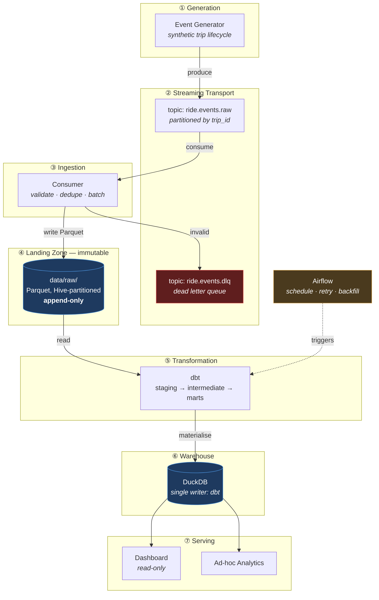
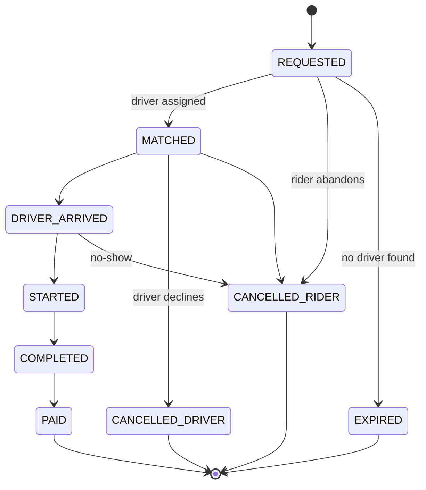
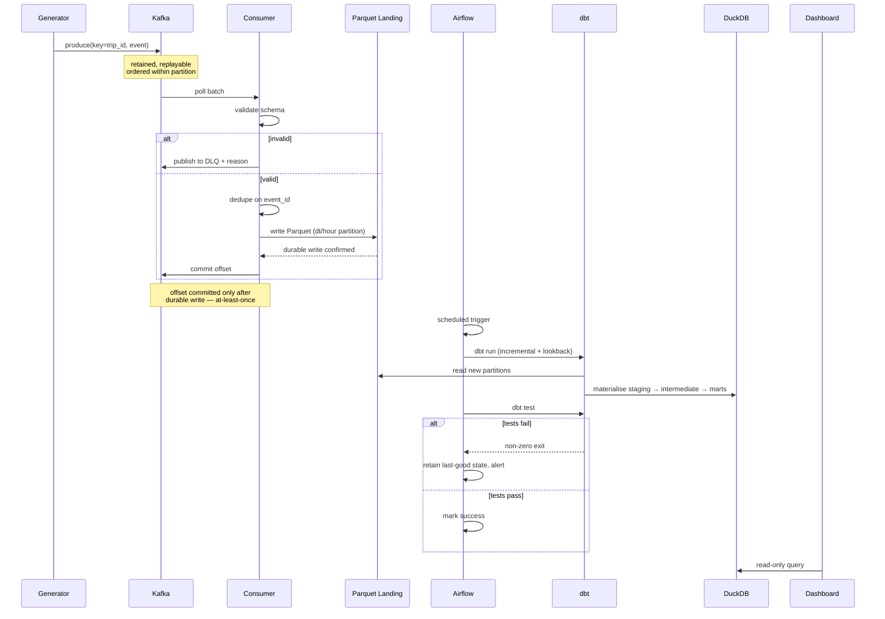

# RideFlow — Real-Time Ride-Hailing Data Platform

**Project Plan & Technical Design Document**

| Field | Value |
|---|---|
| Document owner | Rajat Pandey |
| Status | Draft — pending implementation |
| Last updated | 2026-08-05 |
| Document type | Design specification |

---

## 1. Project Overview

RideFlow is an end-to-end streaming data platform that models the data infrastructure behind a ride-hailing marketplace (Uber, Ola, Lyft, Grab). It ingests a continuous stream of trip lifecycle events, lands them durably, transforms them into a dimensionally modelled warehouse, and exposes curated marts to analysts and an operational dashboard.

The platform is deliberately built as a **lakehouse**: streaming ingestion is decoupled from batch transformation by an immutable landing zone. Raw events are captured once and never mutated; all business logic lives in version-controlled, tested SQL that can be re-run against history at any time. This separation is the central design decision of the project and is explained in §4.

The scope is a single-region, single-tenant platform processing simulated event volumes in the range of hundreds to low thousands of events per second — enough to exercise real backpressure, partitioning, late-arrival, and idempotency concerns without requiring distributed compute.

**This is a portfolio project built to production engineering standards**, not a tutorial. It is version-controlled, containerised, tested, CI-gated, and documented. Every technology choice is justified in §7, including the choices that were rejected.

---

## 2. Problem Statement

### 2.1 The business problem

A ride-hailing marketplace is a real-time, two-sided system. Supply (drivers) and demand (riders) must be matched continuously, and the business is steered by metrics that decay in value within minutes:

- **Marketplace health** — Where is unmet demand right now? Which zones have idle drivers while adjacent zones have unserved requests?
- **Conversion funnel** — Of all ride requests, what fraction reach a completed trip? Where do riders abandon, and where do drivers decline?
- **Pricing effectiveness** — Is surge pricing actually rebalancing supply, or is it only suppressing demand?
- **Financial truth** — What is gross bookings, net revenue, and driver payout, reconciled to the cent, for any arbitrary time window?

These questions cannot be answered from the production transactional database. Running analytical scans against the OLTP store that is concurrently serving dispatch would degrade the customer-facing product, and the OLTP schema is normalised for write throughput rather than analytical access.

### 2.2 The engineering problem

Building the analytical layer surfaces the problems this project exists to solve:

| Problem | Why it is hard |
|---|---|
| **Event ordering** | A trip's `completed` event can arrive before its `started` event. Ordering is only guaranteed within a Kafka partition, so partitioning strategy determines correctness. |
| **Late-arriving data** | A driver's phone loses signal in a tunnel and flushes buffered events twenty minutes later. Yesterday's completed metrics must be revised without corrupting them. |
| **Duplicate delivery** | Kafka gives at-least-once delivery. Consumer restarts and producer retries mean the same event will be delivered more than once, and revenue must not be double-counted. |
| **Schema evolution** | The mobile client ships a new field. The pipeline must not break, and historical data must remain queryable. |
| **Concurrent access** | Streaming writers and batch transformers contend for the same storage. Resolving this without data loss drives the architecture. |
| **Data quality** | A negative fare or a trip with no driver is a bug somewhere upstream. It must be caught before it reaches a dashboard, not after a stakeholder notices. |

### 2.3 What "done" means

RideFlow is complete when an operator can start the platform with a single command, watch events flow from generation through to a live dashboard, deliberately inject failure (kill the consumer, emit malformed events, replay a duplicate batch), and observe that the warehouse remains correct.

---

## 3. Objectives

### 3.1 Primary objectives

| # | Objective | Success criterion |
|---|---|---|
| O1 | Ingest a continuous ride-event stream without loss | Zero message loss across a forced consumer restart, verified by event-count reconciliation |
| O2 | Guarantee exactly-once semantics in the warehouse | Replaying a full day of events produces byte-identical marts |
| O3 | Model the domain dimensionally | Star schema with conformed dimensions supporting slice-and-dice on time, geography, driver, and rider |
| O4 | Enforce data quality as a pipeline gate | Quality violations fail the run and alert; bad data never reaches a mart |
| O5 | Orchestrate reproducibly | Any historical window can be re-materialised by a backfill with no manual steps |
| O6 | Expose analytics | Dashboard answering the §2.1 business questions against live warehouse data |

### 3.2 Explicit non-objectives

Stating what is out of scope is as important as stating what is in it. RideFlow does **not** attempt:

- **Sub-second serving latency.** This is an analytical platform. Operational dispatch decisions are not made from it. Target freshness is minutes, not milliseconds.
- **Horizontal compute scale.** Single-node processing is a deliberate choice (see §7). Distributed compute is a future enhancement, not a v1 requirement.
- **Multi-region or multi-tenant isolation.** Single region, single tenant.
- **Real personal data.** All data is synthetic. No PII is ever processed, which is itself a design decision rather than an omission (see §6.5).
- **Machine learning.** ETA prediction and demand forecasting are downstream consumers of this platform, not part of it.

---

## 4. Architecture Overview

### 4.1 The central design decision

The defining constraint of this architecture is that **DuckDB is a single-writer embedded database.** It holds an exclusive file lock. A naive design in which a Kafka consumer writes rows into DuckDB continuously would make the warehouse permanently locked, and dbt — running from a separate Airflow worker process — could never acquire write access.

This is not a tuning problem. It is inherent to embedded databases, and it forces a choice:

- **Rejected:** Replace DuckDB with a client-server database (PostgreSQL) to allow concurrent writes. This solves the lock but discards DuckDB's columnar analytical performance and zero-setup reproducibility.
- **Rejected:** Have the consumer and dbt coordinate over the lock. Fragile, introduces deadlock and starvation, and couples two systems that should not know about each other.
- **Adopted:** **Decouple ingestion from transformation with an immutable landing zone.**

The consumer's only write target is Parquet files on disk. It never opens DuckDB. dbt is the sole writer to DuckDB, and Airflow guarantees only one dbt run executes at a time. Neither system contends with the other.

This is precisely how production lakehouses separate streaming ingest from batch transform — the landing zone is the contract between them. The constraint pushed the design toward the correct architecture rather than away from it.

### 4.2 Layered architecture

### 4.3 Layer responsibilities

| Layer | Responsibility | Explicitly **not** responsible for |
|---|---|---|
| ① Generation | Emit realistic trip lifecycle events with controlled anomalies | Correctness of downstream logic |
| ② Transport | Durable, ordered-within-partition, replayable buffer | Interpreting event content |
| ③ Ingestion | Schema validation, deduplication, batching to Parquet | Business logic or aggregation |
| ④ Landing zone | Immutable append-only system of record | Serving queries |
| ⑤ Transformation | All business logic, modelling, quality tests | Ingestion or scheduling |
| ⑥ Warehouse | Analytical query serving | Being written to by anything except dbt |
| ⑦ Serving | Presentation and exploration | Transformation logic |

**Architectural invariant:** business logic lives *only* in layer ⑤. Ingestion does not aggregate; dashboards do not transform. This keeps logic version-controlled, tested, and re-runnable against history.

### 4.4 The medallion model

dbt organises transformation into three enforced tiers:

| Tier | Purpose | Materialisation |
|---|---|---|
| **Staging** (bronze→silver) | 1:1 with source. Cast types, rename to conventions, deduplicate. No joins, no business logic. | View |
| **Intermediate** | Reusable logic. Sessionise events into trips, resolve the lifecycle state machine. | Ephemeral / table |
| **Marts** (gold) | Business-facing star schema. Facts and conformed dimensions. | Incremental table |

---

## 5. Functional Requirements

### 5.1 Domain model — the trip lifecycle

Every event describes a transition in a trip's state machine. Modelling this explicitly is what makes the funnel and marketplace-health metrics computable.

Terminal states are `PAID`, `EXPIRED`, and both cancellation states. Any trip resting in a non-terminal state beyond a threshold is a data-quality signal, not a business event.

### 5.2 Event contract

| Field | Type | Notes |
|---|---|---|
| `event_id` | UUID | Unique per event. Deduplication key. |
| `trip_id` | UUID | Kafka partition key — guarantees per-trip ordering |
| `event_type` | enum | One of the §5.1 states |
| `event_timestamp` | timestamp (UTC) | When it occurred on device |
| `ingested_at` | timestamp (UTC) | When the consumer received it — the two differ for late arrivals |
| `rider_id` / `driver_id` | UUID | `driver_id` null before `MATCHED` |
| `pickup_zone_id` / `dropoff_zone_id` | int | Geographic zone reference |
| `pickup_lat/lon`, `dropoff_lat/lon` | decimal | Coordinates |
| `vehicle_type` | enum | economy / premium / xl / pool |
| `surge_multiplier` | decimal | ≥ 1.0 |
| `fare_amount`, `distance_km`, `duration_sec` | decimal / int | Populated at `COMPLETED` |
| `payment_method` | enum | Populated at `PAID` |
| `schema_version` | string | Enables evolution |

Both `event_timestamp` and `ingested_at` are mandatory: event time drives business metrics, ingestion time drives operational monitoring and incremental loading. Conflating them is a common and costly modelling error.

### 5.3 Requirements by component

**FR-1 — Event Generator**
- Emit complete, causally-consistent trip lifecycles with realistic inter-state delays
- Model temporal demand patterns: commute peaks, weekend nights, zone-specific density
- Couple surge multiplier to simulated supply/demand imbalance rather than randomly
- Inject configurable, *labelled* anomalies: duplicates, late arrivals, out-of-order delivery, malformed payloads, negative fares, orphaned events
- Support deterministic seeding for reproducible test runs
- Configurable throughput

Anomaly injection is a first-class requirement. A pipeline that has never been shown bad data has not been tested.

**FR-2 — Streaming Transport**
- Durable topic with configurable retention and partition count
- Partition by `trip_id` so all events for a trip land on one partition in order
- Separate dead-letter topic for unprocessable messages
- Consumer offsets committed only after successful persistence

**FR-3 — Ingestion Consumer**
- Validate every message against the schema contract; route failures to DLQ with the rejection reason, never drop silently
- Deduplicate on `event_id` within the batch window
- Batch by size or time, whichever fires first
- Write Parquet partitioned by ingestion date and hour
- Commit offsets only after a successful, durable write (at-least-once with downstream idempotency)
- Resume cleanly from last committed offset on restart

**FR-4 — Transformation**
- Staging: type-cast, standardise naming, deduplicate on `event_id`
- Intermediate: collapse the event stream into one row per trip by resolving the state machine; compute funnel outcome
- Marts: star schema — `fct_trips`, `fct_trip_events`, `dim_driver`, `dim_rider`, `dim_zone`, `dim_date`, `dim_vehicle_type`
- Incremental models must be idempotent: re-running any window produces identical output
- Handle late arrivals via a bounded lookback window on incremental runs
- Slowly-changing dimensions (Type 2) where attribute history matters

**FR-5 — Data Quality**
- Schema tests: not-null, unique, accepted values, referential integrity
- Business assertions: fare ≥ 0, `dropoff_time` > `pickup_time`, `surge_multiplier` ≥ 1.0, no trip in two terminal states
- Reconciliation: events landed = events staged + events rejected
- Freshness checks on source data
- **Test failures fail the pipeline run.** Quality is a gate, not a report.

**FR-6 — Orchestration**
- Scheduled DAG: ingest-window check → dbt run → dbt test → publish
- Retry with exponential backoff; alert on final failure
- Parameterised backfill over an arbitrary date range
- Task-level idempotency so any retry is safe
- No concurrent dbt runs (enforces the single-writer invariant)

**FR-7 — Serving**
- Read-only warehouse connections
- Marketplace health, conversion funnel, revenue, surge effectiveness, zone heatmap
- Time-window and dimension filtering
- Explicit data-freshness indicator so no one reads a stale number as current

---

## 6. Non-Functional Requirements

### 6.1 Reliability

| Requirement | Target |
|---|---|
| Message loss | Zero, verified by reconciliation |
| Consumer restart | Resume from last offset, no gap or duplicate in warehouse |
| Broker unavailability | Producer buffers and retries with backoff |
| Transformation failure | No partial writes; failed run leaves last-good state intact |
| Recovery | Full warehouse rebuildable from the landing zone alone |

The last row is the strongest guarantee in the system: **the landing zone is the system of record.** If the warehouse is deleted entirely, it can be reconstructed. This is why the landing zone is immutable and append-only.

### 6.2 Performance

| Metric | Target |
|---|---|
| Sustained ingestion | ≥ 1,000 events/sec single consumer |
| End-to-end freshness | < 15 minutes, event emission to mart |
| Mart query response | < 2 seconds on 90 days of history |
| Full backfill | 30 days in < 30 minutes |

Targets are stated so they can be *measured and missed*. An unmeasured target is a wish.

### 6.3 Scalability

Single-node by design, with defined escape hatches: partition count sized above current consumer count so consumers can scale out; Parquet + Hive partitioning is engine-portable, so the transformation layer can move to Spark or a cloud warehouse without touching ingestion; dbt models are largely portable across adapters.

### 6.4 Maintainability

- Every transformation in version-controlled SQL — no logic in notebooks or dashboards
- Auto-generated lineage documentation
- Enforced formatting and linting via pre-commit and CI
- Unit tests on ingestion and generation; dbt tests on all models
- Typed function signatures on all Python
- Structured JSON logging with correlation IDs

### 6.5 Security & Privacy

- **All data is synthetic. No real PII enters the system by design** — this is architectural, not incidental.
- Credentials via environment variables only; `.env` never committed; `.env.example` documents required variables
- Warehouse consumers use read-only connections
- The event contract deliberately excludes names, phone numbers, and payment identifiers, modelling the tokenisation a production system would require

### 6.6 Observability

- Structured logs across all components
- Pipeline metrics: throughput, lag, batch latency, rejection rate
- Data metrics: row counts per layer, test pass rate, freshness lag
- DLQ depth as a first-class alertable signal

### 6.7 Reproducibility

- One command to start the full platform
- Pinned dependency versions
- Containerised services with declared health checks
- Seeded generation for deterministic runs
- Documented setup verified from a clean clone

---

## 7. Technology Stack

Each choice below records the alternatives rejected and why. A choice without a rejected alternative is an assumption, not a decision.

### 7.1 Apache Kafka — streaming transport

**Why:** Kafka is the durable, replayable log the architecture depends on. Three properties are load-bearing: **replayability** (retained events can be re-consumed, so a consumer bug is recoverable rather than fatal), **ordering within a partition** (keying by `trip_id` gives per-trip ordering without global ordering cost), and **consumer groups** (scale-out without changing the producer). It is also the near-universal standard in data engineering, so the skill transfers directly.

**Rejected:** *RabbitMQ* — a message queue, not a log; messages are consumed and gone, so replay is impossible. *AWS Kinesis / Pub-Sub* — managed and capable, but cloud-locked and not runnable by a reviewer from a clean clone. *Direct file writes* — sidesteps the entire class of distributed-systems problems the project exists to demonstrate.

### 7.2 Apache Parquet — landing zone format

**Why:** Columnar, compressed, and self-describing with an embedded schema. Analytical queries touching three of twenty columns read only those three. Hive-style partitioning lets the transformation layer prune entire directories. Critically, it is **engine-neutral** — DuckDB, Spark, Snowflake, BigQuery, and Polars all read it, so the landing zone never becomes a lock-in point.

**Rejected:** *JSON/CSV* — no schema enforcement, no compression, full scans on every read. *Delta Lake / Iceberg* — genuinely better (ACID, time travel, schema evolution), but the operational complexity is not justified at this scale. Noted as a future enhancement in §11.

### 7.3 DuckDB — analytical warehouse

**Why:** Columnar OLAP performance in an embedded engine with zero infrastructure. It queries Parquet directly without an import step, and a reviewer can clone the repository and run real analytical SQL immediately — a decisive advantage for a portfolio project. Its SQL dialect is close enough to Postgres and Snowflake that the modelling work transfers.

**Trade-off accepted:** single-writer, single-node. This directly caused the §4.1 architecture and is the most instructive constraint in the project.

**Rejected:** *PostgreSQL* — row-oriented, materially slower for wide analytical scans, and requires a running server. *Snowflake / BigQuery* — the production-realistic answer, but requires credentials and incurs cost, so no reviewer can run it. *SQLite* — row-oriented, not built for analytics.

### 7.4 dbt — transformation framework

**Why:** dbt makes transformation logic *engineering* rather than scripting. It provides dependency resolution (a DAG inferred from model references, not hand-maintained), testing as a first-class concept, environment separation, incremental materialisation with well-defined idempotency semantics, and auto-generated lineage documentation. `dbt-duckdb` is a mature adapter. It is also the dominant tool in the modern data stack, so the skill is directly marketable.

**Rejected:** *Hand-written SQL scripts* — every capability above would have to be rebuilt badly. *PySpark* — a distributed engine's overhead with none of its benefit at this data volume; genuinely correct at 100× the scale. *Pandas* — memory-bound, untestable at this granularity, and moves logic out of SQL.

### 7.5 Apache Airflow (Docker) — orchestration

**Why:** Airflow supplies scheduling, dependency management, retry with backoff, **parameterised backfill over historical windows**, and concurrency control. That last point enforces the §4.1 single-writer invariant directly. It is the industry default, and demonstrating it is a concrete resume signal.

**Trade-off accepted:** Airflow is heavy — multiple containers and non-trivial local resource use. Accepted deliberately, because the alternative teaches less.

**Rejected:** *Prefect / Dagster* — lighter and arguably better-designed, but less common in job requirements. *Cron* — no dependency management, no retry semantics, no backfill, no visibility.

### 7.6 Docker & Docker Compose — runtime

**Why:** Kafka and Airflow are multi-service systems; Compose declares the topology, networking, volumes, and health checks as version-controlled configuration. It makes "one command to start the platform" achievable and eliminates environment drift.

**Rejected:** *Local installs* — unreproducible, platform-specific, hostile to any reviewer. *Kubernetes* — correct for production deployment, disproportionate for local development.

### 7.7 Python — application language

**Why:** The lingua franca of data engineering, with mature Kafka clients, first-class Parquet support via PyArrow, and native DuckDB and dbt integration.

**Rejected:** *Java/Scala* — better raw Kafka ecosystem, but far slower iteration and outside the target skill profile. *Go* — excellent for the consumer specifically, but fragments the stack for marginal gain.

### 7.8 Supporting tooling

| Tool | Purpose | Rationale |
|---|---|---|
| PyArrow | Parquet I/O | Reference implementation; zero-copy to DuckDB |
| Pydantic | Schema validation | Declarative contracts, typed, clear failure messages |
| ~~Streamlit~~ → **Power BI** | Dashboard | **Superseded — see `docs/architecture.md` §0 and §7.** Power BI is a materially stronger hiring signal and its model view validates the star schema. It weakens §6.7 reproducibility (Windows-only, binary `.pbix`) and puts §6.4 at risk (DAX can become business logic); both are mitigated by binding rules and a Parquet mart export. |
| pytest | Testing | Standard; fixtures suit pipeline testing |
| Ruff + Black | Lint & format | Fast, opinionated, ends style debate |
| pre-commit | Local gates | Catches issues before CI |
| GitHub Actions | CI | Native to the repository host |

### 7.9 Known environment constraints

Two constraints identified during environment assessment must be resolved before implementation:

1. ~~**Local interpreter is Python 3.13.5.**~~ ✅ **Resolved 2026-08-06.** The concern was that dbt lags new Python releases. Verified against the package index rather than assumed: dbt-core 1.12.0, dbt-duckdb 1.10.1, duckdb 1.5.5, confluent-kafka 2.15.0 and pyarrow 25.0.0 all resolve together on 3.13.5 with native cp313 wheels. Versions are pinned in `requirements.txt`. One near-conflict surfaced — dbt-core constrains `pathspec` below black's preference — and pip settles it at 1.0.4.
2. **The system interpreter resides at a path containing spaces and an ampersand** (`...\AI & ML\python.exe`). `&` is a shell metacharacter and will break unquoted tooling on Windows. A project-local virtual environment is required rather than use of that interpreter directly.

A third item — the Docker daemon not currently running — is an operational prerequisite rather than a design constraint.

---

## 8. Data Flow

### 8.1 Event journey

### 8.2 Data at each stage

| Stage | Format | Grain | Mutability | Retention |
|---|---|---|---|---|
| Kafka topic | JSON/Avro | One event | Immutable, expires | Days |
| Landing zone | Parquet, partitioned | One event | **Append-only, permanent** | Indefinite |
| Staging | View | One event, cleaned | Recomputed each run | N/A |
| Intermediate | Table/ephemeral | One trip | Recomputed | N/A |
| Marts | Incremental table | Fact grain | Incrementally updated | Indefinite |

### 8.3 Handling the hard cases

**Late-arriving events.** Incremental models process a lookback window wider than the maximum tolerated lateness, not merely the newest partition. Events are located by `event_timestamp` (business truth) while incremental filtering uses `ingested_at` (arrival truth). This revises affected historical aggregates correctly instead of silently dropping late data.

**Duplicate delivery.** Deduplication happens twice: opportunistically in the consumer within a batch window, and authoritatively in staging via a window function over `event_id`. Because staging is recomputed from the immutable landing zone, this is correct even for duplicates arriving days apart — the consumer's in-memory window cannot catch those, and relying on it alone would be a defect.

**Out-of-order events.** The intermediate layer reconstructs each trip by resolving its full event set against the §5.1 state machine, rather than assuming arrival order reflects causal order.

**Schema evolution.** `schema_version` travels on every event. Parquet stores schema per file, so old and new files coexist; staging normalises across versions.

### 8.4 Idempotency contract

Re-running any pipeline stage over any window must produce identical output. This is what makes backfill, retry, and disaster recovery safe, and it is a testable property — not an aspiration.

---

## 9. Folder Responsibilities

| Path | Owns | Must not contain |
|---|---|---|
| `event_generator/` | Synthetic event generation, demand modelling, anomaly injection, Kafka producer | Consumption or transformation logic |
| `ingestion/` | Kafka consumer, schema validation, deduplication, batching, Parquet writer, DLQ handling | Business logic or aggregation |
| `transformation/` | dbt project — models, tests, macros, seeds, sources | Ingestion code or orchestration |
| `warehouse/` | DuckDB connection management, schema bootstrap, read-only accessors | Transformation logic |
| `sql/` | Ad-hoc analytical and reconciliation queries outside the dbt DAG | Pipeline-critical transformations |
| `analytics/` | Metric definitions, exploratory analysis, validation notebooks | Anything the pipeline depends on |
| `dashboard/` | Power BI report (`.pbix`) and `measures.md`, read-only queries against exported Parquet marts | Transformation logic, writes, or **any business logic in DAX** |
| `data/raw/` | **Immutable landing zone.** Partitioned Parquet. Append-only. | Any mutation or deletion |
| `data/processed/` | Intermediate artefacts, reconciliation outputs | Source-of-truth data |
| `data/warehouse/` | DuckDB database file. Written only by dbt. | Any second writer |
| `docker/` | Dockerfiles, Compose topology, service configuration, health checks | Application logic |
| `tests/` | pytest suites — unit, integration, contract | Production code |
| `docs/` | Architecture decisions, runbooks, data dictionary, diagrams | Code |
| `.github/workflows/` | CI — lint, test, dbt parse, build validation | Deployment secrets |
| `.vscode/` | Editor configuration | Anything machine-specific or secret |

**Directory-level invariants:**
1. `data/` is never committed to version control.
2. `data/raw/` is append-only. No process deletes or rewrites a landed file.
3. Only dbt writes to `data/warehouse/`.
4. Business logic exists only in `transformation/`.

---

## 10. Milestones

Each milestone ends in a **demonstrable, verifiable state**. No milestone is complete because code exists; it is complete when its exit criteria are proven.

### M0 — Foundation & Environment
Resolve the §7.9 constraints; project-local virtual environment; pinned dependencies verified against the package index; Docker daemon operational; `.gitignore`, `.env.example`, pre-commit, CI skeleton.
**Exit:** clean clone reaches a working environment via documented steps; CI green on an empty commit.

### M1 — Domain Model & Event Contract
Formalise the state machine, event schema, zone reference data, and validation rules as versioned artefacts in `docs/`.
**Exit:** contract reviewed and frozen; every downstream component references it as the single source of truth.

### M2 — Event Generator
Lifecycle generation with realistic timing, temporal demand curves, supply-coupled surge, seeded determinism, configurable throughput, labelled anomaly injection.
**Exit:** generator produces a statistically plausible day of events; anomalies present at configured rates; identical seed reproduces identical output.

### M3 — Streaming Infrastructure
Kafka via Compose with health checks; topics created with deliberate partitioning; DLQ topic; producer integrated with retry and backoff.
**Exit:** events flow end-to-end into Kafka; broker restart loses no messages.

### M4 — Ingestion Consumer
Consumer with validation, deduplication, batching, Parquet writing, DLQ routing, and post-write offset commit.
**Exit:** sustained ≥ 1,000 events/sec; forced restart mid-stream produces zero loss and zero gap, proven by reconciliation; malformed events land in DLQ with reasons.

### M5 — Warehouse & dbt Foundation
DuckDB initialised; dbt project configured against the landing zone; staging layer with deduplication and typing; source freshness checks.
**Exit:** `dbt run` and `dbt test` pass; staging row counts reconcile against landed events.

### M6 — Dimensional Model
Intermediate trip sessionisation resolving the state machine; star schema marts; incremental materialisation with lookback; SCD Type 2 where warranted.
**Exit:** marts answer every §2.1 question; **re-running any window produces identical output** (idempotency proven, not assumed).

### M7 — Data Quality
Full test suite — schema, business assertions, reconciliation, freshness. Failures block the run.
**Exit:** deliberately injected bad data fails the pipeline and never reaches a mart.

### M8 — Orchestration
Airflow in Compose; DAG for ingest-check → run → test → publish; retries, alerting, parameterised backfill, concurrency control.
**Exit:** DAG runs on schedule and recovers from transient failure; a 30-day backfill completes correctly with no manual intervention.

### M9 — Analytics & Dashboard
Metric definitions; Parquet mart export; Power BI report covering marketplace health, funnel, revenue, surge, and zone heatmap, with an explicit freshness indicator sourced from the run marker.
**Exit:** dashboard reflects live warehouse state and degrades honestly when data is stale.

### M10 — Hardening & Documentation
Chaos scenarios (consumer kill, broker restart, duplicate replay, malformed flood); performance validation against §6.2; architecture decision records; runbook; data dictionary; setup verified from a clean clone.
**Exit:** every §6.1 reliability guarantee is demonstrated by a repeatable test, and the platform starts from one command on a machine that has never run it.

**Dependency note:** M1 gates everything. M2–M4 form the ingestion path; M5–M7 the transformation path; M5 cannot begin until M4 is landing real data.

---

## 11. Future Enhancements

Deliberately deferred, with the trigger that would justify each.

**Near-term**
- *Schema Registry (Avro/Protobuf)* — enforce contracts at the broker rather than the consumer. Justified once more than one producer exists.
- *Real-time aggregation layer* — Kafka Streams or Flink for sub-minute metrics, complementing rather than replacing batch marts.
- *Data contract testing in CI* — fail a build when a producer change breaks a downstream model.

**Medium-term**
- *Open table format (Iceberg / Delta Lake)* — ACID, time travel, and safe schema evolution over the landing zone. Justified when concurrent writers or historical corrections become routine.
- *Cloud warehouse migration* — Snowflake or BigQuery, exercising the §6.3 escape hatch. Justified when data exceeds single-node capacity.
- *Observability stack* — Prometheus and Grafana over pipeline and data metrics.
- *Data catalogue and column-level lineage* — DataHub or OpenMetadata.

**Long-term**
- *Distributed processing* — Spark, once volume genuinely warrants it. Explicitly not before.
- *CDC ingestion* — Debezium against a simulated OLTP store, adding a second, differently-shaped ingestion pattern.
- *Streaming ML feature store* — real-time features for ETA and demand models.
- *Multi-region and data mesh* — domain-oriented ownership with federated governance.
- *Cost attribution* — per-query and per-pipeline cost, the discipline that separates senior from mid-level data engineers.

---

## 12. Learning Goals

The project is structured so that each area is *demonstrated under failure*, not merely used.

**Distributed streaming.** Partitioning as a correctness decision rather than a throughput knob; consumer groups and rebalancing; offset management and its relationship to delivery semantics; why at-least-once plus idempotency is the pragmatic answer to exactly-once.

**Data modelling.** Dimensional modelling and star schemas; conformed dimensions; SCD Type 2; the event-time versus ingestion-time distinction and why conflating them corrupts metrics; grain as the first modelling decision.

**Transformation engineering.** dbt's dependency graph, testing model, and incremental semantics; the medallion architecture; treating SQL as software — versioned, tested, reviewed.

**Reliability engineering.** Idempotency as a design property; replayability and recovery; graceful degradation; dead-letter handling; designing for the failure that will happen rather than the success that is hoped for.

**Data quality.** Quality as an enforced gate; reconciliation between layers; freshness monitoring; distinguishing schema violations from business-rule violations.

**Orchestration.** Dependency management, retry semantics, backfill design, and concurrency control as a correctness mechanism.

**Systems thinking.** The §4.1 decision is the central lesson: a real constraint (single-writer DuckDB) forced a better architecture (decoupled ingest and transform) than an unconstrained design would have produced. Recognising that constraints are information is the difference between implementing a system and engineering one.

---

## 13. Resume Value

### 13.1 What this project evidences

| Signal | Evidence |
|---|---|
| End-to-end ownership | Generation through serving, not an isolated component |
| Production discipline | Containerised, tested, CI-gated, documented, one-command startup |
| Architectural judgement | Documented decisions **with rejected alternatives** — the strongest available signal of engineering maturity |
| Failure-mode thinking | Duplicates, late arrivals, out-of-order delivery, and restarts designed for from the outset |
| Data modelling depth | Dimensional model with SCD handling and an explicit event-time/ingestion-time separation |
| Quality ownership | Tests as pipeline gates, not reports |
| Current tooling | Kafka, dbt, Airflow, DuckDB, Docker — the modern data stack |

### 13.2 Interview leverage

The project is designed to generate strong answers to the questions data engineering interviews actually ask:

- *"Tell me about a difficult technical decision."* → §4.1. A hard constraint, three evaluated options, a documented trade-off, and an outcome better than the unconstrained design.
- *"How do you handle late-arriving data?"* → A concrete lookback-window implementation, with the event-time/ingestion-time distinction articulated.
- *"How do you guarantee you don't double-count?"* → Two-layer deduplication, with a clear explanation of why the consumer-level pass alone is insufficient.
- *"How do you ensure data quality?"* → Tests as gates, layer reconciliation, DLQ with reasons.
- *"What would you do differently at 100× scale?"* → §6.3 escape hatches and §11 triggers, each with the condition that would justify it.
- *"What are the weaknesses of your design?"* → §3.2 non-objectives and §7 trade-offs, stated before being asked.

That last point matters most. Candidates who can articulate the limitations of their own systems are rare, and the distinction registers immediately.

### 13.3 Positioning

RideFlow targets **Data Engineer** and **Analytics Engineer** roles. Its differentiator is not the technology list — many portfolio projects name Kafka and dbt. It is that the design decisions are **documented with their rejected alternatives and accepted trade-offs**, and that the reliability guarantees are **demonstrated by repeatable tests** rather than asserted in a README.

Most portfolio projects prove that someone can make a pipeline run once. This one is built to prove it keeps running when things go wrong.

---

## Appendix A — Open Decisions

| # | Decision | Status |
|---|---|---|
| A1 | Kafka deployment mode (KRaft vs. ZooKeeper) | Open — KRaft preferred; fewer moving parts |
| A2 | Event serialisation (JSON vs. Avro) | Open — JSON for v1 simplicity; Avro when a registry is introduced |
| A3 | Geographic zone granularity and count | Open — pending M1 |
| A4 | Consumer batch size and flush interval | Open — to be tuned empirically in M4 |
| A5 | Lookback window width for late arrivals | Open — must exceed maximum simulated lateness |
| A6 | dbt-core / dbt-duckdb versions under Python 3.13 | ✅ **RESOLVED 2026-08-06.** Verified by combined `pip install --dry-run` on Python 3.13.5: dbt-core 1.12.0, dbt-duckdb 1.10.1, duckdb 1.5.5 resolve cleanly with native cp313 wheels. No 3.11/3.12 fallback needed. Pinned in `requirements.txt`. |

## Appendix B — Risk Register

| Risk | Impact | Likelihood | Mitigation |
|---|---|---|---|
| ~~Python 3.13 incompatibility with dbt tooling~~ | ~~Blocks M0~~ | **Closed** | ✅ Verified resolvable on 3.13.5 (2026-08-06). Risk retired. |
| Airflow resource consumption on a local machine | Slow iteration | Medium | Trim to essential services; scale down parallelism; consider a lighter local profile |
| DuckDB lock contention despite the §4.1 design | Data unavailability | Low | Enforce single-writer via Airflow concurrency control; read-only serving connections |
| Landing zone small-file proliferation | Query degradation | Medium | Size batches deliberately; add a compaction step if measured degradation appears |
| Scope expansion beyond deliverable size | Project never completes | **High** | Milestone exit criteria are binding; §11 is a holding area, not a backlog |

The final risk is the most serious. The §3.2 non-objectives and the milestone exit criteria exist specifically to contain it.
