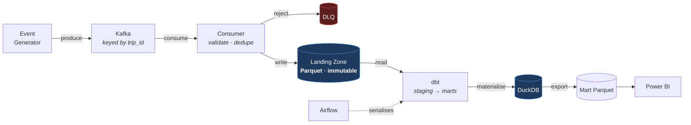

# RideFlow

**A real-time ride-hailing data platform — Kafka → Parquet lakehouse → dbt → DuckDB → Power BI, orchestrated by Airflow.**


---

> ## ⚠️ Current status: **design complete, implementation not started**
>
> This repository currently contains **documentation only**. There is no runnable code yet.
>
> The **How to Run** section below describes the *target* state and **will not work today**. It is published early so the design is reviewable before it is built — which is the whole point of finishing the specification first.
>
> **What exists:** 8 design documents, a frozen event contract, a dimensional model, and a 30-event verified sample dataset.
> **What does not:** every Python module, dbt model, Docker service, DAG, and the Power BI report.
>
> Progress is tracked in [Implementation Status](#8-implementation-status).

---

## 1. Project Overview

RideFlow models the data infrastructure behind a ride-hailing marketplace — Uber, Ola, Lyft, Grab. It ingests a continuous stream of trip lifecycle events, lands them durably, transforms them into a dimensionally modelled warehouse, and serves curated marts to a BI dashboard.

It is built as a **lakehouse**: streaming ingestion is decoupled from batch transformation by an immutable landing zone. Raw events are captured once and never mutated; all business logic lives in version-controlled, tested SQL that can be re-run against history at any time.

**This is a portfolio project built to production engineering standards** — version-controlled, containerised, tested, CI-gated, and documented. Every technology choice records the alternatives that were rejected and why.

### The business questions it answers

| Question | Why it is hard |
|---|---|
| **Marketplace health** — where is unmet demand right now? | Requires joining demand (trips) to supply (driver sessions) at zone × hour grain |
| **Conversion funnel** — where do riders drop off? | Requires modelling cancellations, not just completions |
| **Pricing effectiveness** — is surge rebalancing supply, or just suppressing demand? | Requires isolating surge revenue and controlling for weather and traffic |
| **Financial truth** — revenue reconciled to the cent | Requires fare decomposition and cross-layer reconciliation |

---

## 2. Architecture



### The decision everything else follows from

**DuckDB is a single-writer embedded database.** A consumer writing continuously into it would hold an exclusive lock forever, and dbt — running from a separate Airflow process — could never acquire it.

Rather than swap DuckDB out or attempt lock coordination, ingestion and transformation are **decoupled by an immutable landing zone**. The consumer's only write target is Parquet; dbt is the sole writer to DuckDB; Airflow's `max_active_runs=1` guarantees only one writer at a time.

This is how production lakehouses separate streaming ingest from batch transform. **The constraint pushed the design toward the correct architecture rather than away from it.**

Full detail: [`docs/architecture.md`](docs/architecture.md)

---

## 3. Tech Stack

| Layer | Technology | Chosen because | Rejected alternative |
|---|---|---|---|
| **Streaming** | Apache Kafka | Replayable log — a consumer bug is recoverable, not fatal | RabbitMQ (no replay), Kinesis (cloud-locked) |
| **Landing format** | Apache Parquet | Columnar, compressed, **engine-neutral** — no lock-in | JSON (no schema, no compression), Iceberg (complexity) |
| **Warehouse** | DuckDB | Columnar OLAP, zero setup, reads Parquet directly | Postgres (row-oriented), Snowflake (needs credentials) |
| **Transformation** | dbt | DAG from `ref()`, tests as first-class, defined idempotency | Raw SQL (rebuild it all badly), PySpark (overkill) |
| **Orchestration** | Apache Airflow | Backfill, retry policy, **concurrency control** | Prefect (lighter but weaker hiring signal), cron (no DAG) |
| **Runtime** | Docker Compose | One-command startup, no environment drift | Local installs (unreproducible), K8s (disproportionate) |
| **BI** | Power BI | Enterprise BI signal; **validates the star schema** | Streamlit (weaker signal), Tableau (no free tier) |
| **Language** | Python | Mature Kafka, Parquet, DuckDB, dbt ecosystem | Java/Scala (slow iteration), Go (fragments the stack) |

Full rationale with rejected alternatives: [`docs/architecture.md`](docs/architecture.md) §2–§8

---

## 4. Folder Structure

```
RideFlow-Data-Engineering-Pipeline/
├── event_generator/      Synthetic event generation, demand modelling, anomaly injection
├── ingestion/            Kafka consumer, validation, dedup, Parquet writer, DLQ
├── transformation/       dbt project — models, tests, macros, seeds
├── warehouse/            DuckDB connection management, read-only accessors
├── sql/                  Ad-hoc analytical and reconciliation queries
├── analytics/            Metric definitions, exploratory analysis
├── dashboard/            Power BI report + measures.md
├── data/
│   ├── raw/              ⚠️  Immutable landing zone — append-only, never committed
│   ├── processed/        Mart Parquet export for Power BI
│   └── warehouse/        DuckDB file — written only by dbt
├── docker/               Dockerfiles, Compose topology, health checks
├── docs/                 Design documentation (see §7)
├── tests/                pytest — unit, integration, contract, chaos
└── .github/workflows/    CI — lint, test, dbt parse, docs consistency
```

**Four directory-level invariants:**
1. `data/` is never committed to version control.
2. `data/raw/` is **append-only** — no process deletes or rewrites a landed file.
3. Only dbt writes to `data/warehouse/`.
4. Business logic exists **only** in `transformation/`.

---

## 5. The Pipeline

```
Generator → Kafka (keyed by trip_id, 12 partitions)
    → Consumer (validate → dedupe → batch → Parquet)
    → Landing zone (immutable, partitioned by dt/hour)
    → dbt staging      (typed, deduplicated, 1:1 with source)
    → dbt intermediate (state machine resolved, one row per trip)
    → dbt marts        (star schema, incremental with lookback)
    → DuckDB + Parquet export → Power BI
```

### What makes it correct rather than merely working

| Problem | Solution |
|---|---|
| **Duplicates** (Kafka is at-least-once) | Two-pass dedup — consumer batch window, then authoritative window function in staging |
| **Late arrivals** | Incremental filter on `ingested_at`, business grouping on `event_timestamp`, 48h lookback |
| **Out-of-order events** | Trip assembly resolves the state machine from the full event set via `causation_id`, never arrival order |
| **Malformed events** | → DLQ with rejection reason; offset committed so the partition never stalls |
| **Retry safety** | Every stage idempotent; marts use `delete+insert`, never `append` |
| **Quality** | dbt tests are a **gate** — financial invariant failures block publication |

Full detail: [`docs/etl_design.md`](docs/etl_design.md)

---

## 6. How to Run

> ⚠️ **None of this works yet.** This is the target state, published for review. See [Implementation Status](#8-implementation-status).

### Prerequisites

- Python 3.11 or 3.12 *(see [Known Constraints](#known-constraints) — 3.13 is not yet verified)*
- Docker Desktop, **running**
- Power BI Desktop *(Windows only, optional — Parquet marts are readable without it)*

### Target commands

```bash
# 1. Environment
python -m venv .venv
source .venv/Scripts/activate        # Git Bash on Windows
pip install -r requirements.txt

# 2. Infrastructure
docker compose -f docker/docker-compose.yml up -d
docker compose ps                    # verify health checks pass

# 3. Generate and ingest
python -m event_generator.main --rate 500 --duration 600 --seed 42
python -m ingestion.consumer

# 4. Transform
cd transformation && dbt deps && dbt seed && dbt run && dbt test

# 5. Explore
duckdb data/warehouse/rideflow.duckdb
```

Airflow UI at `localhost:8080`, Kafka UI at `localhost:8081`.

---

## 7. Documentation

| Document | Contents |
|---|---|
| [`PROJECT_PLAN.md`](PROJECT_PLAN.md) | Objectives, requirements, milestones, non-objectives, risk register |
| [`docs/architecture.md`](docs/architecture.md) | Technology rationale, component diagram, failure recovery, scaling |
| [`docs/data_strategy.md`](docs/data_strategy.md) | Data provenance, TLC calibration approach, Bengaluru zones, honest limits |
| [`docs/event_contract.md`](docs/event_contract.md) | **Frozen** — 9 event schemas, envelope, versioning, 20 invariants |
| [`docs/reference_data.md`](docs/reference_data.md) | 10 lookup dimensions with allowed values |
| [`docs/data_dictionary.md`](docs/data_dictionary.md) | Every warehouse column — type, rule, example, source, destination |
| [`docs/star_schema.md`](docs/star_schema.md) | Dimensional model, grain, bus matrix, additivity |
| [`docs/etl_design.md`](docs/etl_design.md) | Pipeline stages, dedup, nulls, late data, retry strategy |
| [`docs/kafka_design.md`](docs/kafka_design.md) | Topics, partitioning, delivery semantics, DLQ |
| [`docs/airflow_design.md`](docs/airflow_design.md) | DAG, tasks, retry policy, backfill, monitoring |
| [`docs/testing_strategy.md`](docs/testing_strategy.md) | Test pyramid, chaos scenarios, performance targets |
| [`LEARNING.md`](LEARNING.md) | Build journal — decisions, problems, resolutions |
| [`INTERVIEW_NOTES.md`](INTERVIEW_NOTES.md) | Question bank derived from this project |

### Data provenance

**All RideFlow events are synthetic.** The generator's demand curves, distance distributions, and fare structures are **calibrated against NYC TLC public trip records** (real Uber/Lyft trips); cancellations, driver sessions, and anomalies are modelled from business rules, because no public dataset contains labelled bad data.

**Honest limit:** calibration covers the car-based tiers only. `AUTO` and `BIKE` are hand-tuned — New York has no equivalent, and in Bengaluru those carry a large share of real demand. Full detail and the parameter-labelling scheme: [`docs/data_strategy.md`](docs/data_strategy.md).

### Sample data

[`docs/samples/sample_events.json`](docs/samples/sample_events.json) — 30 events, 5 complete trip lifecycles, 3 driver sessions. **Hand-authored** in M1 as a test fixture, because real data never contains edge cases labelled on demand.

**Its invariants were verified programmatically, not assumed.** F1–F7 (fare decomposition, payout split, surge derivation), T1–T2 (temporal ordering), I2/I3 (key alignment), C1 (causation resolution), S4 (status exclusivity), and every stored duration checked against its own timestamps.

Edge cases included: cancelled ride (rider and driver), late driver (+9.7 min past ETA), payment failure and retry, peak-hour surge (2.30×), airport pickup, duplicate event, and out-of-order delivery (`RideCompleted` arriving 14 seconds **before** its `RideStarted`).

---

## 8. Implementation Status

| # | Milestone | Status |
|---|---|---|
| M0 | Foundation & environment | ✅ **Complete** — venv, pinned deps, lint, pyproject |
| M1 | Domain model & event contract | ✅ **Complete** |
| M2 | Event generator | ✅ **Complete** — 83 tests passing |
| M3 | Streaming infrastructure | ✅ **Complete** — verified against a live broker |
| M4 | Ingestion consumer | ✅ **Complete** — zero loss proven under SIGKILL |
| M5 | Warehouse & dbt foundation | ✅ **Complete** — staging layer, exact reconciliation |
| M6 | Dimensional model | ✅ **Complete** — 19 models, idempotency proven |
| M7 | Data quality | ✅ **Complete** — gate proven by chaos injection |
| M8 | Orchestration | ✅ **Complete** — Airflow 3.3 DAG, backfill proven |
| M9 | Analytics & dashboard | 🟡 **Data + metrics done** — `.pbix` is yours to build |
| M10 | Hardening & documentation | ⬜ Not started |

### Known Constraints

Three items must be resolved before implementation begins. They were found by inspecting the actual environment, not assumed:

1. **Docker daemon is not running.** Docker Desktop 28.4.0 and Compose v2.39.4 are installed, but the engine is not started. M3 onward cannot be tested until it is.
2. ~~**Python 3.13 compatibility with dbt.**~~ ✅ **Resolved.** Verified against the package index, not assumed: dbt-core 1.12.0, dbt-duckdb 1.10.1, duckdb 1.5.5, confluent-kafka 2.15.0 and pyarrow 25.0.0 all resolve together on Python 3.13.5 with native cp313 wheels. Pinned in [`requirements.txt`](requirements.txt).
3. ~~**Interpreter path contains an ampersand.**~~ ✅ **Downgraded.** `py -0p` registers a 3.13 at `...\AI & ML\python.exe`, but `python` on PATH actually resolves to `C:\Users\...\anaconda3\python.exe`, which has no problematic characters. The project-local `.venv` is used regardless, so the hazard never applies.

### Verified

- **`pip install -r requirements.txt` resolves cleanly** on Python 3.13.5 (84 packages, no conflicts).
- **103 tests pass**; `ruff` and `black` clean.
- **Generator output validates against the contract** — every event checked against the JSON Schemas parsed out of `event_contract.md` itself.
- **Compose file and topic script validate** (`docker compose config`, `bash -n`).

### M3 exit criteria — proven against a live broker

| Criterion | Evidence |
|---|---|
| Topics with deliberate partitioning | 12 / 6 / 3 / 3, verified from broker metadata |
| Auto-creation disabled | Producing to an unknown topic is **rejected** |
| Per-trip ordering | Every trip's events land on a **single partition** |
| Events flow end to end | 1,612 generated → 1,612 delivered → 1,612 in Kafka, 0 failed |
| **Broker restart loses no messages** | 912 / 1,108 before restart, **identical after** |
| Replay from `earliest` | New consumer group reads the full retained log |

Reproduce with `docker compose -f docker/docker-compose.yml up -d` then `pytest tests/integration -v`. Full runbook: [`docker/README.md`](docker/README.md).

### M4 exit criteria — proven

| Criterion | Target | Measured |
|---|---|---|
| Sustained ingestion | ≥ 1,000 events/sec | **4,368 events/sec** |
| Reconciliation (N1) | polled = landed + rejected + duplicates | **holds on every run** |
| Malformed → DLQ with reasons | all rejected, none dropped | `MALFORMED_JSON`, `SCHEMA_VIOLATION` |
| Poison message doesn't stall a partition | stream continues | verified |
| **SIGKILL mid-stream → zero loss** | 0 missing | **17,880 / 17,880 recovered** |

The crash test kills the consumer with `SIGKILL` — no flush, no commit — then resumes with the same group and compares every event in Kafka against the landing zone:

```
kafka valid (distinct ids) : 17880
parquet distinct event_ids : 17880
MISSING (data loss)        : 0
parquet duplicate rows     : 13   <- the uncommitted batch, redelivered
```

Those 13 duplicates are the **expected signature of at-least-once delivery**, not a defect: the batch in flight when the process died was never committed, so Kafka redelivered it. Staging removes them deterministically.

> **Note on throughput:** the rate is measured from first to last message, not wall clock. Wall clock includes idle polling and shutdown, which understates it — the first measurement of this consumer reported 297 ev/s for work actually done at ~1,300 ev/s.

### M5 exit criteria — proven

| Criterion | Result |
|---|---|
| `dbt run` passes | **11 models** built |
| `dbt test` passes | **91 pass, 1 warn, 0 errors** across 92 tests |
| Source freshness | both sources PASS |
| **Staging reconciles with landed events** | **15,089 + 2,791 = 17,880** = distinct landed events |

Deduplication is verifiable rather than assumed: the landing zone holds 17,893 rows and 17,880 distinct event IDs — the 13 extra are the crash-test redeliveries — and staging contains exactly 17,880. A test also asserts the **earliest** arrival was kept, which is what makes re-runs byte-identical.

```bash
cd transformation
dbt seed && dbt run && dbt test && dbt source freshness
```

### M6 exit criteria — proven

| Criterion | Result |
|---|---|
| `dbt build` | **19 models, 160 pass / 1 warn / 0 errors** across 161 tests |
| Marts answer every §2.1 question | marketplace health, funnel, pricing, financial truth |
| **Idempotency** | **byte-identical marts** across incremental re-run *and* full refresh |

Idempotency is proven by hashing every mart's content (excluding audit columns), re-running dbt, and comparing:

```
fct_trips|2720|70e34a6b2e23cba9        <- identical before and after
fct_payments|2358|cb1ad27f5fb55f80
fct_driver_sessions|2288|483a5a1875b2c68a
fct_trip_events|15089|e77d40a6c8da30c8
```

**Local time keys work**: UTC hour 2 → local hour 8, so the Bengaluru morning peak lands at 08–09 IST rather than 02–03 UTC.

**Financial reconciliation is exact.** For trips holding both a completion and a payment: `sum(total_fare) - sum(trip_fare) = 0.00`. The ₹5,712.98 apparent gap traces to exactly 11 payments whose `RideCompleted` was quarantined in the DLQ.

### M7 exit criteria — proven by chaos injection

Two **schema-valid** trips were injected into the landing zone — every required field present, every type correct, so they pass ingestion validation cleanly — but with fares that violate the financial invariants. Result:

```
assert_fare_components_sum_to_total .... FAIL 1     <- F1 caught
assert_payout_split_reconciles ......... FAIL 2     <- F2 caught
int_trips_assembled .................... SKIP
fct_trips .............................. SKIP       <- mart never built
```

| Check | Result |
|---|---|
| Corrupt trips reaching `fct_trips` | **0** |
| Corrupt trips reaching `fct_payments` | **0** |
| Corrupt events reaching `fct_trip_events` | **10 — by design** |

> **Precise claim:** bad data never reaches the **business** marts. It *does* reach `fct_trip_events`, deliberately — that table is the audit record of what **arrived**, not what was accepted. Consumers aggregate from `fct_trips` (filtered on `is_quarantined = false`), never from the atomic event table.

**Quarantine, never discard.** 35 trips are quarantined — 12 missing their `RideRequested`, 23 with invalid sequences — and every one carries a stated reason in `quarantined_trips`. They stay in `fct_trips` so that when a missing event arrives late, the next run reassembles them and they leave quarantine on their own.

`fct_pipeline_quality` tracks orphan rate, sequence-invalid rate, late arrivals, clock skew, unknown-key rate, and **unexplained revenue** (₹5,601 of payments whose trip cannot be described) — as trends, not gates.

### M8 — orchestration

```bash
docker compose -f docker/docker-compose.airflow.yml build airflow-init
docker compose -f docker/docker-compose.airflow.yml up -d
# http://localhost:8080   (admin / admin)
```

`rideflow_transform_hourly` — **9/9 tasks green** end to end:

```
check_landing_zone_freshness → dbt_deps → dbt_seed → dbt_run → dbt_test
                                                                  ├→ export_marts_parquet → reconciliation_check → publish_success_marker
                                                                  └→ dbt_docs_generate
```

| Setting | Why |
|---|---|
| **`max_active_runs=1`** | Enforces the DuckDB single-writer invariant the whole architecture rests on |
| `dbt_test` retries **= 0** | A data-quality failure is deterministic; retrying delays the alert for no benefit |
| `catchup=False` | With `max_active_runs=1`, catchup would execute a backlog *serially* for days |
| `dagrun_timeout` < schedule | A hung run is killed before the next is due |
| Landing zone mounted **read-only** | Immutability enforced by the OS, not by convention |

The run publishes `_LAST_SUCCESSFUL_RUN.json` with live reconciliation — 17,893 landed → 17,880 distinct (13 duplicates removed) → 17,880 staged — plus seven Parquet marts that are **readable from the host**, which is the serving-layer contract.

> **Path binding, stated plainly:** dbt bakes the landing-zone path into the *staging views*, so when Airflow builds the warehouse those views are container-bound. The **marts are tables**, carry no path dependency, and are what pytest, the host and Power BI actually read.

#### Backfill — the M8 exit criterion

Trigger the same DAG with a run configuration:

```json
{"backfill_start": "2026-07-15", "backfill_end": "2026-08-14"}
{"backfill_start": "...", "backfill_end": "...", "full_refresh": true}
```

**One code path, two modes.** With no config it is an ordinary incremental run, so the backfill path cannot drift out of sync with the one that actually runs hourly. The compiled SQL proves the window is genuinely applied, not silently ignored:

| Mode | Compiled predicate |
|---|---|
| Backfill | `ingested_at >= '2026-07-15' AND ingested_at < '2026-08-14'` |
| Normal | `ingested_at >= (max(dbt_loaded_at) - interval 48 hour)` |

A 30-day backfill ran **unattended, 9/9 tasks green**, and left the marts **byte-identical**:

```
BEFORE  fct_trips|2720|af42e24191925cb4   AFTER  fct_trips|2720|af42e24191925cb4
        fct_payments|2358|cb1ad27f5fb55f80        fct_payments|2358|cb1ad27f5fb55f80
```

That is `delete+insert` doing its job — a backfill **replaces** its window rather than appending to it. An `append` strategy would have double-counted every row in the range.

Supplying only one bound is rejected at compile time rather than silently processing the wrong range:

```
Compilation Error: backfill_start and backfill_end must be supplied together.
```

**Alerting** is wired via `on_failure_callback`, graded by severity — `dbt_test` and `reconciliation_check` are CRITICAL (wrong numbers), everything else HIGH. Alerts append to `data/processed/_ALERTS.jsonl` so they survive container restarts and log rotation. It writes structured records rather than sending to a channel; wiring a real destination is one function call, but inventing a webhook that doesn't exist would make the alerting *look* implemented when it isn't.

### M9 — analytics & serving layer

**A full 24-hour day now flows through the real pipeline**: 57,168 events → Kafka → consumer (3,624 ev/s) → 105,324 landed → 16,415 trips. The demand curve is finally visible:

```
 06    254 #
 07    448 ###
 08   6137 ############################################## <- PEAK
 09   2094 ###############
 12    395 ##
 18    817 ######  <- PEAK
 19    773 #####
 03     28
```

| Deliverable | State |
|---|---|
| 19 Parquet marts, verified Power BI-readable (no nested types) | ✅ |
| [`analytics/metrics/`](analytics/metrics/) — SQL for all four business questions | ✅ |
| [`dashboard/measures.md`](dashboard/measures.md) — every DAX measure + its dbt equivalent | ✅ |
| Freshness contract (`_FRESHNESS.json`) | ✅ |
| [`dashboard/README.md`](dashboard/README.md) — step-by-step build guide | ✅ |
| **`RideFlow.pbix`** | ⬜ **Manual** — Power BI Desktop is a Windows GUI; `.pbix` cannot be scripted |

**Funnel, measured:**

| Stage | Trips | % of requests | Step conversion |
|---|---|---|---|
| Requested | 16,203 | 100.0% | — |
| Matched | 15,007 | 92.6% | 92.6% |
| Driver arrived | 14,201 | 87.6% | 94.6% |
| Started | 13,943 | 86.1% | 98.2% |
| Completed | 13,897 | 85.8% | 99.7% |
| Paid | 13,863 | 85.6% | 99.8% |

The biggest loss is **matching — 1,196 trips**, which is a supply problem, not a rider-behaviour one.

> **Known friction: staging views are path-bound.** dbt bakes the landing-zone path into staging *views*, so a warehouse built by Airflow leaves them readable only inside the container. **Marts are tables and are unaffected** — they're the consumer contract, and the four staging-dependent tests skip with an explanatory reason rather than failing. Run `cd transformation && dbt build` on the host to re-enable them.

### Known Design Gaps

Documented deliberately rather than discovered later:

| Gap | Impact | Resolution |
|---|---|---|
| **No `RideExpired` event** | Expiry must be *inferred* from a timeout, making it indistinguishable from lost events | Contract v1.1 |
| **No `PaymentFailed` event** | A payment that never succeeds is unrepresentable; `payment_status` is always `SUCCEEDED` | Contract v1.1 |
| **`POOL` trips modelled as independent** | Over-counts vehicle-hours for pooled trips | Needs a `fct_pool_segments` grain |
| **Driver status only at session start** | Intra-session `AVAILABLE` → `ON_TRIP` transitions are invisible | Needs a `DriverStatusChanged` event |
| **Power BI weakens reproducibility** | `.pbix` is a binary blob; Desktop is Windows-only | Mitigated by Parquet mart export |

---

## 9. Future Scope

**Near-term** — Schema Registry (Avro), real-time aggregation layer, data contract testing in CI.

**Medium-term** — Open table format (Iceberg/Delta), cloud warehouse migration, Prometheus + Grafana observability, column-level lineage.

**Long-term** — Distributed processing (only once volume warrants it), CDC ingestion via Debezium, streaming feature store, multi-region data mesh, per-query cost attribution.

Each with its justifying trigger: [`PROJECT_PLAN.md`](PROJECT_PLAN.md) §11

---

## 10. Screenshots

> Added as milestones complete. Planned: Kafka UI topic throughput, Airflow DAG graph and Gantt, dbt lineage DAG, Power BI marketplace-health and funnel pages, and a chaos test demonstrating zero data loss across a forced consumer restart.

---

## License

MIT
