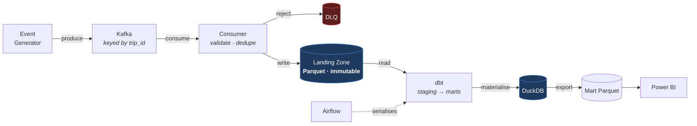

# RideFlow

**A real-time ride-hailing data platform — Kafka → Parquet lakehouse → dbt → DuckDB → Power BI, orchestrated by Airflow.**


---

> ## ⚠️ Current status: **design complete, implementation not started**
>
> This repository currently contains **documentation only**. There is no runnable code yet.
>
> The **How to Run** section below describes the *target* state and **will not work today**. It is published early so the design is reviewable before it is built — which is the whole point of finishing the specification first.
>
> **What exists:** 8 design documents, a frozen event contract, a dimensional model, and a 30-event verified sample dataset.
> **What does not:** every Python module, dbt model, Docker service, DAG, and the Power BI report.
>
> Progress is tracked in [Implementation Status](#8-implementation-status).

---

## 1. Project Overview

RideFlow models the data infrastructure behind a ride-hailing marketplace — Uber, Ola, Lyft, Grab. It ingests a continuous stream of trip lifecycle events, lands them durably, transforms them into a dimensionally modelled warehouse, and serves curated marts to a BI dashboard.

It is built as a **lakehouse**: streaming ingestion is decoupled from batch transformation by an immutable landing zone. Raw events are captured once and never mutated; all business logic lives in version-controlled, tested SQL that can be re-run against history at any time.

**This is a portfolio project built to production engineering standards** — version-controlled, containerised, tested, CI-gated, and documented. Every technology choice records the alternatives that were rejected and why.

### The business questions it answers

| Question | Why it is hard |
|---|---|
| **Marketplace health** — where is unmet demand right now? | Requires joining demand (trips) to supply (driver sessions) at zone × hour grain |
| **Conversion funnel** — where do riders drop off? | Requires modelling cancellations, not just completions |
| **Pricing effectiveness** — is surge rebalancing supply, or just suppressing demand? | Requires isolating surge revenue and controlling for weather and traffic |
| **Financial truth** — revenue reconciled to the cent | Requires fare decomposition and cross-layer reconciliation |

---

## 2. Architecture



### The decision everything else follows from

**DuckDB is a single-writer embedded database.** A consumer writing continuously into it would hold an exclusive lock forever, and dbt — running from a separate Airflow process — could never acquire it.

Rather than swap DuckDB out or attempt lock coordination, ingestion and transformation are **decoupled by an immutable landing zone**. The consumer's only write target is Parquet; dbt is the sole writer to DuckDB; Airflow's `max_active_runs=1` guarantees only one writer at a time.

This is how production lakehouses separate streaming ingest from batch transform. **The constraint pushed the design toward the correct architecture rather than away from it.**

Full detail: [`docs/architecture.md`](docs/architecture.md)

---

## 3. Tech Stack

| Layer | Technology | Chosen because | Rejected alternative |
|---|---|---|---|
| **Streaming** | Apache Kafka | Replayable log — a consumer bug is recoverable, not fatal | RabbitMQ (no replay), Kinesis (cloud-locked) |
| **Landing format** | Apache Parquet | Columnar, compressed, **engine-neutral** — no lock-in | JSON (no schema, no compression), Iceberg (complexity) |
| **Warehouse** | DuckDB | Columnar OLAP, zero setup, reads Parquet directly | Postgres (row-oriented), Snowflake (needs credentials) |
| **Transformation** | dbt | DAG from `ref()`, tests as first-class, defined idempotency | Raw SQL (rebuild it all badly), PySpark (overkill) |
| **Orchestration** | Apache Airflow | Backfill, retry policy, **concurrency control** | Prefect (lighter but weaker hiring signal), cron (no DAG) |
| **Runtime** | Docker Compose | One-command startup, no environment drift | Local installs (unreproducible), K8s (disproportionate) |
| **BI** | Power BI | Enterprise BI signal; **validates the star schema** | Streamlit (weaker signal), Tableau (no free tier) |
| **Language** | Python | Mature Kafka, Parquet, DuckDB, dbt ecosystem | Java/Scala (slow iteration), Go (fragments the stack) |

Full rationale with rejected alternatives: [`docs/architecture.md`](docs/architecture.md) §2–§8

---

## 4. Folder Structure

```
RideFlow-Data-Engineering-Pipeline/
├── event_generator/      Synthetic event generation, demand modelling, anomaly injection
├── ingestion/            Kafka consumer, validation, dedup, Parquet writer, DLQ
├── transformation/       dbt project — models, tests, macros, seeds
├── warehouse/            DuckDB connection management, read-only accessors
├── sql/                  Ad-hoc analytical and reconciliation queries
├── analytics/            Metric definitions, exploratory analysis
├── dashboard/            Power BI report + measures.md
├── data/
│   ├── raw/              ⚠️  Immutable landing zone — append-only, never committed
│   ├── processed/        Mart Parquet export for Power BI
│   └── warehouse/        DuckDB file — written only by dbt
├── docker/               Dockerfiles, Compose topology, health checks
├── docs/                 Design documentation (see §7)
├── tests/                pytest — unit, integration, contract, chaos
└── .github/workflows/    CI — lint, test, dbt parse, docs consistency
```

**Four directory-level invariants:**
1. `data/` is never committed to version control.
2. `data/raw/` is **append-only** — no process deletes or rewrites a landed file.
3. Only dbt writes to `data/warehouse/`.
4. Business logic exists **only** in `transformation/`.

---

## 5. The Pipeline

```
Generator → Kafka (keyed by trip_id, 12 partitions)
    → Consumer (validate → dedupe → batch → Parquet)
    → Landing zone (immutable, partitioned by dt/hour)
    → dbt staging      (typed, deduplicated, 1:1 with source)
    → dbt intermediate (state machine resolved, one row per trip)
    → dbt marts        (star schema, incremental with lookback)
    → DuckDB + Parquet export → Power BI
```

### What makes it correct rather than merely working

| Problem | Solution |
|---|---|
| **Duplicates** (Kafka is at-least-once) | Two-pass dedup — consumer batch window, then authoritative window function in staging |
| **Late arrivals** | Incremental filter on `ingested_at`, business grouping on `event_timestamp`, 48h lookback |
| **Out-of-order events** | Trip assembly resolves the state machine from the full event set via `causation_id`, never arrival order |
| **Malformed events** | → DLQ with rejection reason; offset committed so the partition never stalls |
| **Retry safety** | Every stage idempotent; marts use `delete+insert`, never `append` |
| **Quality** | dbt tests are a **gate** — financial invariant failures block publication |

Full detail: [`docs/etl_design.md`](docs/etl_design.md)

---

## 6. How to Run

> ⚠️ **None of this works yet.** This is the target state, published for review. See [Implementation Status](#8-implementation-status).

### Prerequisites

- Python 3.11 or 3.12 *(see [Known Constraints](#known-constraints) — 3.13 is not yet verified)*
- Docker Desktop, **running**
- Power BI Desktop *(Windows only, optional — Parquet marts are readable without it)*

### Target commands

```bash
# 1. Environment
python -m venv .venv
source .venv/Scripts/activate        # Git Bash on Windows
pip install -r requirements.txt

# 2. Infrastructure
docker compose -f docker/docker-compose.yml up -d
docker compose ps                    # verify health checks pass

# 3. Generate and ingest
python -m event_generator.main --rate 500 --duration 600 --seed 42
python -m ingestion.consumer

# 4. Transform
cd transformation && dbt deps && dbt seed && dbt run && dbt test

# 5. Explore
duckdb data/warehouse/rideflow.duckdb
```

Airflow UI at `localhost:8080`, Kafka UI at `localhost:8081`.

---

## 7. Documentation

| Document | Contents |
|---|---|
| [`PROJECT_PLAN.md`](PROJECT_PLAN.md) | Objectives, requirements, milestones, non-objectives, risk register |
| [`docs/architecture.md`](docs/architecture.md) | Technology rationale, component diagram, failure recovery, scaling |
| [`docs/data_strategy.md`](docs/data_strategy.md) | Data provenance, TLC calibration approach, Bengaluru zones, honest limits |
| [`docs/event_contract.md`](docs/event_contract.md) | **Frozen** — 9 event schemas, envelope, versioning, 20 invariants |
| [`docs/reference_data.md`](docs/reference_data.md) | 10 lookup dimensions with allowed values |
| [`docs/data_dictionary.md`](docs/data_dictionary.md) | Every warehouse column — type, rule, example, source, destination |
| [`docs/star_schema.md`](docs/star_schema.md) | Dimensional model, grain, bus matrix, additivity |
| [`docs/etl_design.md`](docs/etl_design.md) | Pipeline stages, dedup, nulls, late data, retry strategy |
| [`docs/kafka_design.md`](docs/kafka_design.md) | Topics, partitioning, delivery semantics, DLQ |
| [`docs/airflow_design.md`](docs/airflow_design.md) | DAG, tasks, retry policy, backfill, monitoring |
| [`docs/testing_strategy.md`](docs/testing_strategy.md) | Test pyramid, chaos scenarios, performance targets |
| [`LEARNING.md`](LEARNING.md) | Build journal — decisions, problems, resolutions |
| [`INTERVIEW_NOTES.md`](INTERVIEW_NOTES.md) | Question bank derived from this project |

### Data provenance

**All RideFlow events are synthetic.** The generator's demand curves, distance distributions, and fare structures are **calibrated against NYC TLC public trip records** (real Uber/Lyft trips); cancellations, driver sessions, and anomalies are modelled from business rules, because no public dataset contains labelled bad data.

**Honest limit:** calibration covers the car-based tiers only. `AUTO` and `BIKE` are hand-tuned — New York has no equivalent, and in Bengaluru those carry a large share of real demand. Full detail and the parameter-labelling scheme: [`docs/data_strategy.md`](docs/data_strategy.md).

### Sample data

[`docs/samples/sample_events.json`](docs/samples/sample_events.json) — 30 events, 5 complete trip lifecycles, 3 driver sessions. **Hand-authored** in M1 as a test fixture, because real data never contains edge cases labelled on demand.

**Its invariants were verified programmatically, not assumed.** F1–F7 (fare decomposition, payout split, surge derivation), T1–T2 (temporal ordering), I2/I3 (key alignment), C1 (causation resolution), S4 (status exclusivity), and every stored duration checked against its own timestamps.

Edge cases included: cancelled ride (rider and driver), late driver (+9.7 min past ETA), payment failure and retry, peak-hour surge (2.30×), airport pickup, duplicate event, and out-of-order delivery (`RideCompleted` arriving 14 seconds **before** its `RideStarted`).

---

## 8. Implementation Status

| # | Milestone | Status |
|---|---|---|
| M0 | Foundation & environment | ⚠️ **Blocked** — see below |
| M1 | Domain model & event contract | ✅ **Complete** |
| M2 | Event generator | ⬜ Not started |
| M3 | Streaming infrastructure | ⬜ Not started |
| M4 | Ingestion consumer | ⬜ Not started |
| M5 | Warehouse & dbt foundation | ⬜ Not started |
| M6 | Dimensional model | ⬜ Not started |
| M7 | Data quality | ⬜ Not started |
| M8 | Orchestration | ⬜ Not started |
| M9 | Analytics & dashboard | ⬜ Not started |
| M10 | Hardening & documentation | ⬜ Not started |

### Known Constraints

Three items must be resolved before implementation begins. They were found by inspecting the actual environment, not assumed:

1. **Docker daemon is not running.** Docker Desktop 28.4.0 and Compose v2.39.4 are installed, but the engine is not started. M3 onward cannot be tested until it is.
2. ~~**Python 3.13 compatibility with dbt.**~~ ✅ **Resolved.** Verified against the package index, not assumed: dbt-core 1.12.0, dbt-duckdb 1.10.1, duckdb 1.5.5, confluent-kafka 2.15.0 and pyarrow 25.0.0 all resolve together on Python 3.13.5 with native cp313 wheels. Pinned in [`requirements.txt`](requirements.txt).
3. **The system interpreter path contains a space and an ampersand** (`...\AI & ML\python.exe`). `&` is a shell metacharacter and breaks unquoted tooling on Windows. A project-local `.venv` is required.

### Known Design Gaps

Documented deliberately rather than discovered later:

| Gap | Impact | Resolution |
|---|---|---|
| **No `RideExpired` event** | Expiry must be *inferred* from a timeout, making it indistinguishable from lost events | Contract v1.1 |
| **No `PaymentFailed` event** | A payment that never succeeds is unrepresentable; `payment_status` is always `SUCCEEDED` | Contract v1.1 |
| **`POOL` trips modelled as independent** | Over-counts vehicle-hours for pooled trips | Needs a `fct_pool_segments` grain |
| **Driver status only at session start** | Intra-session `AVAILABLE` → `ON_TRIP` transitions are invisible | Needs a `DriverStatusChanged` event |
| **Power BI weakens reproducibility** | `.pbix` is a binary blob; Desktop is Windows-only | Mitigated by Parquet mart export |

---

## 9. Future Scope

**Near-term** — Schema Registry (Avro), real-time aggregation layer, data contract testing in CI.

**Medium-term** — Open table format (Iceberg/Delta), cloud warehouse migration, Prometheus + Grafana observability, column-level lineage.

**Long-term** — Distributed processing (only once volume warrants it), CDC ingestion via Debezium, streaming feature store, multi-region data mesh, per-query cost attribution.

Each with its justifying trigger: [`PROJECT_PLAN.md`](PROJECT_PLAN.md) §11

---

## 10. Screenshots

> Added as milestones complete. Planned: Kafka UI topic throughput, Airflow DAG graph and Gantt, dbt lineage DAG, Power BI marketplace-health and funnel pages, and a chaos test demonstrating zero data loss across a forced consumer restart.

---

## License

MIT
