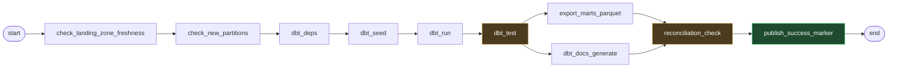

# RideFlow — Airflow Design

**DAG structure, task dependencies, retry policy, backfill, and monitoring.**

| Field | Value |
|---|---|
| Version | `1.0.0` |
| Status | Approved for implementation |
| Milestone | M8 |
| Last updated | 2026-08-06 |
| Deployment | Docker Compose (webserver, scheduler, metadata Postgres) |

---

## 0. What Airflow is actually for here

Airflow does three jobs in RideFlow, and the third is the one that matters most architecturally:

1. **Schedule** the transformation on a fixed cadence.
2. **Retry and alert** on failure, with policy that varies by failure class.
3. **Serialise dbt runs** — `max_active_runs=1` is the mechanism that enforces the single-writer invariant that the entire architecture rests on (`architecture.md` §1.1).

Point 3 is not a scheduling convenience. DuckDB takes an exclusive write lock; two concurrent dbt runs would collide. Airflow's concurrency control is what makes the lakehouse design safe in practice rather than only on paper.

**Airflow does not orchestrate ingestion.** The Kafka consumer is a long-running service, not a scheduled task. Airflow *checks* that ingestion is healthy and *reacts* to it, but never starts or stops it — scheduling a continuous stream consumer would be a category error.

---

## 1. The DAG

**`rideflow_transform_hourly`**



### 1.1 DAG-level configuration

| Setting | Value | Reason |
|---|---|---|
| `schedule` | `0 * * * *` (hourly) | Meets the < 15 min freshness target with margin; short enough that a failed run's backlog stays small |
| `start_date` | Fixed past date | **Never `days_ago()`** — a moving start date makes runs non-reproducible and backfill ranges ambiguous |
| `catchup` | `False` | Prevents a storm of runs on first deploy or after downtime. Backfill is explicit and parameterised (§5). |
| **`max_active_runs`** | **`1`** | **Enforces single-writer on DuckDB.** The most important setting in the file. |
| `max_active_tasks` | `4` | Bounds local resource use |
| `default_args.owner` | `data-engineering` | Alert routing |
| `default_args.depends_on_past` | `False` | An hour's failure must not block the next hour indefinitely |
| `dagrun_timeout` | 45 min | Below the schedule interval, so a hung run cannot overlap the next |
| `tags` | `["rideflow","transform","dbt"]` | UI filtering |

**`catchup=False` combined with explicit backfill is deliberate.** With `catchup=True`, deploying a DAG with a start date three months back would immediately queue ~2,000 runs — and `max_active_runs=1` means they would execute serially for days while the current hour goes unprocessed. Backfill should be a decision, not an accident of configuration.

**`dagrun_timeout` below the schedule interval** guarantees a hung run is killed before the next is due, so `max_active_runs=1` never causes an unbounded queue.

---

## 2. Tasks

| # | Task | Operator | Purpose | Retries | Failure = |
|---|---|---|---|---|---|
| 1 | `check_landing_zone_freshness` | Sensor / Python | Landing zone has data newer than threshold | 2 | **Warn** — no new data may be legitimate |
| 2 | `check_new_partitions` | Python | Identify partitions to process | 3 | Hard |
| 3 | `dbt_deps` | Bash | Install dbt packages | 2 | Hard |
| 4 | `dbt_seed` | Bash | Load reference-data CSVs | 2 | Hard |
| 5 | `dbt_run` | Bash | Build staging → intermediate → marts | 3 | Hard |
| 6 | `dbt_test` | Bash | **Quality gate** | **0** | Hard — see §3.2 |
| 7 | `export_marts_parquet` | Bash | Export marts for Power BI | 3 | Hard |
| 8 | `dbt_docs_generate` | Bash | Lineage documentation | 1 | **Warn** |
| 9 | `reconciliation_check` | Python | N1–N5 cross-layer reconciliation | 0 | Hard |
| 10 | `publish_success_marker` | Python | Mark the run complete | 2 | Hard |

### 2.1 Task detail

**1 — `check_landing_zone_freshness`.** Verifies the newest landing-zone partition is within the freshness threshold. A failure means the consumer may be down or Kafka may be stalled. Classified **warn**, not hard: at 3 a.m. there may genuinely be no new trips, and failing the DAG for correct quiet-hour behaviour would train people to ignore alerts.

**2 — `check_new_partitions`.** Determines which `dt`/`hour` partitions the run covers, including the lookback window (`etl_design.md` §6.2). Pushes the range to XCom for downstream tasks.

**4 — `dbt_seed`.** Loads the ten reference tables from `reference_data.md`. Runs every cycle because seeds are small and it guarantees dimensions match the committed CSVs — a dimension that has silently drifted from its seed file is very hard to detect otherwise.

**5 — `dbt_run`.** The main build, with the lookback range passed as a dbt variable so incremental models reprocess late arrivals.

**6 — `dbt_test`.** All schema tests, business assertions, and financial invariants (F1–F7). **This is the quality gate: if it fails, nothing downstream executes and marts are not published.**

**7 — `export_marts_parquet`.** Writes marts to `data/processed/` for Power BI. This is what keeps the serving layer engine-neutral and preserves reviewer access on non-Windows machines (`architecture.md` §0).

**9 — `reconciliation_check`.** N1–N5 from `etl_design.md` §10 — counts across layers, financial totals, orphan checks. Runs *after* export so a mismatch is caught before the run is declared successful.

**10 — `publish_success_marker`.** Writes a timestamped marker recording the run id, partitions processed, and row counts. This marker is what the dashboard reads to display its freshness indicator — without it, Power BI cannot honestly distinguish "current" from "stale".

---

## 3. Dependencies and Retry Policy

### 3.1 Why the dependency shape is what it is

`dbt_test` **must** sit between `dbt_run` and `export_marts_parquet`. That ordering is the entire quality gate: it guarantees no untested data reaches the serving layer.

`export_marts_parquet` and `dbt_docs_generate` run in parallel — independent of each other, both dependent on tests passing. `reconciliation_check` joins them back, so the run cannot be declared successful until both the export and the cross-layer counts are verified.

### 3.2 Retry policy by failure class

| Class | Tasks | Retries | Backoff | Reason |
|---|---|---|---|---|
| **Transient** | freshness, partitions, deps, seed, run, export | 2–3 | Exponential, 1m base, 10m cap | Broker unavailability, lock contention, transient I/O |
| **Data quality** | `dbt_test`, `reconciliation_check` | **0** | — | **Retrying identical data produces an identical failure** |
| **Advisory** | `dbt_docs_generate` | 1 | 1m | Non-blocking |

**Zero retries on quality gates is the important policy.** A dbt test failure is deterministic — the same data tested again fails again. Retrying burns the retry budget on a guaranteed failure and delays the alert by the full backoff sequence, turning a 1-minute notification into a 15-minute one for no benefit.

This is one of the most common orchestration mistakes: applying a uniform retry policy to every task because it is simpler to configure.

### 3.3 Exponential backoff

`retry_delay=60s`, `retry_exponential_backoff=True`, `max_retry_delay=600s` → 1m, 2m, 4m, capped at 10m.

Exponential rather than fixed because transient failures often have a recovery time proportional to their severity. Hammering a struggling broker every 60 seconds can prevent the recovery it is waiting for.

---

## 4. Schedule

### 4.1 Why hourly

| Interval | Assessment |
|---|---|
| Every 5 min | Freshest, but Airflow scheduling overhead becomes a large fraction of the work, and small-file pressure worsens |
| **Hourly** | **Chosen** — meets < 15 min freshness with margin, aligns with `hour=` partitioning, keeps failure backlog small |
| Daily | Too stale for an operational marketplace dashboard |

Hourly also aligns naturally with the landing-zone partition layout, so `check_new_partitions` maps cleanly onto directory boundaries.

### 4.2 Freshness is not the schedule interval

An hourly DAG does **not** mean data is at most one hour old. Real end-to-end freshness is:

```
consumer batch delay (≤ 60s)
  + wait for next DAG tick (0–60 min)
  + DAG runtime (~5–10 min)
  ────────────────────────────────
  = worst case ~71 min, typical ~35 min
```

The < 15 min target in `PROJECT_PLAN.md` §6.2 refers to **pipeline processing latency**, not scheduling latency. This distinction should be stated rather than glossed — a dashboard claiming "15 minute freshness" while showing hour-old data is a credibility problem, which is exactly why `publish_success_marker` records the actual watermark.

---

## 5. Backfill

### 5.1 Mechanism

Parameterised via DAG run configuration:

```json
{ "backfill_start": "2026-03-01", "backfill_end": "2026-03-17", "full_refresh": false }
```

The range is passed to dbt as variables; incremental models `delete+insert` over it. The landing zone is never touched.

### 5.2 Why backfill is safe

**Idempotency.** `delete+insert` (`etl_design.md` §7.1) means re-running any window produces identical output. An `append` strategy would double-count on every backfill, which is why the incremental strategy choice and the backfill capability are the same decision viewed twice.

### 5.3 Backfill scenarios

| Scenario | Action |
|---|---|
| Logic bug in a mart | Fix model → backfill affected range |
| Late data beyond lookback | Backfill the affected days |
| New column added | `full_refresh=true` over full history |
| Reference data corrected | Backfill from the correction date |
| Warehouse corrupted | Full rebuild from the landing zone |

**Backfill is the recovery path for every logic bug**, and it works only because raw data was preserved before transformation — the concrete payoff of ELT over ETL.

### 5.4 Why not `catchup=True`

Airflow's built-in catchup would queue every missed interval automatically. With `max_active_runs=1` those execute serially, so a three-month gap becomes days of serial runs while the current hour goes unprocessed.

Explicit backfill lets the operator choose the range, the order, and whether a full refresh is needed. **Recovery should be a decision, not an automatic stampede.**

---

## 6. Monitoring and Alerting

### 6.1 What is monitored

| Signal | Threshold | Severity |
|---|---|---|
| DAG run failure | Any | **High** |
| `dbt_test` failure | Any | **High** — data quality breach |
| `reconciliation_check` failure | Any | **Critical** — counts do not agree |
| Financial invariant (F1–F7) failure | Any | **Critical** |
| DAG duration | > 30 min | Medium |
| Landing zone stale | > 2 h | Medium |
| Consecutive failures | ≥ 2 | **High** |
| SLA miss | Run not complete within 45 min | Medium |

### 6.2 Alert routing by class

| Class | Channel | Rationale |
|---|---|---|
| Critical (financial, reconciliation) | Immediate page | Wrong money is worse than no money |
| High (test failure, DAG failure) | Notification | Needs same-day attention |
| Medium (duration, staleness) | Daily digest | Trend signal, not an incident |
| Advisory (docs) | Log only | No action needed |

**Alerting is graded because ungraded alerting is ignored alerting.** If a docs-generation warning pages someone at 2 a.m., the next genuine financial alert will be muted.

### 6.3 What Airflow's UI gives for free

Gantt view (which task is the bottleneck), task duration trends (creeping runtime before it breaches SLA), log access per attempt, and the dependency graph with live status. These matter for a portfolio project — being able to *show* a failed run being diagnosed is stronger evidence than describing it.

### 6.4 Callbacks

`on_failure_callback` at DAG level (run failed, which task, link to logs) and task level for the quality gates specifically — a `dbt_test` failure alert should name the failing test and the affected model, not merely report that a task exited non-zero.

---

## 7. Deployment

### 7.1 Services

| Service | Purpose |
|---|---|
| `airflow-webserver` | UI |
| `airflow-scheduler` | Parses DAGs, schedules and dispatches tasks |
| `airflow-postgres` | **Metadata only** — DAG runs, task states, connections |

**`airflow-postgres` contains no RideFlow business data.** Confusing Airflow's metadata store with the analytical warehouse is a common misreading; they are entirely separate systems with separate lifecycles and separate backup requirements.

### 7.2 Executor

**LocalExecutor.** SequentialExecutor cannot run tasks in parallel; Celery/Kubernetes executors add brokers and workers for scale this project explicitly does not need (`PROJECT_PLAN.md` §3.2). LocalExecutor gives real parallelism with no extra infrastructure.

### 7.3 Volume mounts

| Host | Container | Mode |
|---|---|---|
| `transformation/` | dbt project | read-write (dbt needs `target/`) |
| `data/raw/` | landing zone | **read-only** |
| `data/warehouse/` | DuckDB file | read-write |
| `data/processed/` | mart export | read-write |

**The landing zone is mounted read-only**, enforcing its immutability at the filesystem level rather than by convention. A bug that attempts to delete a landed file fails with a permission error instead of silently destroying the system of record.

### 7.4 Python version

Airflow runs on the container image's own interpreter, insulating it from the host's Python 3.13 (`PROJECT_PLAN.md` §7.9). **dbt runs inside the Airflow container**, so the dbt-core / dbt-duckdb version compatibility risk applies to the image build, not the host venv — this narrows blocking item A6 but does not eliminate it, and the pinned versions must still be verified at build time rather than assumed.

---

## 8. Design decisions worth defending

| Decision | Reasoning |
|---|---|
| **`max_active_runs=1`** | Enforces DuckDB single-writer — the architecture depends on it |
| **`catchup=False` + explicit backfill** | Prevents an accidental multi-day serial stampede on deploy |
| **Zero retries on quality gates** | Deterministic failures gain nothing from retry and delay the alert |
| **Fixed `start_date`, never `days_ago()`** | Moving start dates make runs non-reproducible |
| **`dagrun_timeout` < schedule interval** | A hung run cannot overlap the next |
| **Landing zone mounted read-only** | Immutability enforced by the OS, not by convention |
| **Airflow does not run the consumer** | Streaming is a service, not a scheduled task |
| **LocalExecutor** | Real parallelism without Celery's infrastructure |
| **Graded alert severity** | Ungraded alerting is ignored alerting |
| **`dbt_test` between run and export** | The gate only works if nothing bypasses it |

---

## 9. Related documents

| Document | Covers |
|---|---|
| `docs/etl_design.md` | What the dbt tasks actually do |
| `docs/architecture.md` | Why Airflow, failure recovery |
| `docs/kafka_design.md` | The ingestion side Airflow monitors but does not control |
| `docs/testing_strategy.md` | The tests the quality gate runs |
| `PROJECT_PLAN.md` | M8 exit criteria |
