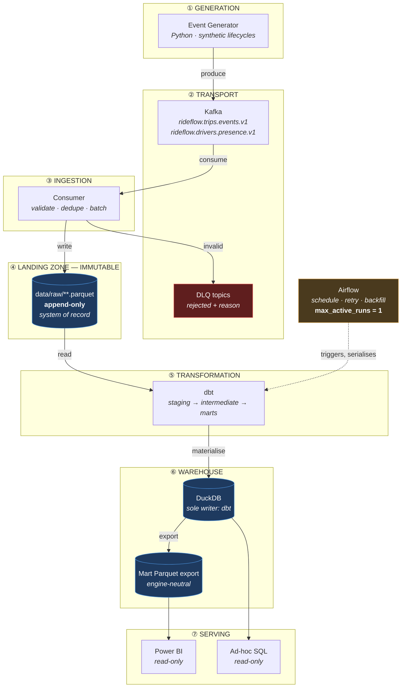
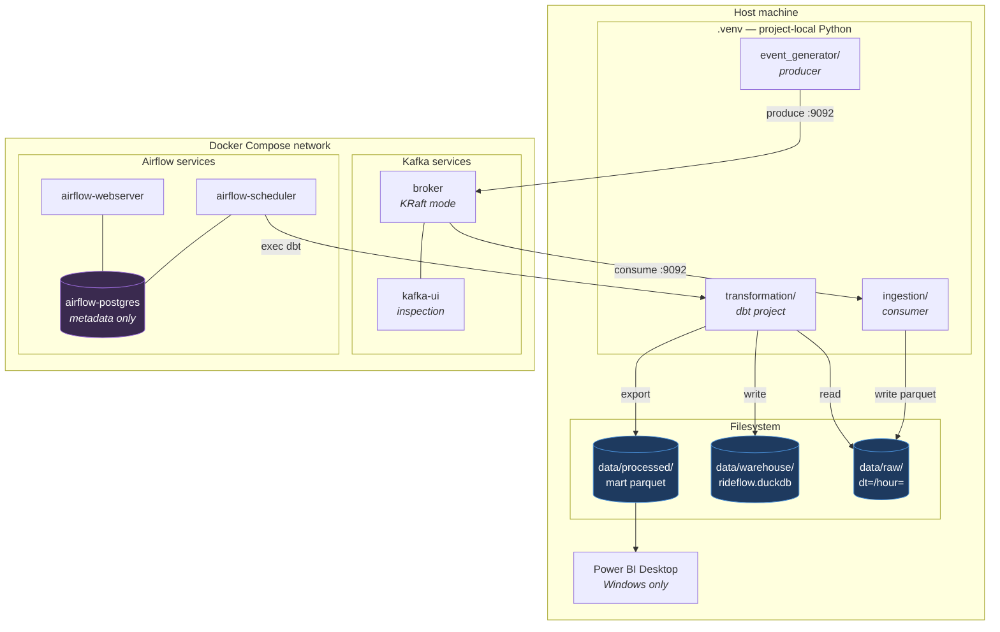

# RideFlow — Architecture

**Technical architecture, technology rationale, failure recovery, and scaling strategy.**

| Field | Value |
|---|---|
| Version | `1.1.0` |
| Status | Approved for implementation |
| Milestone | M1 |
| Last updated | 2026-08-05 |

> **Relationship to `PROJECT_PLAN.md`.** The plan states *what* is being built and *why it matters to the business*. This document states *how it works* and *why each component was chosen over its alternatives*. Where the plan gives a one-paragraph rationale (§7), this document gives the mechanism, the failure behaviour, and the point at which the choice stops being correct.

---

## 0. Change from PROJECT_PLAN.md: Power BI replaces Streamlit

`PROJECT_PLAN.md` §7.8 named Streamlit as the serving layer. **This document supersedes that: the serving layer is Power BI.**

The change is justified — Power BI is a far stronger hiring signal for data and analytics engineering roles than a Python dashboard framework, and BI-tool fluency is a stated requirement in a large share of job descriptions. But it carries a cost that must be recorded rather than discovered later.

| | Streamlit (superseded) | Power BI (adopted) |
|---|---|---|
| Resume signal | Weak — reads as a Python side project | **Strong — a named enterprise BI tool** |
| Runs on | Any OS | **Power BI Desktop is Windows-only** |
| Reviewer can open it | Yes, from a clean clone | **Only on Windows, with Power BI installed** |
| Connection to DuckDB | Native Python driver | ODBC driver or Parquet export (§7) |
| Version control | Plain Python, diffable | `.pbix` is a **binary blob** — no meaningful diffs, no code review |
| Automated testing | Testable | **Not testable in CI** |

**Two guarantees from the plan are weakened by this change, and both are stated honestly rather than quietly dropped:**

1. **§6.7 Reproducibility** — "one command to start the platform" no longer covers the dashboard. A reviewer on macOS or Linux can run the entire pipeline and query the warehouse, but cannot open the report.
2. **§6.4 Maintainability** — "every transformation in version-controlled SQL, no logic in dashboards" is now at *risk*, because Power BI makes it easy to write DAX that silently becomes business logic outside dbt.

**Mitigation, which is binding:**

- **All business logic stays in dbt.** DAX is restricted to presentation-layer formatting and simple aggregation over pre-computed marts. Any measure that defines a business rule belongs in a dbt model, not in a `.pbix`. This is the single most important discipline in the serving layer, because violating it recreates exactly the "logic scattered across dashboards" problem the architecture was designed to prevent.
- **Marts are exported to Parquet** alongside the DuckDB warehouse, so the analytical layer stays engine-neutral and a non-Windows reviewer retains full query access.
- **Every DAX measure is documented** in `dashboard/measures.md` with its dbt-model equivalent, so the report's logic is reviewable even though the file is not.

---

## 1. High-Level Architecture

RideFlow is a **lakehouse**: streaming ingestion is decoupled from batch transformation by an immutable landing zone.



### 1.1 The one decision everything else follows from

**DuckDB is a single-writer embedded database.** It takes an exclusive file lock. A consumer writing continuously into DuckDB would hold that lock forever, and dbt — running in a separate Airflow worker process — could never acquire it.

Three options were evaluated:

| Option | Verdict |
|---|---|
| Swap DuckDB for PostgreSQL to allow concurrent writes | **Rejected** — solves the lock, discards columnar analytical performance and zero-setup reproducibility |
| Coordinate lock handoff between consumer and dbt | **Rejected** — fragile, introduces deadlock and starvation, couples two systems that should know nothing about each other |
| **Decouple ingestion from transformation with an immutable landing zone** | **Adopted** |

The consumer's only write target is Parquet. It never opens DuckDB. dbt is the sole writer, and Airflow's `max_active_runs=1` guarantees only one dbt process runs at a time.

This is how production lakehouses actually separate streaming ingest from batch transform. **The constraint pushed the design toward the correct architecture rather than away from it** — which is the general lesson of the project.

---

## 2. Why Kafka?

### What it does here

Kafka is the durable, replayable log between the generator and the warehouse. It absorbs bursts the consumer cannot immediately process, and it retains events so a consumer bug is recoverable instead of fatal.

### Why it was chosen

**Replayability is the property that matters most.** A message queue deletes a message once consumed. If the consumer had a bug, the data is gone. Kafka retains events for a configured window, so a bug found on Thursday can be fixed and the week's events reprocessed. This single property converts an entire class of incidents from data loss into inconvenience.

**Ordering within a partition.** Keying by `trip_id` puts every event for a trip on one partition, in order, without paying for global ordering. Per-trip ordering is what the business needs; global ordering is what would be expensive.

**Consumer groups.** Adding consumers scales throughput with no producer change and no code change — Kafka rebalances partitions automatically.

**Backpressure decoupling.** A slow consumer does not slow the producer. The log absorbs the difference.

**Industry standard.** Near-universal in data engineering, so the skill transfers directly.

### Alternatives rejected

| Alternative | Why not |
|---|---|
| **RabbitMQ** | A queue, not a log. Messages are consumed and gone — replay is impossible. This alone disqualifies it. |
| **AWS Kinesis / GCP Pub-Sub** | Managed and capable, but cloud-locked, costs money, and cannot be run by a reviewer from a clean clone. |
| **Apache Pulsar** | Genuinely good — tiered storage and multi-tenancy are real advantages over Kafka. Rejected on **ecosystem and hiring signal**, not on technical merit: far fewer job descriptions ask for it, and the tooling around it is thinner. |
| **Direct file writes** | Sidesteps every distributed-systems problem the project exists to demonstrate. Simpler, and teaches nothing. |

### When this choice stops being correct

Below roughly 100 events/sec with no replay requirement, Kafka is overhead. At that scale, appending to files is the right answer, and choosing Kafka anyway would be resume-driven development.

---

## 3. Why Parquet?

### What it does here

Parquet is the format of the landing zone — the immutable system of record from which the entire warehouse can be rebuilt.

### Why it was chosen

**Columnar storage.** An analytical query touching 3 of 25 columns reads only those 3. Row formats read all 25. On wide fact tables this is a large constant-factor difference on almost every query.

**Compression.** Columnar layout compresses far better than row layout because values in a column are homogeneous. Typical reduction versus JSON is 5–10×, which matters directly for both storage and scan time.

**Embedded schema.** Each file carries its own schema. This is what makes schema evolution work: v1.0 and v1.1 files coexist in the same directory, and the reader reconciles them, filling absent columns with null.

**Predicate and partition pushdown.** Hive-style partitioning (`dt=2026-03-17/hour=02/`) lets the query engine skip entire directories without opening them. A query for one hour reads one directory, not the whole landing zone.

**Engine neutrality — the strategic reason.** DuckDB, Spark, Snowflake, BigQuery, Polars, and Pandas all read Parquet. The landing zone therefore never becomes a lock-in point. Every future migration path in `PROJECT_PLAN.md` §11 depends on this one property.

### Alternatives rejected

| Alternative | Why not |
|---|---|
| **JSON / JSONL** | No schema enforcement, no compression, full scan on every read. Fine for transport, wrong for storage. |
| **CSV** | All of the above, plus no type information and ambiguous null handling. |
| **Avro** | Row-oriented — better for *streaming* than for *analytics*. Excellent choice for the Kafka message format later (§ `kafka_design.md`), wrong for the analytical landing zone. |
| **Delta Lake / Iceberg** | **Genuinely better** — ACID transactions, time travel, safe schema evolution, and compaction. Rejected only because the operational complexity is not justified at this scale. This is the most defensible "why didn't you use X" question, and the honest answer is that it is a planned upgrade, not an oversight. |

### Known weakness

**Small-file proliferation.** A consumer flushing frequently produces many small files, and query performance degrades because per-file overhead dominates. Mitigated by deliberate batch sizing and, if measured degradation appears, a compaction step. Tracked in `PROJECT_PLAN.md` Appendix B.

---

## 4. Why DuckDB?

### What it does here

DuckDB is the analytical warehouse — where dbt materialises the star schema and where analysts and Power BI read from.

### Why it was chosen

**Columnar OLAP performance with zero infrastructure.** Vectorised execution and columnar storage give genuine analytical performance, in-process, with no server to run.

**Reads Parquet directly.** `SELECT * FROM 'data/raw/**/*.parquet'` works with no import step. The landing zone is queryable as if it were already a table, which removes an entire load stage from the architecture.

**Zero setup — decisive for a portfolio project.** A reviewer clones the repository and runs real analytical SQL immediately. No container, no credentials, no cost. Nothing else in this category offers that.

**Portable SQL dialect.** Close enough to PostgreSQL and Snowflake that the dbt modelling work transfers to a cloud warehouse largely unchanged.

### The trade-off accepted

**Single writer, single node.** This directly caused §1.1 and is the most instructive constraint in the project. It is a real limitation, not a detail.

### Alternatives rejected

| Alternative | Why not |
|---|---|
| **PostgreSQL** | Row-oriented, materially slower on wide analytical scans, and needs a running server. Would allow concurrent writes — the one thing DuckDB cannot do — but the cost is the wrong storage model for the workload. |
| **Snowflake / BigQuery** | The production-realistic answer, and what a real company would use. Rejected because credentials and cost mean **no reviewer can run the project**. For a portfolio artefact, that is disqualifying. |
| **SQLite** | Row-oriented, built for transactions, not analytics. Same single-writer constraint with none of the columnar benefit. |
| **ClickHouse** | Excellent analytical performance, but requires a server and is heavier operationally than the workload justifies. |

### When this choice stops being correct

When data exceeds single-node memory and disk, or when concurrent writers become a genuine requirement rather than an artefact of poor design. `PROJECT_PLAN.md` §6.3 documents the escape hatch: because the landing zone is Parquet, migrating to a cloud warehouse means re-pointing dbt, not rebuilding the pipeline.

---

## 5. Why dbt?

### What it does here

dbt owns **all** business logic. Staging, intermediate, and mart models are SQL files under version control, with tests, documentation, and a dependency graph.

### Why it was chosen

**It makes transformation engineering rather than scripting.** That claim is concrete:

| Capability | What it replaces |
|---|---|
| DAG inferred from `ref()` | A hand-maintained execution order that drifts out of sync with reality |
| Tests as first-class objects | Ad-hoc validation scripts nobody runs |
| Incremental materialisation | Hand-written merge logic, reimplemented per model |
| Environment separation | Hard-coded database names |
| Auto-generated lineage docs | A stale diagram in a wiki |
| Jinja macros | Copy-pasted SQL |

**Idempotency semantics are defined, not improvised.** dbt's incremental strategies have documented behaviour on re-run. Hand-written SQL requires that behaviour to be designed and defended per model.

**Lineage is derived from the code.** Because dependencies come from `ref()`, the lineage graph cannot be wrong. A diagram maintained by hand always eventually is.

**`dbt-duckdb` is a mature adapter**, and dbt is the dominant tool in the modern data stack — directly marketable.

### Alternatives rejected

| Alternative | Why not |
|---|---|
| **Hand-written SQL + Python runner** | Every capability in the table above would have to be rebuilt, badly. The DAG is the part most often gotten wrong. |
| **PySpark** | A distributed engine's overhead with none of its benefit at this data volume. Correct at roughly 100× the scale. |
| **Pandas** | Memory-bound, hard to test at model granularity, and moves logic out of SQL into imperative code where it is harder to review. |
| **SQLMesh** | Genuinely interesting — stronger column-level lineage and virtual data environments. Rejected on ecosystem maturity and hiring signal, the same reasoning as Pulsar. |

---

## 6. Why Airflow?

### What it does here

Airflow schedules the transformation, retries on failure, backfills history, and — critically — **serialises dbt runs**.

### Why it was chosen

**Concurrency control enforces the core architectural invariant.** `max_active_runs=1` is what guarantees only one process ever writes to DuckDB. This is not a scheduling convenience; it is the mechanism that makes §1.1 safe.

**Backfill is a first-class operation.** Re-materialising an arbitrary historical window is a parameterised command, not a bespoke script. Combined with dbt's idempotency, this makes recovery routine.

**Retry semantics.** Exponential backoff, configurable attempt limits, and per-task granularity — a transient failure retries the failed task, not the whole pipeline.

**Dependency management and visibility.** The DAG is explicit and inspectable; a failed run shows exactly which task failed and why.

**Industry default.** The most requested orchestrator in data engineering job descriptions.

### The trade-off accepted

**Airflow is heavy.** Multiple containers, non-trivial local memory and CPU. This is accepted deliberately: the lighter alternatives teach less and signal less.

### Alternatives rejected

| Alternative | Why not |
|---|---|
| **Prefect** | Lighter, pip-installable, arguably better-designed API. Rejected purely on hiring signal — Airflow appears in far more job requirements. An honest answer in an interview is that Prefect would be a better *engineering* choice for a project this size. |
| **Dagster** | Asset-oriented model is a genuinely better fit for a data platform than Airflow's task-oriented one. Same rejection reasoning as Prefect. |
| **Cron** | No dependency management, no retry semantics, no backfill, no visibility into failure. It runs things; it does not orchestrate them. |
| **dbt Cloud scheduler** | Would orchestrate dbt but nothing else — no ingestion checks, no export step, no cross-system dependencies. |

---

## 7. Why Power BI?

### What it does here

Power BI is the serving layer — the operational dashboard answering the business questions in `PROJECT_PLAN.md` §2.1.

### Why it was chosen

**Enterprise BI fluency is a hiring requirement**, not a nice-to-have. Power BI and Tableau dominate the BI market, and "built a Streamlit app" and "built a Power BI report against a dimensional model" are read very differently by hiring managers.

**It validates the star schema.** This is the underrated technical reason. Power BI's model view expects conformed dimensions and clean fact-to-dimension relationships. A badly-modelled warehouse becomes obvious immediately — ambiguous relationships, bidirectional filter warnings, unusable measures. **The BI tool is a test of the dimensional model**, and a star schema that works cleanly in Power BI is very likely correct.

**Purpose-built for slice-and-dice**, which is exactly the access pattern the marts are designed for.

### Connection strategy — two options, one recommendation

| Option | Mechanism | Assessment |
|---|---|---|
| **A — DuckDB via ODBC** | Official DuckDB ODBC driver, Power BI ODBC connector | Direct, live against the warehouse. The driver is officially supported but less battle-tested than mainstream database drivers. **Must be verified during M10 rather than assumed.** |
| **B — Parquet mart export** *(recommended)* | dbt exports marts to Parquet; Power BI's native Parquet connector reads them | Fewer moving parts, no driver dependency, and the export keeps the analytical layer engine-neutral for non-Windows reviewers |

**Recommendation: B, with A as a stretch goal.** Option B also directly mitigates the §0 reproducibility regression, since the exported Parquet marts remain queryable by anyone on any platform.

### Alternatives rejected

| Alternative | Why not |
|---|---|
| **Streamlit** | Originally chosen (`PROJECT_PLAN.md` §7.8). Cross-platform, version-controllable, testable — genuinely better on engineering grounds. Superseded because the hiring signal is materially weaker. |
| **Tableau** | Comparable BI signal, but no free desktop tier suitable for a portfolio project. |
| **Metabase / Superset** | Open-source and container-friendly, which fits the architecture better. Weaker hiring signal than Power BI. |
| **Grafana** | Built for time-series operational monitoring, not dimensional business analytics. Wrong tool for this job. |

### The binding constraint

**No business logic in DAX.** Restated here because it is the single discipline that determines whether the serving layer strengthens or undermines the architecture. Any measure that encodes a business rule belongs in dbt.

---

## 8. Why Docker?

### What it does here

Docker Compose declares the multi-service topology: Kafka, Airflow's components, and their networking, volumes, and health checks.

### Why it was chosen

**It makes "one command to start the platform" achievable.** Kafka and Airflow are multi-process systems with real dependency ordering. Compose expresses that as version-controlled configuration rather than a README full of manual steps.

**It eliminates environment drift** — the same image runs identically on every machine.

**Health checks encode startup ordering.** Airflow must not initialise before its metadata database is accepting connections. Compose expresses this dependency declaratively; a shell script would express it as a `sleep` and hope.

**It isolates the Python version problem.** Airflow runs on its own interpreter inside its image, insulating it from the host's Python 3.13 (`PROJECT_PLAN.md` §7.9).

### Alternatives rejected

| Alternative | Why not |
|---|---|
| **Local installs** | Unreproducible, platform-specific, and hostile to any reviewer. Running Kafka natively on Windows is its own ordeal. |
| **Kubernetes** | Correct for production deployment, wildly disproportionate for local development. Would add more complexity than the entire rest of the project. |
| **Vagrant / full VMs** | Heavier and slower than containers with no compensating benefit. |

### Current blocker

**The Docker daemon is not running on this machine.** Docker Desktop 28.4.0 and Compose v2.39.4 are installed, but the engine is not started. M3 onward cannot be tested until it is.

---

## 9. Component Diagram



### 9.1 What runs where, and why

| Component | Location | Reason |
|---|---|---|
| Kafka broker | Docker | Multi-process, JVM-based, painful to run natively on Windows |
| Airflow (web, scheduler, metadata DB) | Docker | Multi-service; also isolates it from host Python 3.13 |
| Event generator | Host venv | Fast iteration during development; no service dependencies |
| Consumer | Host venv | Same. Containerised later in M10 for the one-command demo |
| dbt | Executed by Airflow, mounted from host | Must write to the host DuckDB file |
| DuckDB file | Host filesystem | Embedded — belongs to whichever process opens it, and only one does |
| Power BI Desktop | Host, Windows | Cannot be containerised |

### 9.2 The Airflow metadata database is not the warehouse

`airflow-postgres` stores DAG runs, task states, and connections. **It contains no RideFlow business data.** Confusing Airflow's metadata store with the analytical warehouse is a common misreading of this kind of diagram, and they are entirely separate systems with separate lifecycles.

---

## 10. Data Flow

Covered in full in `PROJECT_PLAN.md` §8 and `docs/etl_design.md`. Summarised here for completeness:

```
Generator → Kafka (keyed by trip_id) → Consumer (validate, dedupe, batch)
    → Parquet landing zone (immutable, partitioned by dt/hour)
    → dbt staging (typed, deduplicated, 1:1 with source)
    → dbt intermediate (state machine resolved, one row per trip)
    → dbt marts (star schema, incremental)
    → DuckDB + Parquet export → Power BI / SQL
```

**Offsets are committed only after a durable Parquet write.** This makes delivery at-least-once, and downstream idempotency converts it to effectively-once. Committing before the write would make it at-most-once and permit silent data loss on crash.

---

## 11. Failure Recovery

Each row states what breaks, what happens automatically, and what a human must do.

| Failure | Blast radius | Automatic behaviour | Manual action | Data loss |
|---|---|---|---|---|
| **Generator crashes** | New events stop | None | Restart | None — no events were produced to lose |
| **Kafka broker down** | Producer cannot publish | Producer buffers and retries with backoff; consumer waits | Restart broker | None if the outage is shorter than the producer buffer; beyond that, unproduced events are lost at source |
| **Consumer crashes mid-batch** | Ingestion pauses | On restart, resumes from **last committed offset** | Restart | **None.** Uncommitted events are redelivered. Duplicates are expected and removed downstream. |
| **Consumer crashes after write, before commit** | Ingestion pauses | Redelivers the already-written batch | Restart | **None** — duplicates, not loss. This is precisely why deduplication is mandatory rather than defensive. |
| **Malformed event** | One event | Routed to DLQ with rejection reason | Inspect DLQ, fix producer | None — the event is preserved in the DLQ |
| **Disk full on landing zone** | Ingestion halts | Write fails, offset not committed, consumer retries | Free space | None — the uncommitted offset protects the data |
| **dbt model fails** | Transformation halts | Airflow retries with backoff; **no partial write** — last-good marts remain | Fix model, re-run | None — the landing zone is intact |
| **dbt test fails** | Publication blocked | Run fails, marts not published, alert raised | Investigate the data quality issue | None — **this is the gate working as designed** |
| **DuckDB file corrupted** | Warehouse unavailable | None | Delete and re-run full dbt build | **None — the warehouse is fully rebuildable from the landing zone** |
| **Airflow scheduler down** | Nothing is scheduled | None | Restart; missed intervals are backfilled | None — events keep landing regardless |
| **Landing zone deleted** | **Total** | None | Restore from backup, or re-consume from Kafka within retention | **Catastrophic beyond Kafka retention.** This is the one unrecoverable failure. |

### 11.1 The strongest guarantee

**The warehouse is fully reconstructible from the landing zone.** Delete `rideflow.duckdb` entirely and a full dbt build restores it exactly. This is why the landing zone is immutable and append-only, and why no process is permitted to mutate or delete a landed file.

### 11.2 The one thing that must not be lost

The landing zone is the **only** unrecoverable component. Kafka retention (7 days) provides a bounded second chance; beyond that, loss is permanent. Backing up `data/raw/` is therefore the highest-value operational safeguard in the system — and worth stating plainly because it is easy to assume Kafka is the safety net when it is only a short-lived one.

---

## 12. Scaling Strategy

### 12.1 What breaks first, in order

Honest sequencing matters more than a general claim of scalability.

| # | Bottleneck | Symptom | Fix | Complexity |
|---|---|---|---|---|
| 1 | **Small-file proliferation** | dbt runs slow down while data volume looks modest | Larger batches; add compaction | Low |
| 2 | **Single consumer throughput** | Kafka consumer lag grows steadily | Scale to multiple consumers in the group | Low — partition count already allows it |
| 3 | **DuckDB memory on full refresh** | Out-of-memory during a full rebuild | Rely on incremental models; partition the rebuild | Medium |
| 4 | **Single-node CPU on transformation** | dbt runtime exceeds the schedule interval | Move transformation to a cloud warehouse | Medium — dbt models are largely portable |
| 5 | **Landing zone size** | Local disk exhausted | Move to object storage (S3/GCS) | Medium — Parquet paths become URIs |
| 6 | **Genuine distributed compute need** | Data exceeds any single node | Spark or a cloud warehouse | High |

**Items 1 and 2 are the realistic near-term limits.** Items 5 and 6 are a long way off at this project's data volumes, and claiming otherwise would be a red flag in an interview.

### 12.2 Escape hatches designed in from the start

| Hatch | How it works |
|---|---|
| **Kafka partition count > consumer count** | 12 partitions, 1 consumer today. Scaling to 12 consumers requires zero code change. |
| **Parquet is engine-neutral** | Transformation can move to Spark, Snowflake, or BigQuery without touching ingestion. |
| **dbt models are largely portable** | Adapter swap plus dialect fixes, not a rewrite. |
| **Landing zone paths are configurable** | Local path → `s3://` is a configuration change. |
| **Marts exported to Parquet** | Serving layer is not bound to DuckDB, or to Power BI. |

### 12.3 What deliberately does not scale

`PROJECT_PLAN.md` §3.2 states these as non-objectives, and they are restated here so the limits are visible in the architecture itself:

- **Single region, single tenant.** No multi-region replication or tenant isolation.
- **Minutes, not milliseconds.** This is an analytical platform. Nothing serves operational dispatch decisions.
- **Power BI Desktop, not Power BI Service.** No scheduled cloud refresh or shared workspace.
- **Single-node compute.** Deliberate, with item 4 above as the documented exit.

### 12.4 The scaling answer worth giving in an interview

The correct response to "how would you scale this?" is not a list of bigger technologies. It is:

> "I would measure which bottleneck actually binds first. In this design it is small-file proliferation, then single-consumer throughput — both cheap to fix. The architecture defers the expensive changes by keeping the landing zone in an engine-neutral format, so moving transformation to distributed compute is a re-point rather than a rebuild. I would not introduce Spark before the data justified it, because distributed compute has real overhead and at this volume it would make the pipeline slower, not faster."

---

## 13. Related Documents

| Document | Covers |
|---|---|
| `PROJECT_PLAN.md` | Business context, objectives, milestones, non-objectives |
| `docs/event_contract.md` | Event schemas, envelope, versioning, invariants |
| `docs/reference_data.md` | Lookup tables and enums |
| `docs/data_dictionary.md` | Every warehouse column |
| `docs/star_schema.md` | Dimensional model and relationships |
| `docs/etl_design.md` | Transformation stages and edge-case handling |
| `docs/kafka_design.md` | Topics, partitions, delivery semantics, DLQ |
| `docs/airflow_design.md` | DAG structure, retries, monitoring |
| `docs/testing_strategy.md` | Test pyramid and quality gates |
