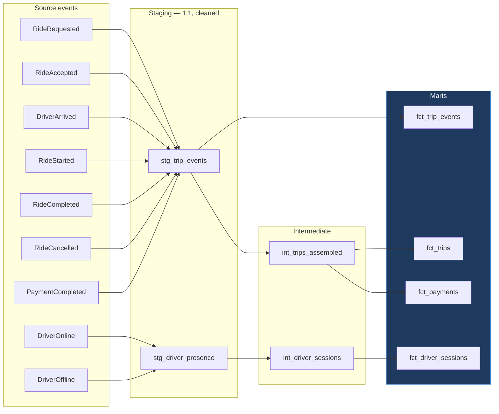

# RideFlow — Data Dictionary

**Every column that will exist in the RideFlow warehouse, from source event to destination table.**

| Field | Value |
|---|---|
| Version | `1.0.0` |
| Status | **Frozen** — aligned to `docs/event_contract.md` v1.0.0 |
| Milestone | M1 |
| Last updated | 2026-08-05 |

> **This document is derived, not authoritative.** `docs/event_contract.md` defines the events; `docs/reference_data.md` defines the lookups. This dictionary maps them onto warehouse columns and adds the derived columns that exist only after transformation. Where it disagrees with the contract, **the contract wins and this document is a defect.** CI validates the three against each other (event contract §9.5).

---

## 1. How to read this document

### 1.1 Column definitions

| Attribute | Meaning |
|---|---|
| **Column Name** | Physical column name in the warehouse |
| **Data Type** | DuckDB type. `decimal(p,s)` never `float` for money or coordinates. |
| **Description** | What the column contains |
| **Business Rule** | The constraint that must hold. Enforced by a dbt test unless marked *(advisory)*. |
| **Example** | A real value from `docs/samples/sample_events.json` |
| **Nullable** | Whether null is permitted **in the destination table** |
| **Source Event** | Which event supplies it. `—` means derived in transformation. |
| **Destination Table** | Where it lands |

### 1.2 The three column origins

| Origin | Marker | Meaning |
|---|---|---|
| **Sourced** | Named event | Copied from an event payload or envelope |
| **Derived** | `—` | Computed in dbt from sourced columns. Has no event of origin. |
| **Conformed** | `dim_*` | A surrogate key resolved from a natural key during staging |

**Every derived column is a place where the warehouse asserts something the source data did not.** Each one is listed with the rule that produces it, so the assertion is auditable rather than buried in SQL.

### 1.3 Nullability has three distinct meanings

Conflating these is a common source of incorrect metrics:

| Meaning | Example | How to treat it |
|---|---|---|
| **Meaningful absence** | `driver_id` on a pre-match cancellation | The null *is* the fact. Do not impute. |
| **Not yet applicable** | `completed_at` on an in-flight trip | Filter, do not count as missing. |
| **Did not exist yet** | A v1.1 column on a v1.0 event | Exclude from the period before introduction (event contract §9.3). |

A count of nulls that does not separate these three will misreport all of them.

---

## 2. Table inventory

### 2.1 Fact tables

| Table | Grain | Rows per trip | Source |
|---|---|---|---|
| `fct_trip_events` | One row per event | 3–7 | All 7 trip events |
| `fct_trips` | One row per trip | 1 | Assembled from all trip events |
| `fct_payments` | One row per payment | 0–1 | `PaymentCompleted` |
| `fct_driver_sessions` | One row per driver session | n/a | `DriverOnline` + `DriverOffline` |

### 2.2 Dimension tables

| Table | Type | Defined in |
|---|---|---|
| `dim_city` | SCD2 | `reference_data.md` §1 |
| `dim_vehicle_type` | SCD2 | `reference_data.md` §2 |
| `dim_ride_status` | SCD1 | `reference_data.md` §3 |
| `dim_cancellation_reason` | SCD1 | `reference_data.md` §4 |
| `dim_payment_method` | SCD1 | `reference_data.md` §5 |
| `dim_payment_status` | SCD1 | `reference_data.md` §6 |
| `dim_driver_status` | SCD1 | `reference_data.md` §7 |
| `dim_customer_tier` | SCD2 | `reference_data.md` §8 |
| `dim_weather` | SCD1 | `reference_data.md` §9 |
| `dim_traffic_level` | SCD1 | `reference_data.md` §10 |
| `dim_zone` | SCD2 | **M2** — generated |
| `dim_date` / `dim_time` | Static | **M2** — generated |
| `dim_driver` | SCD2 | **M6** — accumulated from events |
| `dim_rider` | SCD2 | **M6** — accumulated from events |

Dimension *internals* are not repeated here — `reference_data.md` is their single source of truth. This document covers only the **foreign keys** that point at them (§9) and the four generated dimensions above.

### 2.3 Lineage

---

## 3. Envelope columns

Present on **every** row of `fct_trip_events` and `fct_driver_sessions`. Defined in event contract §3.1.

| Column Name | Data Type | Description | Business Rule | Example | Nullable | Source Event | Destination Table |
|---|---|---|---|---|---|---|---|
| `event_id` | uuid | Unique event identifier | Unique after dedup (I1). The dedup key. | `9f2b1c7e-4a3d-4e18-b6c2-77a1e9d40c31` | No | All | `fct_trip_events` |
| `event_type` | varchar(30) | Discriminator | One of the 9 contract types. Unknown → DLQ. | `RideRequested` | No | All | `fct_trip_events` |
| `event_version` | varchar(12) | Schema version of this event | Matches `^\d+\.\d+\.\d+$` | `1.0.0` | No | All | `fct_trip_events` |
| `event_timestamp` | timestamptz | **Business time** — when it happened | Within 7 days past / 5 min future of `ingested_at` (T3, T4) | `2026-03-17T02:42:10.412Z` | No | All | `fct_trip_events` |
| `ingested_at` | timestamptz | **Arrival time** — when the consumer received it | `>= event_timestamp − 5 min` (T1). Set by consumer only. | `2026-03-17T02:42:11.087Z` | No | All | `fct_trip_events` |
| `partition_key` | varchar(36) | Kafka partition key | `= trip_id` (trip events) or `driver_id` (presence) (I2) | `1a4f8c22-9e5b-4c07-8d3a-2f6b1e904d77` | No | All | `fct_trip_events` |
| `correlation_id` | uuid | Business-process correlation | `= trip_id` or `session_id` (I3) | `1a4f8c22-9e5b-4c07-8d3a-2f6b1e904d77` | No | All | `fct_trip_events` |
| `causation_id` | uuid | The event that caused this one | References a real `event_id` with the same `correlation_id` (C1); acyclic (C2) | `9f2b1c7e-4a3d-4e18-b6c2-77a1e9d40c31` | **Yes** — null for chain-initiating events | All | `fct_trip_events` |
| `producer_service` | varchar(40) | Emitting service | `^[a-z][a-z0-9-]{2,39}$` | `rideflow-event-generator` | No | All | `fct_trip_events` |
| `producer_version` | varchar(12) | Producer build version | Semver | `0.3.1` | No | All | `fct_trip_events` |
| `environment` | varchar(10) | Deployment environment | One of `local`/`dev`/`staging`/`prod`. Marts filter to one. | `local` | No | All | `fct_trip_events` |

---

## 4. `fct_trip_events` — atomic event fact

**Grain:** one row per event, after deduplication. The most granular table in the warehouse and the only one that preserves individual events. Everything else is an aggregation of it.

Carries all §3 envelope columns plus:

| Column Name | Data Type | Description | Business Rule | Example | Nullable | Source Event | Destination Table |
|---|---|---|---|---|---|---|---|
| `trip_id` | uuid | Trip identity | Present on all 7 trip events | `1a4f8c22-9e5b-4c07-8d3a-2f6b1e904d77` | No | All trip events | `fct_trip_events` |
| `rider_id` | uuid | Requesting rider | Constant across a trip | `c3d8e0b5-6a1f-4b92-9e77-0d4c8a3f1b26` | No | All trip events | `fct_trip_events` |
| `driver_id` | uuid | Assigned driver | Null before `RideAccepted` (R2) | `7f3a2c18-0b4e-4d6a-9c15-3e82f7a06d94` | **Yes** — meaningful absence | `RideAccepted`+ | `fct_trip_events` |
| `city_id` | integer | Operating city FK | FK → `dim_city` | `1` | No | All | `fct_trip_events` |
| `event_sequence_number` | integer | Position in causal order | Dense rank over `causation_id` chain, then `event_timestamp` | `4` | No | **—** derived | `fct_trip_events` |
| `is_duplicate` | boolean | Flagged as a redelivery | True when `event_id` was seen before this row | `false` | No | **—** derived | `fct_trip_events` |
| `is_out_of_order` | boolean | Arrived out of causal order | True when `ingested_at` order ≠ causal order | `false` | No | **—** derived | `fct_trip_events` |
| `lateness_sec` | integer | Arrival lag | `ingested_at − event_timestamp`, seconds. **May be negative** under clock skew. | `1` | No | **—** derived | `fct_trip_events` |
| `is_late_arrival_event` | boolean | Exceeded lateness tolerance | `lateness_sec > 300` | `false` | No | **—** derived | `fct_trip_events` |
| `payload_json` | json | Original payload, unmodified | Byte-preserving | `{...}` | No | All | `fct_trip_events` |

**Why `payload_json` is retained.** It is redundant with the parsed columns and kept deliberately: it makes the fact table self-auditing. When a mart number is disputed, the original event can be inspected without re-reading the landing zone. It also allows fields added in a future minor version to be recovered for history predating their extraction. This costs storage and is worth it.

**`is_duplicate` marks rather than deletes.** Duplicates are removed from `fct_trips` but *retained and flagged* here, because the duplicate rate is an operational metric about the pipeline. Deleting the evidence would make it unmeasurable.

---

## 5. `fct_trips` — one row per trip

**Grain:** one row per `trip_id`. The primary analytical table. Assembled by resolving the event sequence (event contract §6.2), so most columns arrive from a specific event while the rest are derived from the assembled whole.

### 5.1 Identity and dimensions

| Column Name | Data Type | Description | Business Rule | Example | Nullable | Source Event | Destination Table |
|---|---|---|---|---|---|---|---|
| `trip_id` | uuid | **PK.** Trip identity | Unique (N2) | `1a4f8c22-9e5b-4c07-8d3a-2f6b1e904d77` | No | `RideRequested` | `fct_trips` |
| `rider_id` | uuid | Rider FK | FK → `dim_rider` | `c3d8e0b5-6a1f-4b92-9e77-0d4c8a3f1b26` | No | `RideRequested` | `fct_trips` |
| `driver_id` | uuid | Driver FK | Null only when never matched | `7f3a2c18-0b4e-4d6a-9c15-3e82f7a06d94` | **Yes** | `RideAccepted` | `fct_trips` |
| `vehicle_id` | uuid | Vehicle used | Null when never matched | `b2e91d04-7c35-4a80-91f6-5d0a2b834e17` | **Yes** | `RideAccepted` | `fct_trips` |
| `city_id` | integer | City FK | FK → `dim_city` | `1` | No | `RideRequested` | `fct_trips` |
| `vehicle_type_id` | integer | Delivered tier FK | FK → `dim_vehicle_type` | `2` | No | Conformed | `fct_trips` |
| `requested_vehicle_type_id` | integer | Requested tier FK | May differ from delivered on upgrade; never lower | `2` | No | Conformed | `fct_trips` |
| `customer_tier_id` | integer | Tier **at request time** | Point-in-time. **Never** joined from current tier. | `3` | No | Conformed | `fct_trips` |
| `ride_status_id` | integer | Final status FK | FK → `dim_ride_status` | `6` | No | **—** derived | `fct_trips` |
| `pickup_zone_id` | integer | Requested pickup zone | FK → `dim_zone`; belongs to `city_id` | `412` | No | `RideRequested` | `fct_trips` |
| `dropoff_zone_id` | integer | Requested dropoff zone | FK → `dim_zone` | `118` | No | `RideRequested` | `fct_trips` |
| `actual_dropoff_zone_id` | integer | Actual dropoff zone | May differ from requested | `118` | **Yes** — only if completed | `RideCompleted` | `fct_trips` |
| `request_date_id` | integer | Date FK (**local** date) | Derived via `dim_city.timezone` | `20260317` | No | **—** derived | `fct_trips` |
| `request_time_id` | integer | Time-of-day FK (**local**) | Derived via `dim_city.timezone` | `812` | No | **—** derived | `fct_trips` |

> **`request_date_id` and `request_time_id` are local, not UTC.** Events store UTC (contract §3.1); "morning peak" is a local concept. 08:12 IST is 02:42 UTC — bucketing on UTC would place the Bengaluru morning peak at 2 a.m. and every hour-of-day chart would be silently wrong. See `reference_data.md` §1.

### 5.2 Lifecycle timestamps

All UTC. Nullability encodes how far the trip progressed — a null here is "did not reach this stage", never "unknown".

| Column Name | Data Type | Description | Business Rule | Example | Nullable | Source Event | Destination Table |
|---|---|---|---|---|---|---|---|
| `requested_at` | timestamptz | Request created | Never null; funnel origin | `2026-03-17T02:42:10.412Z` | No | `RideRequested` | `fct_trips` |
| `accepted_at` | timestamptz | Driver matched | `> requested_at` (T2) | `2026-03-17T02:42:47.930Z` | **Yes** | `RideAccepted` | `fct_trips` |
| `arrived_at` | timestamptz | Driver at pickup | `> accepted_at` (T2) | `2026-03-17T02:49:58.204Z` | **Yes** | `DriverArrived` | `fct_trips` |
| `started_at` | timestamptz | Trip began | `>= arrived_at` (T2) | `2026-03-17T02:52:19.664Z` | **Yes** | `RideStarted` | `fct_trips` |
| `completed_at` | timestamptz | Trip ended | `> started_at` (T2) | `2026-03-17T03:44:31.208Z` | **Yes** | `RideCompleted` | `fct_trips` |
| `cancelled_at` | timestamptz | Trip cancelled | Mutually exclusive with `completed_at` (S4) | `null` | **Yes** | `RideCancelled` | `fct_trips` |
| `paid_at` | timestamptz | Payment settled | `>= completed_at` (T2) | `2026-03-17T03:45:02.331Z` | **Yes** | `PaymentCompleted` | `fct_trips` |

### 5.3 Request attributes

| Column Name | Data Type | Description | Business Rule | Example | Nullable | Source Event | Destination Table |
|---|---|---|---|---|---|---|---|
| `pickup_lat` | decimal(9,6) | Requested pickup latitude | Inside `dim_city.bounding_box_wkt` | `13.199512` | No | `RideRequested` | `fct_trips` |
| `pickup_lon` | decimal(9,6) | Requested pickup longitude | Inside city bounds | `77.708374` | No | `RideRequested` | `fct_trips` |
| `dropoff_lat` | decimal(9,6) | Requested dropoff latitude | −90 … 90 | `12.971891` | No | `RideRequested` | `fct_trips` |
| `dropoff_lon` | decimal(9,6) | Requested dropoff longitude | −180 … 180 | `77.641350` | No | `RideRequested` | `fct_trips` |
| `estimated_fare` | decimal(12,2) | Fare quoted to rider | `> 0` | `1980.00` | No | `RideRequested` | `fct_trips` |
| `estimated_distance_km` | decimal(8,2) | Quoted distance | `> 0`, `<= 500` | `34.20` | No | `RideRequested` | `fct_trips` |
| `estimated_duration_sec` | integer | Quoted duration | `> 0`, `<= 43200` | `3120` | No | `RideRequested` | `fct_trips` |
| `surge_multiplier` | decimal(4,2) | Surge at request | `>= 1.00`; must match `RideCompleted` (F7) | `2.30` | No | `RideRequested` | `fct_trips` |
| `is_airport_pickup` | boolean | Airport origin | Governs `airport_fee` (F6) | `true` | No | `RideRequested` | `fct_trips` |
| `is_airport_dropoff` | boolean | Airport destination | Governs `airport_fee` (F6) | `false` | No | `RideRequested` | `fct_trips` |
| `promo_code` | varchar(16) | Promotion applied | Non-null ⟺ discount applied | `null` | **Yes** | `RideRequested` | `fct_trips` |
| `device_platform` | varchar(10) | Rider app platform | `IOS`/`ANDROID`/`WEB` | `ANDROID` | No | `RideRequested` | `fct_trips` |
| `app_version` | varchar(12) | Rider app build | Semver | `8.14.2` | No | `RideRequested` | `fct_trips` |
| `request_weather_id` | integer | Weather at request | FK → `dim_weather` | `1` | No | Conformed | `fct_trips` |
| `request_traffic_level_id` | integer | Traffic at request | FK → `dim_traffic_level` | `4` | No | Conformed | `fct_trips` |

### 5.4 Matching attributes

| Column Name | Data Type | Description | Business Rule | Example | Nullable | Source Event | Destination Table |
|---|---|---|---|---|---|---|---|
| `matching_duration_sec` | integer | Time to find a driver | `>= 0`; `= accepted_at − requested_at` | `37` | **Yes** | `RideAccepted` | `fct_trips` |
| `eta_to_pickup_sec` | integer | Promised pickup ETA | `> 0`, `<= 3600` | `420` | **Yes** | `RideAccepted` | `fct_trips` |
| `distance_to_pickup_km` | decimal(8,2) | Deadhead distance | `>= 0`, `<= 100` | `2.40` | **Yes** | `RideAccepted` | `fct_trips` |
| `driver_rating_at_accept` | decimal(3,2) | Driver rating snapshot | 1.00 … 5.00. Point-in-time; never joined from current. | `4.87` | **Yes** | `RideAccepted` | `fct_trips` |
| `dispatch_attempt_number` | integer | Which offer succeeded | `>= 1`. `> 1` means prior declines. | `1` | **Yes** | `RideAccepted` | `fct_trips` |
| `driver_pickup_zone_id` | integer | Driver's zone at accept | FK → `dim_zone` | `412` | **Yes** | `RideAccepted` | `fct_trips` |

### 5.5 Pickup and arrival attributes

| Column Name | Data Type | Description | Business Rule | Example | Nullable | Source Event | Destination Table |
|---|---|---|---|---|---|---|---|
| `actual_pickup_duration_sec` | integer | Real time to reach pickup | `>= 0` | `1004` | **Yes** | `DriverArrived` | `fct_trips` |
| `arrival_delay_sec` | integer | Late-driver metric | `= actual_pickup_duration_sec − eta_to_pickup_sec`. **Signed** — negative means early. | `584` | **Yes** | `DriverArrived` | `fct_trips` |
| `is_late_arrival` | boolean | Breached 3-min tolerance | `arrival_delay_sec > 180` | `true` | **Yes** | `DriverArrived` | `fct_trips` |
| `rider_wait_duration_sec` | integer | How long the driver waited | `>= 0`; `= started_at − arrived_at` | `137` | **Yes** | `RideStarted` | `fct_trips` |
| `actual_pickup_lat` | decimal(9,6) | Actual boarding latitude | Within 500 m of requested *(advisory)* | `13.199488` | **Yes** | `RideStarted` | `fct_trips` |
| `actual_pickup_lon` | decimal(9,6) | Actual boarding longitude | As above *(advisory)* | `77.708201` | **Yes** | `RideStarted` | `fct_trips` |

### 5.6 Completion and fare attributes

All monetary values are `decimal(12,2)` — **never float** (contract §4.3). All are `>= 0` (F4).

| Column Name | Data Type | Description | Business Rule | Example | Nullable | Source Event | Destination Table |
|---|---|---|---|---|---|---|---|
| `distance_km` | decimal(8,2) | Actual route distance | `> 0`, `<= 500`. Route, not straight-line. | `34.80` | **Yes** | `RideCompleted` | `fct_trips` |
| `duration_sec` | integer | Actual in-trip duration | `> 0`; `= completed_at − started_at` | `3132` | **Yes** | `RideCompleted` | `fct_trips` |
| `base_fare` | decimal(12,2) | Flat starting charge | `>= 0` | `60.00` | **Yes** | `RideCompleted` | `fct_trips` |
| `distance_fare` | decimal(12,2) | Per-km component | `>= 0` | `626.40` | **Yes** | `RideCompleted` | `fct_trips` |
| `time_fare` | decimal(12,2) | Per-minute component | `>= 0` | `104.00` | **Yes** | `RideCompleted` | `fct_trips` |
| `surge_amount` | decimal(12,2) | Surge revenue, isolated | `= (base+distance+time) × (surge−1)` (F5) | `1027.52` | **Yes** | `RideCompleted` | `fct_trips` |
| `airport_fee` | decimal(12,2) | Regulated airport levy | `> 0` only if airport pickup or dropoff (F6) | `150.00` | **Yes** | `RideCompleted` | `fct_trips` |
| `toll_amount` | decimal(12,2) | Tolls | `>= 0`. Passed to driver in full. | `0.00` | **Yes** | `RideCompleted` | `fct_trips` |
| `booking_fee` | decimal(12,2) | Platform booking charge | `>= 0` | `25.00` | **Yes** | `RideCompleted` | `fct_trips` |
| `tax_amount` | decimal(12,2) | Tax on taxable subtotal | `>= 0`. Remitted, not earned. | `99.65` | **Yes** | `RideCompleted` | `fct_trips` |
| `total_fare` | decimal(12,2) | Total charged to rider | Components must sum to this ±0.01 (F1) | `2092.57` | **Yes** | `RideCompleted` | `fct_trips` |
| `driver_payout` | decimal(12,2) | Driver earnings | `payout + commission = total − tax` ±0.01 (F2) | `1594.34` | **Yes** | `RideCompleted` | `fct_trips` |
| `platform_commission` | decimal(12,2) | **Net revenue** | See F2 | `398.58` | **Yes** | `RideCompleted` | `fct_trips` |
| `currency` | char(3) | Currency of all amounts | ISO 4217 | `INR` | **Yes** | `RideCompleted` | `fct_trips` |
| `trip_weather_id` | integer | Weather during trip | FK → `dim_weather` | `1` | **Yes** | Conformed | `fct_trips` |
| `trip_traffic_level_id` | integer | Traffic during trip | FK → `dim_traffic_level` | `4` | **Yes** | Conformed | `fct_trips` |

### 5.7 Cancellation attributes

| Column Name | Data Type | Description | Business Rule | Example | Nullable | Source Event | Destination Table |
|---|---|---|---|---|---|---|---|
| `cancelled_by` | varchar(10) | Cancelling party | `RIDER`/`DRIVER`/`SYSTEM` | `RIDER` | **Yes** | `RideCancelled` | `fct_trips` |
| `cancellation_reason_id` | integer | Reason FK | FK → `dim_cancellation_reason`; unknown → `-1` | `2` | **Yes** | Conformed | `fct_trips` |
| `cancelled_at_status_id` | integer | Stage reached before cancelling | FK → `dim_ride_status`. **The key funnel column.** | `2` | **Yes** | Conformed | `fct_trips` |
| `seconds_since_request` | integer | Elapsed before abandonment | `>= 0` | `312` | **Yes** | `RideCancelled` | `fct_trips` |
| `cancellation_fee` | decimal(12,2) | Fee assessed | `>= 0` | `30.00` | **Yes** | `RideCancelled` | `fct_trips` |
| `is_fee_charged` | boolean | Fee actually collected | True ⟹ `cancellation_fee > 0`. Gap vs assessed = waiver rate. | `true` | **Yes** | `RideCancelled` | `fct_trips` |
| `is_driver_fault` | boolean | Counts against driver quality | Canonicalised in the event | `false` | **Yes** | `RideCancelled` | `fct_trips` |

### 5.8 Derived trip columns

Computed in `int_trips_assembled`. **No source event** — each is an assertion the warehouse makes.

| Column Name | Data Type | Description | Business Rule | Example | Nullable | Source Event | Destination Table |
|---|---|---|---|---|---|---|---|
| `is_completed` | boolean | Trip reached completion | `completed_at IS NOT NULL` | `true` | No | **—** | `fct_trips` |
| `is_cancelled` | boolean | Trip was cancelled | `cancelled_at IS NOT NULL`; XOR with `is_completed` (S4) | `false` | No | **—** | `fct_trips` |
| `is_paid` | boolean | Payment settled | `paid_at IS NOT NULL` | `true` | No | **—** | `fct_trips` |
| `is_matched` | boolean | A driver was assigned | `driver_id IS NOT NULL` | `true` | No | **—** | `fct_trips` |
| `is_expired` | boolean | **Inferred** expiry | `RideRequested` only, no successor, age > 10 min. **Inference, not observation** — see below. | `false` | No | **—** | `fct_trips` |
| `funnel_stage_reached` | smallint | Furthest funnel stage | Max `funnel_stage` across observed statuses | `6` | No | **—** | `fct_trips` |
| `total_lifecycle_sec` | integer | Request → terminal state | `>= 0` | `3772` | No | **—** | `fct_trips` |
| `estimate_accuracy_pct` | decimal(6,2) | Fare estimate error | `(total_fare − estimated_fare) / estimated_fare × 100`. Signed. | `5.68` | **Yes** | **—** | `fct_trips` |
| `distance_accuracy_pct` | decimal(6,2) | Distance estimate error | Signed | `1.75` | **Yes** | **—** | `fct_trips` |
| `eta_accuracy_pct` | decimal(6,2) | Pickup ETA error | Signed. Negative = early. | `139.05` | **Yes** | **—** | `fct_trips` |
| `revenue_per_km` | decimal(10,2) | Unit revenue | `total_fare / distance_km`; null when distance is 0 | `60.13` | **Yes** | **—** | `fct_trips` |
| `is_surge_trip` | boolean | Surge applied | `surge_multiplier > 1.00` | `true` | No | **—** | `fct_trips` |
| `event_count` | smallint | Events assembled into this trip | 2–6 post-dedup. Max is 6, not 7 — `RideCancelled` is exclusive with `RideCompleted` (S4), so no trip can emit all seven. | `6` | No | **—** | `fct_trips` |
| `had_duplicate_events` | boolean | Duplicates were seen | Pipeline quality signal, not a business fact | `false` | No | **—** | `fct_trips` |
| `had_out_of_order_events` | boolean | Events arrived out of causal order | As above | `false` | No | **—** | `fct_trips` |
| `max_lateness_sec` | integer | Worst arrival lag on this trip | `>= 0` | `1` | No | **—** | `fct_trips` |
| `is_sequence_valid` | boolean | Passes all S1–S7 rules | False ⟹ quarantine, do not aggregate | `true` | No | **—** | `fct_trips` |

> **`is_expired` is an inference and must be labelled as one wherever it surfaces.** No event produces it (contract §0.1 Gap 1; `reference_data.md` §3). A trip flagged expired is indistinguishable from one whose later events were lost, so the column conflates a business outcome with a pipeline failure. It is retained because unmatched demand is too important to omit — but presenting it with the same confidence as `is_completed` would misrepresent it. Resolved when `RideExpired` ships in contract v1.1.

---

## 6. `fct_payments` — one row per payment

**Grain:** one row per `payment_id`. Separate from `fct_trips` because payments have their own identity, their own timing, and — once refunds exist — a many-to-one relationship with trips. Folding them into `fct_trips` would need restructuring the day the first refund arrives.

| Column Name | Data Type | Description | Business Rule | Example | Nullable | Source Event | Destination Table |
|---|---|---|---|---|---|---|---|
| `payment_id` | uuid | **PK.** Payment identity | Unique | `3b6f0c92-8d47-4e15-a0b3-6f29c1d78e40` | No | `PaymentCompleted` | `fct_payments` |
| `trip_id` | uuid | Trip FK | Must have a `RideCompleted` (S3) | `1a4f8c22-9e5b-4c07-8d3a-2f6b1e904d77` | No | `PaymentCompleted` | `fct_payments` |
| `rider_id` | uuid | Payer | FK → `dim_rider` | `c3d8e0b5-6a1f-4b92-9e77-0d4c8a3f1b26` | No | `PaymentCompleted` | `fct_payments` |
| `driver_id` | uuid | Payee | FK → `dim_driver` | `7f3a2c18-0b4e-4d6a-9c15-3e82f7a06d94` | No | `PaymentCompleted` | `fct_payments` |
| `city_id` | integer | City FK | FK → `dim_city` | `1` | No | `PaymentCompleted` | `fct_payments` |
| `paid_at` | timestamptz | Settlement moment | `>= completed_at` (T2) | `2026-03-17T03:45:02.331Z` | No | `PaymentCompleted` | `fct_payments` |
| `payment_method_id` | integer | Method FK | FK → `dim_payment_method` | `3` | No | Conformed | `fct_payments` |
| `payment_status_id` | integer | Status FK | FK → `dim_payment_status`. **Always `3` (SUCCEEDED) in v1.0.0.** | `3` | No | Conformed | `fct_payments` |
| `trip_fare` | decimal(12,2) | Fare before tip/discount | `= fct_trips.total_fare` (N3) | `2092.57` | No | `PaymentCompleted` | `fct_payments` |
| `tip_amount` | decimal(12,2) | Rider tip | `>= 0`. To driver in full — never commissioned. | `0.00` | No | `PaymentCompleted` | `fct_payments` |
| `discount_amount` | decimal(12,2) | Promotion applied | `>= 0`, `<= trip_fare`. **Platform-funded** — reduces net revenue, not driver payout. | `0.00` | No | `PaymentCompleted` | `fct_payments` |
| `amount_charged` | decimal(12,2) | What the rider paid | `= trip_fare + tip − discount` ±0.01 (F3) | `2092.57` | No | `PaymentCompleted` | `fct_payments` |
| `currency` | char(3) | Currency | ISO 4217 | `INR` | No | `PaymentCompleted` | `fct_payments` |
| `promo_code` | varchar(16) | Promotion code | Non-null ⟺ `discount_amount > 0` | `null` | **Yes** | `PaymentCompleted` | `fct_payments` |
| `attempt_number` | integer | Which attempt succeeded | `>= 1` | `3` | No | `PaymentCompleted` | `fct_payments` |
| `previous_attempt_failure_reason` | varchar(40) | Why the prior attempt failed | Non-null ⟺ `attempt_number > 1`. **Only payment-failure visibility in v1.0.0.** | `INSUFFICIENT_FUNDS` | **Yes** | `PaymentCompleted` | `fct_payments` |
| `gateway_reference` | varchar(64) | Processor reference | 8–64 chars. Join key for finance reconciliation. | `pg_9f31c0a84b7d` | No | `PaymentCompleted` | `fct_payments` |
| `had_failed_attempts` | boolean | Any attempt failed first | `attempt_number > 1` | `true` | No | **—** derived | `fct_payments` |
| `settlement_due_at` | timestamptz | Expected settlement | `paid_at + dim_payment_method.settlement_delay_hours` | `2026-03-18T03:45:02.331Z` | No | **—** derived | `fct_payments` |
| `gateway_fee_amount` | decimal(12,2) | Processor cost | `amount_charged × gateway_fee_pct / 100`. Real margin leakage. | `6.28` | No | **—** derived | `fct_payments` |
| `net_platform_revenue` | decimal(12,2) | Commission after gateway cost and discount | `platform_commission − gateway_fee_amount − discount_amount` | `392.30` | No | **—** derived | `fct_payments` |

> **`payment_status_id` is always `3` in v1.0.0.** `PaymentCompleted` constrains it to `SUCCEEDED` (contract §5.7). This must not be read as a 100% success rate — failures are unobservable until `PaymentFailed` ships. `had_failed_attempts` is the only available proxy, and it undercounts, because it can only see failures that were eventually followed by success.

---

## 7. `fct_driver_sessions` — one row per driver session

**Grain:** one row per `session_id`. The supply-side fact table. Separate from every trip table because its grain is a driver's duty period, not a trip (contract §3.3).

| Column Name | Data Type | Description | Business Rule | Example | Nullable | Source Event | Destination Table |
|---|---|---|---|---|---|---|---|
| `session_id` | uuid | **PK.** Session identity | Unique | `8e14b5c0-3a92-4d67-b105-7c4e83f2a916` | No | `DriverOnline` | `fct_driver_sessions` |
| `driver_id` | uuid | Driver FK | FK → `dim_driver` | `7f3a2c18-0b4e-4d6a-9c15-3e82f7a06d94` | No | Both | `fct_driver_sessions` |
| `vehicle_id` | uuid | Vehicle for this session | Captured per session — drivers switch vehicles | `b2e91d04-7c35-4a80-91f6-5d0a2b834e17` | No | `DriverOnline` | `fct_driver_sessions` |
| `city_id` | integer | City FK | FK → `dim_city` | `1` | No | Both | `fct_driver_sessions` |
| `vehicle_type_id` | integer | Tier served | FK → `dim_vehicle_type` | `2` | No | Conformed | `fct_driver_sessions` |
| `driver_status_id` | integer | Status at session start | FK → `dim_driver_status`. **Start only** — intra-session changes are not observable. | `1` | No | Conformed | `fct_driver_sessions` |
| `online_at` | timestamptz | Session start | Never null | `2026-03-17T02:10:00.000Z` | No | Both | `fct_driver_sessions` |
| `offline_at` | timestamptz | Session end | `> online_at`. **Null = still online**, not missing data. | `2026-03-17T06:55:12.480Z` | **Yes** | `DriverOffline` | `fct_driver_sessions` |
| `online_zone_id` | integer | Starting zone | FK → `dim_zone`. **Supply side of marketplace health.** | `412` | No | `DriverOnline` | `fct_driver_sessions` |
| `offline_zone_id` | integer | Ending zone | FK → `dim_zone` | `205` | **Yes** | `DriverOffline` | `fct_driver_sessions` |
| `online_lat` / `online_lon` | decimal(9,6) | Location at go-online | Valid coordinates | `13.201004` / `77.709112` | No | `DriverOnline` | `fct_driver_sessions` |
| `offline_lat` / `offline_lon` | decimal(9,6) | Location at go-offline | Valid coordinates | `12.934411` / `77.610237` | **Yes** | `DriverOffline` | `fct_driver_sessions` |
| `session_duration_sec` | integer | Total online time | `> 0`. **The utilisation denominator.** | `17112` | **Yes** | `DriverOffline` | `fct_driver_sessions` |
| `trips_completed_in_session` | integer | Trips finished | `>= 0` | `2` | **Yes** | `DriverOffline` | `fct_driver_sessions` |
| `offline_reason` | varchar(20) | Why the session ended | Enum. `CONNECTION_LOST` ≠ deliberate sign-off. | `SHIFT_END` | **Yes** | `DriverOffline` | `fct_driver_sessions` |
| `device_platform` | varchar(10) | Driver app platform | `IOS`/`ANDROID` | `ANDROID` | No | `DriverOnline` | `fct_driver_sessions` |
| `app_version` | varchar(12) | Driver app build | Semver | `5.2.0` | No | `DriverOnline` | `fct_driver_sessions` |
| `is_session_open` | boolean | No matching `DriverOffline` | `offline_at IS NULL`. **Legitimate**, not an error. | `false` | No | **—** derived | `fct_driver_sessions` |
| `trips_per_online_hour` | decimal(6,2) | Driver productivity | `trips / (duration_sec / 3600)`; null when open | `0.42` | **Yes** | **—** derived | `fct_driver_sessions` |
| `zone_drift` | boolean | Ended in a different zone | `online_zone_id != offline_zone_id` | `true` | **Yes** | **—** derived | `fct_driver_sessions` |

> **An open session is not missing data.** A driver still online when the window closes has `offline_at IS NULL` legitimately (contract §5.9). Imputing an end time would fabricate supply hours and inflate every utilisation denominator. Open sessions are excluded from completed-session metrics and reported separately.

> **Known v1.0.0 limitation.** `driver_status_id` is captured only at session start. `AVAILABLE` → `ON_TRIP` → `AVAILABLE` transitions are invisible, so utilisation must be derived by overlapping `fct_trips` against session windows rather than read from status history. A `DriverStatusChanged` event is the direct fix (`reference_data.md` §7).

---

## 8. Generated dimensions

Not reference data — algorithmically produced. Defined here because no other document owns them.

### 8.1 `dim_date` — M2

| Column Name | Data Type | Description | Business Rule | Example | Nullable | Source Event | Destination Table |
|---|---|---|---|---|---|---|---|
| `date_id` | integer | **PK.** `YYYYMMDD` | Unique, contiguous | `20260317` | No | **—** | `dim_date` |
| `full_date` | date | Calendar date | — | `2026-03-17` | No | **—** | `dim_date` |
| `day_of_week` | smallint | 1 = Monday … 7 = Sunday | 1–7 | `2` | No | **—** | `dim_date` |
| `day_name` | varchar(10) | Day name | — | `Tuesday` | No | **—** | `dim_date` |
| `is_weekend` | boolean | Saturday or Sunday | — | `false` | No | **—** | `dim_date` |
| `week_of_year` | smallint | ISO week | 1–53 | `12` | No | **—** | `dim_date` |
| `month_number` | smallint | Month | 1–12 | `3` | No | **—** | `dim_date` |
| `quarter` | smallint | Quarter | 1–4 | `1` | No | **—** | `dim_date` |
| `year` | smallint | Year | — | `2026` | No | **—** | `dim_date` |
| `is_holiday` | boolean | Public holiday | **City-specific** — see note | `false` | No | **—** | `dim_date` |
| `holiday_name` | varchar(60) | Holiday name | Non-null ⟺ `is_holiday` | `null` | **Yes** | **—** | `dim_date` |

> **`is_holiday` is city-specific and this table is not.** Indian public holidays vary by state; a single global flag will be wrong for some cities. A `bridge_city_holiday` table is the correct fix. Recorded as a known simplification rather than shipped silently.

### 8.2 `dim_time` — M2

**Grain:** one row per minute of a day (1,440 rows). Separate from `dim_date` so time-of-day patterns aggregate across dates without a 1,440× row multiplier on the date dimension.

| Column Name | Data Type | Description | Business Rule | Example | Nullable | Source Event | Destination Table |
|---|---|---|---|---|---|---|---|
| `time_id` | integer | **PK.** `HHMM` local | 0–2359, valid clock time | `812` | No | **—** | `dim_time` |
| `hour_24` | smallint | Hour | 0–23 | `8` | No | **—** | `dim_time` |
| `minute` | smallint | Minute | 0–59 | `12` | No | **—** | `dim_time` |
| `day_part` | varchar(20) | Named period | `NIGHT`/`EARLY_MORNING`/`MORNING_PEAK`/`MIDDAY`/`EVENING_PEAK`/`EVENING`/`LATE_NIGHT` | `MORNING_PEAK` | No | **—** | `dim_time` |
| `is_peak_hour` | boolean | Commute peak | 07:00–10:00 or 17:00–21:00 **local** | `true` | No | **—** | `dim_time` |

> **Peak hours are local, and the boundaries are a business definition, not a fact.** Defined once here so no two consumers disagree. Changing them changes historical metrics and must be versioned, not edited in place.

### 8.3 `dim_zone` — M2

| Column Name | Data Type | Description | Business Rule | Example | Nullable | Source Event | Destination Table |
|---|---|---|---|---|---|---|---|
| `zone_id` | integer | **PK.** Surrogate key | Unique | `412` | No | **—** | `dim_zone` |
| `zone_code` | varchar(20) | Natural key | Unique within city | `BLR_KIA_T1` | No | **—** | `dim_zone` |
| `zone_name` | varchar(80) | Display name | — | `Kempegowda Intl — Terminal 1` | No | **—** | `dim_zone` |
| `city_id` | integer | City FK | FK → `dim_city` | `1` | No | **—** | `dim_zone` |
| `zone_type` | varchar(20) | Classification | `AIRPORT`/`CBD`/`RESIDENTIAL`/`COMMERCIAL`/`TRANSIT_HUB`/`SUBURBAN` | `AIRPORT` | No | **—** | `dim_zone` |
| `centroid_lat` / `centroid_lon` | decimal(9,6) | Zone centre | Inside city bounds | `13.199512` / `77.708374` | No | **—** | `dim_zone` |
| `boundary_wkt` | varchar(4000) | Zone polygon | Valid WKT; non-overlapping within city | `POLYGON((...))` | No | **—** | `dim_zone` |
| `is_airport_zone` | boolean | Airport zone | Drives `is_airport_pickup`/`airport_fee` (F6) | `true` | No | **—** | `dim_zone` |
| `is_surge_eligible` | boolean | Surge permitted | Some zones are regulated | `true` | No | **—** | `dim_zone` |
| `avg_daily_demand` | integer | Baseline demand *(advisory)* | `>= 0`. Generator input; not a measured fact. | `840` | No | **—** | `dim_zone` |

### 8.4 `dim_driver` and `dim_rider` — M6

Accumulated from event history rather than sourced from a master system, because RideFlow has no upstream OLTP store. Both are SCD Type 2.

| Column Name | Data Type | Description | Business Rule | Example | Nullable | Source Event | Destination Table |
|---|---|---|---|---|---|---|---|
| `driver_id` | uuid | **PK** (with version) | Unique per version | `7f3a2c18-…` | No | `RideAccepted`, presence events | `dim_driver` |
| `city_id` | integer | Home city FK | FK → `dim_city` | `1` | No | Derived | `dim_driver` |
| `first_seen_at` | timestamptz | First observation | — | `2026-03-17T02:10:00.000Z` | No | Derived | `dim_driver` |
| `current_rating` | decimal(3,2) | Latest observed rating | 1.00–5.00. **Never join this to historical facts** — use `driver_rating_at_accept`. | `4.87` | **Yes** | Derived | `dim_driver` |
| `lifetime_trips` | integer | Completed trips | `>= 0` | `147` | No | Derived | `dim_driver` |
| `lifetime_earnings` | decimal(14,2) | Total payout | `>= 0` | `184320.50` | No | Derived | `dim_driver` |
| `rider_id` | uuid | **PK** (with version) | Unique per version | `c3d8e0b5-…` | No | All trip events | `dim_rider` |
| `current_tier_id` | integer | Latest tier FK | FK → `dim_customer_tier`. **Never join to historical facts** — use `fct_trips.customer_tier_id`. | `3` | No | Derived | `dim_rider` |
| `lifetime_trips` | integer | Completed trips | `>= 0` | `112` | No | Derived | `dim_rider` |
| `lifetime_spend` | decimal(14,2) | Total charged | `>= 0` | `98450.00` | No | Derived | `dim_rider` |
| `cancellation_rate_pct` | decimal(5,2) | Rider cancellation rate | 0–100 | `4.46` | No | Derived | `dim_rider` |

> **`current_rating` and `current_tier_id` are traps, and they are named to make the trap visible.** Joining either to a historical fact answers "what is this rider's tier *today*?" when the question is "what was it when the trip happened?" That error systematically inflates the apparent performance of higher tiers, because riders who later upgraded carry their new tier backwards over trips they took at a lower one. The point-in-time snapshots on `fct_trips` are the correct join for any historical analysis.

---

## 9. Foreign key summary

| FK column | Points to | Present in | Unknown handling |
|---|---|---|---|
| `city_id` | `dim_city` | All facts | `-1` |
| `vehicle_type_id` | `dim_vehicle_type` | `fct_trips`, `fct_driver_sessions` | `-1` |
| `ride_status_id` | `dim_ride_status` | `fct_trips` | `-1` |
| `cancelled_at_status_id` | `dim_ride_status` | `fct_trips` | `-1` |
| `cancellation_reason_id` | `dim_cancellation_reason` | `fct_trips` | `-1` |
| `payment_method_id` | `dim_payment_method` | `fct_payments` | `-1` |
| `payment_status_id` | `dim_payment_status` | `fct_payments` | `-1` |
| `driver_status_id` | `dim_driver_status` | `fct_driver_sessions` | `-1` |
| `customer_tier_id` | `dim_customer_tier` | `fct_trips` | `-1` |
| `request_weather_id`, `trip_weather_id` | `dim_weather` | `fct_trips` | `-1` |
| `request_traffic_level_id`, `trip_traffic_level_id` | `dim_traffic_level` | `fct_trips` | `-1` |
| `pickup_zone_id`, `dropoff_zone_id`, `actual_dropoff_zone_id`, `driver_pickup_zone_id` | `dim_zone` | `fct_trips` | `-1` |
| `online_zone_id`, `offline_zone_id` | `dim_zone` | `fct_driver_sessions` | `-1` |
| `request_date_id` | `dim_date` | `fct_trips` | — |
| `request_time_id` | `dim_time` | `fct_trips` | — |
| `driver_id` | `dim_driver` | `fct_trips`, `fct_payments`, `fct_driver_sessions` | null permitted |
| `rider_id` | `dim_rider` | `fct_trips`, `fct_payments` | — |

**No FK is ever left null on an unresolved lookup.** It resolves to `-1` / `UNKNOWN` and increments a quality metric (`reference_data.md` §0.2). A null FK would silently drop rows from every inner join, and the loss would not appear in any count.

---

## 10. Technical columns

Present on every mart table. Never business data.

| Column Name | Data Type | Description | Business Rule | Example | Nullable | Source Event | Destination Table |
|---|---|---|---|---|---|---|---|
| `dbt_loaded_at` | timestamptz | Materialisation time | Set by dbt | `2026-03-17T04:00:12.884Z` | No | **—** | All marts |
| `dbt_invocation_id` | varchar(36) | dbt run identity | Traces a row to the run that produced it | `4c1e7b09-2d83-4f56-a710-9e5b3c8d024f` | No | **—** | All marts |
| `source_file_path` | varchar(500) | Landing-zone origin | Path to the Parquet file | `data/raw/dt=2026-03-17/hour=02/part-0001.parquet` | No | **—** | `fct_trip_events` |
| `is_backfilled` | boolean | Produced by a backfill | Distinguishes backfill from scheduled runs | `false` | No | **—** | All marts |

`dbt_invocation_id` and `source_file_path` together make any warehouse row traceable to the exact file and run that produced it. When a number is wrong, this reduces the investigation from a search to a lookup — the difference between an afternoon and a minute.

---

## 11. Column count summary

| Table | Sourced | Derived | Conformed FK | Technical | Total |
|---|---|---|---|---|---|
| `fct_trip_events` | 15 | 5 | 1 | 3 | **24** |
| `fct_trips` | 48 | 17 | 14 | 3 | **82** |
| `fct_payments` | 17 | 4 | 2 | 3 | **26** |
| `fct_driver_sessions` | 17 | 3 | 3 | 3 | **26** |

Counts are indicative for M1 planning and will be validated against the built models in M6.

---

## 12. Related documents

| Document | Relationship |
|---|---|
| `docs/event_contract.md` | **Authoritative** for events, envelope, versioning, invariants |
| `docs/reference_data.md` | **Authoritative** for all lookup tables and enums |
| `docs/samples/sample_events.json` | 30 events exercising this dictionary, including edge cases |
| `PROJECT_PLAN.md` | Architecture, milestones, non-objectives |
