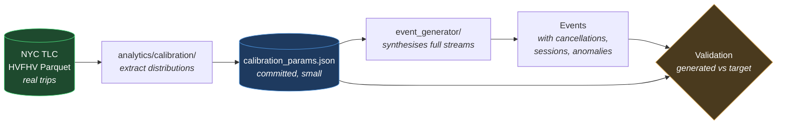

# RideFlow — Data Strategy

**Where the data comes from, what is real, what is synthetic, and what that costs.**

| Field | Value |
|---|---|
| Version | `1.0.0` |
| Status | Approved for M2 |
| Milestone | M1 → M2 |
| Last updated | 2026-08-06 |

---

## 0. Provenance — stated plainly

**No RideFlow event is real. Every event in this project is synthetic.**

This document exists because "where did the data come from?" is a question a reviewer *will* ask, and the honest answer must be recorded rather than improvised.

| Artefact | Origin | Real? |
|---|---|---|
| `docs/samples/sample_events.json` | **Hand-authored** in M1 to exercise specific edge cases, then verified programmatically against invariants F1–F7, T1–T2, I2/I3, C1, S4 | ❌ Fabricated |
| Generated events (M2 onward) | Produced by `event_generator/`, **calibrated against real observed distributions** | ❌ Synthetic, ✅ statistically grounded |
| Distribution parameters | Derived from NYC TLC public trip records | ✅ **Real** |
| `dim_zone` | Hand-built from real Bengaluru localities | ⚠️ Real places, approximate boundaries |
| Reference data (cities, tiers, weather…) | Hand-authored business rules | ❌ Plausible, not observed |

### 0.1 Why the M1 sample data was fabricated, and why that was correct

The 30-event sample needed to contain a **labelled duplicate**, a **labelled out-of-order arrival**, and a **payment retry**. Real datasets do not come with edge cases annotated on demand — that is precisely what makes them unsuitable as test fixtures.

Fabricating them was right for a *fixture*. It would be wrong for the *pipeline's* data, which is why everything from M2 onward is calibrated.

---

## 1. The core problem

**Real ride-hailing datasets are batch trip records. RideFlow is an event stream.**

A public dataset gives one row per **completed trip**. RideFlow needs 2–6 **events** per trip, arriving out of order, occasionally duplicated, sometimes never completing at all.

### 1.1 How far the best real dataset actually gets

**NYC TLC High-Volume For-Hire Vehicle (HVFHV) records** — actual Uber and Lyft trips, official, free, published monthly as Parquet — is the closest real analogue available. It is unusually good because it carries **four lifecycle timestamps**, which most trip datasets do not.

| RideFlow event | TLC coverage |
|---|---|
| `RideRequested` | ⚠️ `request_datetime` only — no surge multiplier, tier, or payment method |
| `RideAccepted` | ❌ **No accept timestamp.** The matching moment is invisible. |
| `DriverArrived` | ✅ `on_scene_datetime` |
| `RideStarted` | ✅ `pickup_datetime` |
| `RideCompleted` | ✅ `dropoff_datetime`, `trip_miles`, `trip_time`, `base_passenger_fare`, `driver_pay`, `tolls`, `airport_fee` |
| `RideCancelled` | ❌ **Completed trips only** |
| `PaymentCompleted` | ⚠️ Amounts yes; method, status, retries no |
| `DriverOnline` / `DriverOffline` | ❌ **No supply-side data whatsoever** |

**4 of 9 event types**, and the gaps are not random.

### 1.2 Why replaying real trips was rejected

Replaying TLC rows directly would lose:

| Missing | Business question it kills |
|---|---|
| Cancellations | **Conversion funnel** — where do riders drop off? |
| Driver sessions | **Marketplace health** — is unmet demand a supply problem? |
| Accept timestamp | Matching duration, the primary supply-health metric |
| Duplicates, late, out-of-order | The pipeline's entire reason for existing |

That is **two of the four business questions in `PROJECT_PLAN.md` §2.1** made unanswerable, plus every reliability guarantee in §6.1 rendered undemonstrable.

**Decision: calibrate the generator from real distributions rather than replace it.**

---

## 2. The calibration approach

**Only `calibration_params.json` is committed** — a few KB of fitted parameters. The multi-GB TLC source is downloaded on demand by a script and gitignored. A reviewer gets reproducible generation without a large download; anyone wanting to re-derive the parameters can run the script.

---

## 3. What transfers from NYC to Bengaluru, and what does not

The city decision was **keep Bengaluru** (INR, existing contract and sample data), borrowing distribution *shapes* only. This is defensible, but the limits are real and are recorded here rather than glossed over.

### 3.1 Transfers — shape is universal

| Property | Why it transfers |
|---|---|
| **Hourly demand curve shape** | Bimodal commute peaks are a property of urban working patterns, not of New York |
| **Weekday vs weekend divergence** | Same reasoning |
| **Trip-distance distribution family** | Right-skewed, roughly log-normal — a consequence of urban geography generally |
| **Fare structure** (base + per-km + per-min) | The pricing *model* is shared; only the coefficients differ |
| **Airport trip profile** | Longer, lower-variance, directionally peaked — true of any airport |
| **OD concentration** | A small share of zone pairs carries a large share of trips (Zipf-like) |
| **Trip-duration variance under congestion** | Congestion inflates duration without inflating distance, everywhere |

### 3.2 Does **not** transfer — must be hand-tuned

| Property | Why not |
|---|---|
| **Absolute fares** | USD vs INR, and completely different price levels |
| **Absolute speeds** | Bengaluru average speeds are materially lower than NYC's. Distance→duration must be re-derived. |
| **Vehicle mix** | ⚠️ **The largest gap — see §3.3** |
| **Zone geography** | NYC zones are irrelevant to Bengaluru |
| **Weather patterns** | Monsoon has no NYC analogue; `dim_weather` impact factors stay hand-tuned |
| **Cancellation rates** | Absent from TLC entirely |
| **Driver session behaviour** | Absent from TLC entirely |

### 3.3 The vehicle-mix gap — the honest limitation

**NYC has no auto-rickshaws and no two-wheeler taxis.** `AUTO` and `BIKE` are **2 of RideFlow's 6 vehicle tiers** (`reference_data.md` §2) and have **zero** NYC analogue.

Consequences:

- Calibration covers only the car-based tiers: `ECONOMY`, `PREMIUM`, `XL`, `POOL`.
- `AUTO` and `BIKE` parameters — fare curves, distance profiles, share of demand — are **hand-tuned, not calibrated**, and must be labelled as such wherever they appear.
- Their distance profiles genuinely differ: autos and bikes serve shorter trips, so borrowing the car distance distribution would be wrong, not merely imprecise.
- In Bengaluru these tiers carry a **large** share of real demand, so this is not a rounding error.

**This must be stated when presenting the project.** Claiming "calibrated against real data" without noting that a third of the tier catalogue is hand-tuned would overstate it.

**Mitigation:** `calibration_params.json` marks every parameter with its `source` — `"tlc_calibrated"` or `"hand_tuned"` — so the distinction survives into the code and cannot be quietly forgotten.

---

## 4. Parameters extracted from TLC

| Parameter | Feeds |
|---|---|
| Hourly demand multiplier, 24 values, weekday and weekend | Generator arrival rate |
| Trip-distance distribution (fitted log-normal, per trip type) | `estimated_distance_km`, `distance_km` |
| Distance → duration relationship, with congestion residual | `duration_sec`, `traffic_level` coupling |
| Fare-vs-distance-vs-time regression coefficients | Validates the fare model's *structure*, not its rates |
| Driver-pay share of passenger fare | `driver_payout` / `platform_commission` split |
| Airport trip share and hourly profile | `is_airport_pickup`, airport demand |
| Shared-ride request and match rates | `POOL` behaviour |
| OD concentration curve | Zone-pair selection |
| Tip incidence and size distribution | `tip_amount` |

### 4.1 Rates deliberately **not** taken from TLC

The **absolute** rates in `dim_city` — `base_fare`, `per_km_rate`, `per_min_rate`, `commission_pct`, `tax_pct` — stay as Indian-market values already in `reference_data.md` §1.

Only the fare *structure* is validated against TLC. Importing NYC dollar rates into an INR model would produce internally inconsistent data that fails invariant F1 and looks absurd to anyone familiar with the market.

---

## 5. What the generator must synthesise entirely

TLC cannot supply these. They are modelled from business rules in the existing documentation:

| Synthesised | Source of rules |
|---|---|
| **Cancellations** — rate, reason mix, stage | `reference_data.md` §4 |
| **Driver sessions** — online/offline, duration, productivity | `event_contract.md` §5.8–5.9 |
| **Accept timestamps** — matching duration coupled to supply density | `event_contract.md` §5.2 |
| **Identities** — driver, rider, vehicle, session UUIDs | No PII by design |
| **Surge** — coupled to simulated supply/demand imbalance | `reference_data.md` §9 |
| **Customer tiers** | `reference_data.md` §8 |
| **Payment methods, retries** | `reference_data.md` §5 |
| **Weather and traffic** | `reference_data.md` §9–10 |
| **Anomalies** — duplicates, late, out-of-order, malformed | `PROJECT_PLAN.md` FR-1 |

**Anomaly injection remains first-class.** No real dataset provides labelled bad data, which is exactly why the generator must.

---

## 6. `dim_zone` — 24 Bengaluru zones

Hand-built from real localities. **The six zone IDs already used in `sample_events.json` are preserved**, so the M1 fixture stays valid.

| `zone_id` | `zone_code` | Locality | `zone_type` | Airport |
|---|---|---|---|:---:|
| `087` | `BLR_MG_ROAD` | MG Road | `CBD` | |
| `091` | `BLR_SHIVAJINAGAR` | Shivajinagar | `CBD` | |
| `095` | `BLR_CUBBON` | Cubbon Park / Vidhana Soudha | `CBD` | |
| `099` | `BLR_MAJESTIC` | Majestic (Kempegowda Bus Stn) | `TRANSIT_HUB` | |
| `104` | `BLR_KSR_STN` | KSR City Railway Station | `TRANSIT_HUB` | |
| **`118`** | `BLR_INDIRANAGAR` | Indiranagar | `RESIDENTIAL` | |
| `124` | `BLR_ULSOOR` | Ulsoor | `RESIDENTIAL` | |
| `131` | `BLR_MALLESHWARAM` | Malleshwaram | `RESIDENTIAL` | |
| `137` | `BLR_RAJAJINAGAR` | Rajajinagar | `RESIDENTIAL` | |
| `142` | `BLR_RT_NAGAR` | RT Nagar | `RESIDENTIAL` | |
| **`205`** | `BLR_KORAMANGALA` | Koramangala | `COMMERCIAL` | |
| `212` | `BLR_BTM` | BTM Layout | `RESIDENTIAL` | |
| `219` | `BLR_JAYANAGAR` | Jayanagar | `RESIDENTIAL` | |
| `226` | `BLR_JP_NAGAR` | JP Nagar | `RESIDENTIAL` | |
| `233` | `BLR_BANASHANKARI` | Banashankari | `RESIDENTIAL` | |
| `240` | `BLR_BASAVANAGUDI` | Basavanagudi | `RESIDENTIAL` | |
| **`260`** | `BLR_HSR` | HSR Layout | `RESIDENTIAL` | |
| `318` | `BLR_MARATHAHALLI` | Marathahalli | `COMMERCIAL` | |
| `324` | `BLR_BELLANDUR` | Bellandur | `COMMERCIAL` | |
| **`331`** | `BLR_WHITEFIELD` | Whitefield | `COMMERCIAL` | |
| `338` | `BLR_SARJAPUR` | Sarjapur Road | `COMMERCIAL` | |
| **`412`** | `BLR_KIA_T1` | Kempegowda Intl — Terminal 1 | `AIRPORT` | ✅ |
| `415` | `BLR_KIA_T2` | Kempegowda Intl — Terminal 2 | `AIRPORT` | ✅ |
| `421` | `BLR_HEBBAL` | Hebbal | `SUBURBAN` | |
| `434` | `BLR_MANYATA` | Manyata Tech Park | `COMMERCIAL` | |
| `512` | `BLR_ELECTRONIC_CITY` | Electronic City | `COMMERCIAL` | |

> ⚠️ **Centroid coordinates are not fixed in this document.** They must be sourced in M2 from a real geocoding source (OpenStreetMap / Nominatim) rather than estimated. Coordinates invented to look plausible would fail the "inside city bounds" validation in unpredictable ways and would be dishonest to present as real locations.

**Zone-type mix drives realism:** `COMMERCIAL` tech corridors generate strong inbound morning and outbound evening flows; `RESIDENTIAL` zones the reverse; `AIRPORT` zones a flatter round-the-clock profile with longer trips. Without this structure, generated demand is uniform noise and every zone-level metric is meaningless.

---

## 7. Validating that calibration worked

Generation is only credible if it is checked. Added to `testing_strategy.md` in M2:

| Test | Assertion |
|---|---|
| Hourly demand curve | Generated shape correlates with the TLC target above threshold |
| Distance distribution | KS test against the fitted target, car tiers only |
| Fare structure | F1–F7 hold, and fare-per-km falls in the expected band |
| Airport share | Within tolerance of the calibrated value |
| Peak/off-peak ratio | Matches the target ratio |
| **Determinism** | Identical seed ⟹ byte-identical output |
| **Source labelling** | Every parameter carries `tlc_calibrated` or `hand_tuned` |

The last test is not bureaucracy. It is what prevents "calibrated against real data" from silently becoming a claim covering parameters that were invented.

---

## 8. What to say about this project's data

**Accurate:**
> "Events are synthetic, generated by a purpose-built generator whose demand curves, distance distributions, and fare structures are calibrated against NYC TLC public trip records — around 200 million real Uber and Lyft trips. Cancellations, driver sessions, and pipeline anomalies are modelled from business rules, because no public dataset contains labelled bad data."

**Also say, unprompted:**
> "The calibration covers the car-based tiers. Auto-rickshaw and bike tiers are hand-tuned, because New York has no equivalent — and in Bengaluru those carry a large share of real demand. That's the main limitation of the approach."

**Never say:** "I used real Uber data." The events are synthetic. Only the distributions are real.

---

## 9. Related documents

| Document | Relationship |
|---|---|
| `PROJECT_PLAN.md` | FR-1 generator requirements, M2 exit criteria |
| `docs/event_contract.md` | The contract generated events must satisfy |
| `docs/reference_data.md` | Business rules the generator synthesises from |
| `docs/data_dictionary.md` | `dim_zone` column definitions |
| `docs/testing_strategy.md` | Where calibration validation lands |
| `docs/samples/sample_events.json` | M1 fixture — hand-authored, preserved |
