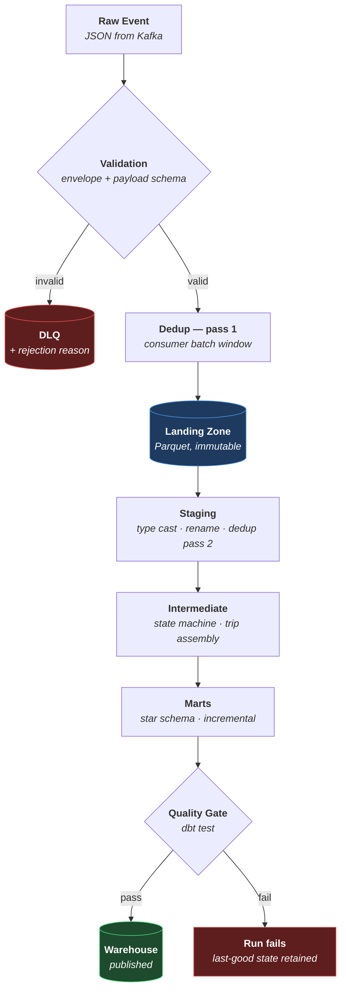

# RideFlow — ETL / ELT Design

**How a raw event becomes a warehouse row, and what happens when it goes wrong.**

| Field | Value |
|---|---|
| Version | `1.0.0` |
| Status | Approved for implementation |
| Milestone | M1 |
| Last updated | 2026-08-06 |

> **It is ELT, not ETL.** Raw events are **Extracted** to the landing zone and **Loaded** into DuckDB essentially unchanged; **Transformation** happens last, in SQL, inside the warehouse. This ordering is deliberate and is the reason the entire warehouse is rebuildable: because raw data is preserved before transformation, a logic bug is a re-run rather than a data loss. Classic ETL — transforming in flight, landing only the result — discards the original and makes a bug found on Thursday unrecoverable.

---

## 1. The pipeline



### 1.1 Stage responsibilities

| Stage | Owns | Must never do |
|---|---|---|
| **Validation** | Envelope + payload schema conformance | Interpret business meaning |
| **Dedup pass 1** | Remove duplicates within a batch | Be trusted as the only dedup |
| **Landing zone** | Immutable durable storage | Be mutated or deleted |
| **Staging** | Typing, renaming, dedup pass 2 | Joins, aggregation, business logic |
| **Intermediate** | State machine resolution, trip assembly | Presentation formatting |
| **Marts** | Star schema, conformed dimensions | Re-derive anything staging already did |
| **Quality gate** | Block publication on failure | Warn and continue |

**The invariant:** business logic exists **only** in Intermediate and Marts. Ingestion does not aggregate; dashboards do not transform.

---

## 2. Stage 1 — Validation

### 2.1 What is checked

| Order | Check | Failure action |
|---|---|---|
| 1 | Message is parseable JSON | → DLQ `MALFORMED_JSON` |
| 2 | Envelope has all 11 required fields | → DLQ `MISSING_ENVELOPE_FIELD` |
| 3 | `event_type` is one of the nine known types | → DLQ `UNKNOWN_EVENT_TYPE` |
| 4 | `event_version` is parseable semver | → DLQ `INVALID_VERSION` |
| 5 | Payload validates against that type's schema | → DLQ `SCHEMA_VIOLATION` |
| 6 | Timestamps parse as ISO 8601 UTC | → DLQ `INVALID_TIMESTAMP` |
| 7 | `event_timestamp` within T3/T4 bounds | → DLQ `TIMESTAMP_OUT_OF_BOUNDS` |
| 8 | Unknown **enum values** (not `event_type`) | **Accept** — see §2.3 |
| 9 | Unknown **extra fields** in payload | **Accept** — see §2.3 |

### 2.2 What validation deliberately does not check

**Cross-event consistency is not validated here.** The consumer does not check that a `RideStarted` has a preceding `RideAccepted`, and this is the most important decision in the ingestion layer.

A consumer that rejected `RideStarted` for arriving after `RideCompleted` would have discarded a perfectly valid event in the sample dataset — trip `2e59f0c7…`, where `RideStarted` was buffered on the device for 31 minutes and arrived *after* completion. The data was correct; only the arrival order was scrambled.

**Sequence rules (S1–S8) are validated in the intermediate layer, against the assembled trip — never in the consumer, against a stream position.** The consumer sees a stream; only the transformation layer sees a trip.

### 2.3 The unknown-value rule

Two categories of "unrecognised" are treated as **new information, not corruption**:

- **Unknown enum values** — a new `cancellation_reason_code` is accepted, landed, and bucketed to `UNKNOWN` in marts with a quality metric incremented.
- **Unknown extra fields** — a field added by a newer producer version is landed and ignored by older readers.

This is what allows producers and consumers to deploy independently (`event_contract.md` §2.3). Without it, every new enum value would require a coordinated release.

**The single exception is `event_type`.** An unrecognised type goes to DLQ, because the consumer cannot infer the shape of a payload it has never seen.

---

## 3. Stage 2 — Deduplication

Kafka guarantees **at-least-once** delivery. Duplicates are not an anomaly to be prevented; they are a certainty to be absorbed.

### 3.1 Two passes, and why one is not enough

| | Pass 1 — Consumer | Pass 2 — Staging |
|---|---|---|
| **Where** | In-memory, during batching | SQL window function |
| **Scope** | Current batch window only | **All history in the landing zone** |
| **Key** | `event_id` | `event_id` |
| **Catches** | Rapid redelivery (producer retry, rebalance) | Everything, including duplicates days apart |
| **Authoritative?** | **No** | **Yes** |

**Pass 1 alone is insufficient, and the reason is concrete.** A consumer's in-memory window covers seconds. A producer that retries after a network partition may redeliver the same `event_id` hours later — or a full landing-zone re-consume after a bug fix may replay a week of events. Neither is visible to an in-memory window.

Pass 2 is the guarantee. Because staging is recomputed from the **immutable** landing zone on every run, it sees all history and is correct regardless of how far apart the duplicates arrived.

Pass 1 exists only to reduce write volume — it is an optimisation, not a correctness mechanism. Treating it as one is a common and subtle error.

### 3.2 Which copy wins

`ROW_NUMBER() OVER (PARTITION BY event_id ORDER BY ingested_at ASC)`, keeping row 1 — **the earliest arrival**.

Earliest, not latest, because `event_id` identifies *the same event redelivered*, not two occurrences. Both copies have identical payloads by definition. Choosing the earliest makes the result **deterministic**, which is what makes re-runs byte-identical — the idempotency requirement in `PROJECT_PLAN.md` O2.

Choosing latest would give the same payload but a different `ingested_at`, making lateness metrics non-reproducible across runs.

### 3.3 Duplicates are flagged, not erased

Duplicates are removed from `fct_trips` but **retained and flagged** in `fct_trip_events` with `is_duplicate = true`.

The duplicate rate is an operational metric about pipeline health. Deleting the evidence would make it unmeasurable — and a rising duplicate rate is an early signal of consumer instability or producer retry storms.

### 3.4 Worked example

Trip `2e59f0c7…` in the sample dataset: `RideStarted` with `event_id = c9a582b7…` arrives at `04:58:20.500`, then again at `04:58:31.940`.

- Landing zone: **both** rows written.
- Staging: first kept, second dropped.
- `fct_trip_events`: both present, second flagged `is_duplicate = true`.
- `fct_trips`: one trip, `had_duplicate_events = true`, `event_count = 6`.

---

## 4. Stage 3 — Landing zone

### 4.1 Layout

```
data/raw/
  topic=trips/
    dt=2026-03-17/
      hour=02/  part-00000.parquet
      hour=03/  part-00000.parquet
  topic=presence/
    dt=2026-03-17/
      hour=02/  part-00000.parquet
```

Partitioned by **`ingested_at`**, not `event_timestamp`. This is deliberate and consequential — see §6.2.

### 4.2 Rules

| Rule | Why |
|---|---|
| **Append-only.** No file is ever modified. | It is the system of record. Mutation makes the warehouse unreconstructible. |
| **No deletes.** | Same. |
| **Never committed to git.** | Volume; and it is regenerable. |
| **Offset committed only after durable write.** | Committing first would make delivery at-most-once and permit silent loss. |

### 4.3 Batching

Flush on **whichever fires first**: 10,000 events, 60 seconds, or a partition boundary crossing.

Both triggers are needed. Size alone stalls forever in low traffic — an event could sit unflushed indefinitely at 3 a.m. Time alone produces tiny files under load. The pair bounds both latency and file size.

**Known weakness:** frequent flushing causes small-file proliferation, which degrades query performance as per-file overhead comes to dominate. This is the first bottleneck expected to bind (`architecture.md` §12.1). Mitigation is deliberate batch sizing, with a compaction step added if measured degradation appears.

---

## 5. Stage 4 — Staging

**Purpose: make raw data trustworthy without interpreting it.** One model per source, 1:1 with the landing zone.

| Operation | Detail |
|---|---|
| Type casting | Strings → `timestamptz`, `decimal(12,2)`, `integer`. **Never float for money.** |
| Renaming | To the `data_dictionary.md` conventions |
| Deduplication | Pass 2 (§3) |
| Envelope flattening | `payload` struct → columns |
| Version normalisation | Branch on `event_version` to reconcile shapes |
| Environment filter | `environment = 'local'` only |
| Null standardisation | Empty strings → `NULL` |

**Prohibited in staging:** joins to other sources, aggregation, business rules, dimension lookups. A staging model that joins is doing intermediate-layer work, and the layering stops being enforceable.

Materialised as **views** — cheap, always fresh, and no storage cost. The one exception would be a staging model expensive enough to be recomputed many times downstream.

---

## 6. Stage 5 — Intermediate

**Purpose: turn a stream of events into a trip.** This is where the hard logic lives.

### 6.1 Trip assembly

For each `trip_id`, collect all events and resolve the state machine (`event_contract.md` §6.2):

1. **Pivot** events to one row per trip — each event type contributes its columns.
2. **Derive final status** from which events are present.
3. **Compute derived measures** — lifecycle duration, accuracy percentages, flags.
4. **Validate sequence** (S1–S8) against the assembled set, setting `is_sequence_valid`.
5. **Quarantine** trips failing validation — retained, flagged, excluded from aggregates.

**Assembly uses the causal chain, not arrival order.** `causation_id` reconstructs true sequence independent of both `ingested_at` (scrambled by the network) and `event_timestamp` (unreliable device clocks). This is the strongest ordering signal available, and it is why trip `2e59f0c7…` assembles correctly despite its `RideStarted` arriving after its `RideCompleted`.

### 6.2 Late-arriving events

**The problem.** A driver's phone loses signal in a tunnel and flushes buffered events twenty minutes later. Yesterday's completed metrics must be revised without corrupting them.

**The mechanism — a lookback window.** Incremental models do not process only the newest partition; they reprocess a window wider than the maximum tolerated lateness.

```
Incremental filter:  ingested_at >= (max ingested_at in target) - LOOKBACK
Business grouping:   event_timestamp
```

**The two timestamps do different jobs and must not be swapped:**

| | Filter on `ingested_at` | Group on `event_timestamp` |
|---|---|---|
| Why | Arrival is monotonic — new data always has a larger value | Business truth — when it actually happened |
| If swapped | Late events fall below the high-water mark and are **missed permanently** | Metrics attributed to arrival time; a network outage looks like a demand spike |

**Filtering on `event_timestamp` is the classic and expensive failure.** The incremental high-water mark has already advanced past a late event's business time, so the event is silently never processed — no error, no warning, just a number that is quietly wrong forever.

**Window width:** starts at 48 hours. It must exceed the maximum simulated lateness (`PROJECT_PLAN.md` Appendix A5). Wider is safer but costs re-processing; the T4 invariant caps genuine lateness at 7 days, beyond which data is treated as corruption.

### 6.3 Out-of-order events

Handled entirely by §6.1 — assembly is order-independent by construction. `fct_trip_events.is_out_of_order` records that it happened, because it is a pipeline-health signal even when the business outcome is unaffected.

### 6.4 Driver session assembly

Pair `DriverOnline` with `DriverOffline` on `session_id`. An unmatched `DriverOnline` is an **open session** — `offline_at IS NULL`, `is_session_open = true`.

**Never impute an end time.** Doing so fabricates supply hours and inflates every utilisation denominator. Open sessions are excluded from completed-session metrics and reported separately.

---

## 7. Stage 6 — Marts

Star schema per `docs/star_schema.md`. Incremental materialisation with the §6.2 lookback.

### 7.1 Incremental strategy

`delete+insert` on the lookback window rather than `append`.

Append would double-count on re-run — the exact opposite of the idempotency requirement. Delete-then-insert over the window makes re-running any period produce identical output, which is what makes backfill and retry safe.

### 7.2 Dimension key resolution

Natural code → surrogate key via left join to the dimension, with unresolved values mapped to `-1`:

```
COALESCE(dim.surrogate_key, -1)
```

**Never a null FK.** A null breaks inner joins and silently drops rows from every aggregate — the loss appears in no count and no error. `-1` keeps the row, keeps joins working, and makes unknowns countable (`reference_data.md` §0.2).

---

## 8. Edge-case handling

### 8.1 Malformed JSON

| | |
|---|---|
| **Detected** | Validation step 1 |
| **Action** | → DLQ with `MALFORMED_JSON`, raw bytes, offset, partition, timestamp |
| **Offset** | **Committed.** The message is unprocessable; blocking on it would halt the partition forever. |
| **Alert** | DLQ depth threshold |

**Committing the offset for a poison message is essential.** Not committing creates a poison-pill loop: the consumer retries the same unparseable message indefinitely and the partition never advances. The message is preserved in the DLQ, so nothing is lost — it is quarantined, not discarded.

### 8.2 Null handling — three distinct kinds

Conflating these produces incorrect metrics, which is why `data_dictionary.md` §1.3 defines them separately.

| Kind | Example | Correct treatment |
|---|---|---|
| **Meaningful absence** | `driver_id` on a pre-match cancellation | The null **is** the fact. Never impute. |
| **Not yet applicable** | `completed_at` on an in-flight trip | Filter out; do not count as missing. |
| **Did not exist yet** | A v1.1 column on a v1.0 event | Exclude from the period before introduction. |

A count of nulls that does not separate these three misreports all of them. The third is the subtlest: counting pre-existence nulls as genuine nulls understates every metric derived from a newly added field for the entire period before it shipped.

**Rules:**
- Measures: null propagates. Never coalesce a measure to `0` — a missing fare is not a zero fare, and coalescing turns "unknown" into a number that silently drags averages down.
- Foreign keys: never null. Resolve to `-1`.
- Flags: never null. Default `false` with a documented rule.
- Timestamps: null means "stage not reached", which is information.

### 8.3 Missing driver

| Scenario | Cause | Handling |
|---|---|---|
| `driver_id` null before `RideAccepted` | **Correct** — no driver assigned yet | Expected. Invariant R2 permits it only here. |
| `driver_id` null on `RideCancelled` at `REQUESTED` | **Correct** — cancelled pre-match | Expected. |
| `driver_id` null after `RideAccepted` | **Defect** | Fails R2. Trip quarantined, `is_sequence_valid = false`, alert. |
| `driver_id` present but absent from `dim_driver` | First appearance | `dim_driver` is accumulated *from* events, so the driver is created on first sighting. Not an error. |
| Trip events exist but no `RideAccepted` | Never matched | `is_matched = false`. Trip is valid — it is unserved demand, which is exactly what marketplace-health analysis needs. |

### 8.4 Missing customer (rider)

`rider_id` is **mandatory on all seven trip events**. A missing one is a schema violation → DLQ. There is no legitimate scenario for a trip without a rider.

A `rider_id` not yet in `dim_rider` is a first-time rider, not an error — the dimension is accumulated from events.

### 8.5 Orphaned events

An event whose trip has no `RideRequested` — the first event was lost or is still in flight.

**Do not discard.** Retain, mark `is_sequence_valid = false`, quarantine from aggregates, and re-evaluate on the next run with the lookback window. If the missing event arrives late, the trip assembles correctly and leaves quarantine automatically. Discarding would make recovery impossible.

### 8.6 Financial inconsistency

Fare components not summing to `total_fare` within ±0.01 (invariant F1) is a **hard failure**. The run fails and marts are not published.

Financial data is the one category where publishing a known-wrong number is worse than publishing nothing. Every other quality issue can be flagged and shipped; this one blocks.

### 8.7 Duplicate trip identity

Two `RideRequested` events with the same `trip_id` but different `event_id` — genuinely distinct events claiming one trip. Not a delivery duplicate.

Quarantine both, alert. This indicates a producer defect and cannot be resolved downstream.

### 8.8 Clock skew

`event_timestamp` after `ingested_at` — a device clock running fast.

Tolerated up to 5 minutes (T1/T3). Beyond that → DLQ. `lateness_sec` may be negative and is stored signed; clamping it to zero would hide the skew, and systematic skew is a real producer defect worth surfacing.

---

## 9. Retry strategy

### 9.1 What makes retry safe

**Idempotency.** Every stage produces identical output when re-run over the same input:

| Stage | Idempotency mechanism |
|---|---|
| Consumer | Offsets committed after durable write; redelivery produces duplicates, removed downstream |
| Landing zone | Append-only; re-consuming appends duplicate rows, removed in staging |
| Staging | Recomputed from scratch every run |
| Intermediate | Recomputed from staging |
| Marts | `delete+insert` over the window |

**Without idempotency, retry is dangerous rather than routine.** An append-only mart with a naive retry would double-count revenue on every transient failure.

### 9.2 Retry policy by failure class

| Class | Examples | Retry? | Policy |
|---|---|---|---|
| **Transient** | Broker unavailable, lock contention, disk I/O | **Yes** | Exponential backoff: 1m, 2m, 4m, 8m. 4 attempts. |
| **Data quality** | dbt test failure | **No** | Retrying identical data gives an identical failure. Alert and stop. |
| **Schema** | Malformed event | **No** | → DLQ, offset committed, continue. |
| **Logic** | dbt compilation error | **No** | Requires a code fix. Alert immediately. |
| **Resource** | Out of memory, disk full | **Limited** | 1 retry after backoff; then alert. |

**Retrying a data-quality failure is the most common orchestration mistake.** It burns the retry budget on a deterministic failure and delays the alert by the full backoff sequence — turning a 1-minute notification into a 15-minute one for no benefit.

### 9.3 Backfill

A parameterised re-run over an arbitrary historical window, using the same models and the same idempotency. Marts are deleted and reinserted for the range; the landing zone is untouched.

**Backfill is the recovery path for every logic bug.** Fix the model, backfill the affected range, and history is corrected — possible only because raw data was preserved before transformation. This is the concrete payoff of choosing ELT over ETL (§ preamble).

---

## 10. Reconciliation

Run every cycle. Failures block publication.

| ID | Check |
|---|---|
| **N1** | Events landed = events staged + events rejected to DLQ |
| **N2** | Distinct `trip_id` in `fct_trips` = distinct `trip_id` in `stg_trip_events` |
| **N3** | `SUM(total_fare)` in `fct_trips` = `SUM(trip_fare)` in `fct_payments`, for paid trips |
| **N4** | No trip in `fct_trips` without at least one row in `fct_trip_events` |
| **N5** | Every `DriverOffline.session_id` matches an earlier `DriverOnline` |

**N3 must exclude cash trips.** Cash payments never produce a gateway reference and settle outside the platform. Including them would fail the check on entirely correct data — a false alarm that trains people to ignore the alert, which is worse than having no alert.

---

## 11. Design decisions worth defending

| Decision | Reasoning |
|---|---|
| **ELT, not ETL** | Raw preserved before transformation ⟹ any logic bug is a re-run, not data loss |
| **Two dedup passes** | Consumer pass is an optimisation; staging pass is the correctness guarantee |
| **Filter on `ingested_at`, group on `event_timestamp`** | The only combination where late data is neither missed nor misattributed |
| **`delete+insert`, not `append`** | Append double-counts on retry, defeating idempotency |
| **Quarantine, never discard** | A quarantined row can be recovered when its missing events arrive; a discarded one cannot |
| **`-1` FK, never null** | Nulls drop rows from aggregates silently; `-1` keeps them countable |
| **Commit offset on poison messages** | Otherwise the partition halts forever on one bad byte |
| **Financial failures block; others flag** | Publishing a wrong revenue number is worse than publishing none |

---

## 12. Related documents

| Document | Covers |
|---|---|
| `docs/event_contract.md` | Event schemas, invariants, sequence rules |
| `docs/star_schema.md` | The dimensional model this produces |
| `docs/data_dictionary.md` | Every column and business rule |
| `docs/kafka_design.md` | Delivery semantics and DLQ mechanics |
| `docs/airflow_design.md` | How retries and backfills are executed |
| `docs/testing_strategy.md` | How these rules are verified |
