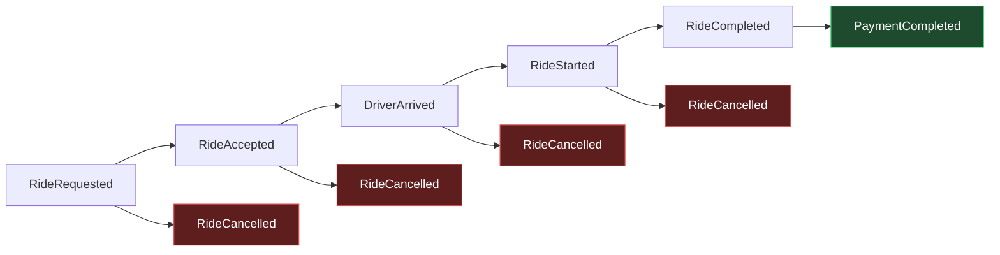

# RideFlow — Event Contract

**The single source of truth for every event in RideFlow.**

| Field | Value |
|---|---|
| Contract version | `1.0.0` |
| Status | **Frozen** — changes require the §2.4 process |
| Milestone | M1 |
| Last updated | 2026-08-05 |
| Supersedes | `PROJECT_PLAN.md` §5.2 (draft sketch) |

> **Authority.** Where this document and any other artefact disagree, this document wins. The event generator, the ingestion consumer, the dbt staging layer, and every test assert against the definitions here. No component may introduce a field, a type, or an enum value that is not defined in this contract.

---

## 0. Contract changes from PROJECT_PLAN.md

M1 formalises what §5.2 of the project plan sketched. Three deliberate changes were made, and they are recorded here rather than applied silently.

| # | Change | Reason |
|---|---|---|
| C1 | Flat event structure replaced by **envelope + payload** | Separates transport concerns (identity, ordering, lineage) from business content. Lets the consumer validate and route an event without understanding its type. |
| C2 | Event names changed to **PascalCase past-tense** (`RideRequested`) from the plan's state names (`REQUESTED`) | Event names and state names are different things. The state machine still uses the §5.1 states; events are the transitions that produce them. |
| C3 | **Driver presence events added** (`DriverOnline` / `DriverOffline`) | Not in the original plan. These are supply-side, not trip-side — see §3.3, which is the most consequential change. |

### 0.1 Two gaps this contract does not close

Stated up front, because a contract that hides its holes is worse than one that has none.

**Gap 1 — `EXPIRED` has no event.** The plan's state machine (§5.1) includes `EXPIRED`, for a request no driver ever accepts. There is no `RideExpired` event in the nine specified here, so an expired request is currently indistinguishable from a request whose downstream events were lost. The transformation layer must infer expiry from a timeout, which is an inference, not a fact.
**Resolution:** add `RideExpired` in contract `v1.1`. Until then, expiry is derived and must be labelled as derived in the marts.

**Gap 2 — terminal payment failure is not representable.** `PaymentCompleted` asserts success by name. A payment that fails and is *retried successfully* is representable via `attempt_number` and `previous_attempt_failure_reason` (§5.7). A payment that **never** succeeds — a genuine terminal failure — has no event and produces a trip stuck in `COMPLETED` forever.
**Resolution:** add `PaymentFailed` in contract `v1.1`. Do not overload `PaymentCompleted` with a `FAILED` status; an event named for success must not carry failure.

Both gaps are tracked in `PROJECT_PLAN.md` Appendix A.

---

## 1. Event Naming Conventions

### 1.1 Event type names

**Rule:** `<Entity><PastTenseVerb>`, PascalCase, no separators.

| Rule | Rationale |
|---|---|
| **Past tense, always** | An event is an immutable statement that something *happened*. `RideRequested`, never `RequestRide` (a command) or `RideRequesting` (a process). This distinction is load-bearing: commands can be rejected, events cannot. |
| **Entity first** | Groups related events alphabetically and reads naturally when filtering: all `Ride*` events, all `Driver*` events. |
| **No version in the name** | `RideRequestedV2` fragments consumer logic. Version lives in `event_version` (§2). |
| **No `Event` suffix** | `RideRequestedEvent` is redundant in a stream of events. |
| **Singular entity** | `RideRequested`, not `RidesRequested`. One event describes one occurrence. |

**Valid event types in `v1.0.0` — this list is closed:**

```
RideRequested   RideAccepted   DriverArrived   RideStarted
RideCompleted   RideCancelled  PaymentCompleted
DriverOnline    DriverOffline
```

### 1.2 Field names

| Rule | Example |
|---|---|
| `snake_case` throughout | `surge_multiplier` |
| Timestamps end in `_at` | `requested_at`, `ingested_at` |
| Durations end in `_sec` and are integers | `eta_to_pickup_sec` |
| Distances end in `_km` and are decimals | `distance_km` |
| Monetary fields end in `_fare`, `_amount`, `_fee`, or `_payout` | `total_fare`, `tip_amount` |
| Identifiers end in `_id` | `trip_id` |
| Booleans are `is_` or `has_` prefixed, never negated | `is_airport_pickup`. **Never** `is_not_shared` — negated booleans invert under `NOT` and cause bugs. |
| Enum reference fields end in `_code` (string) or `_id` (integer) | `cancellation_reason_code` |
| No abbreviations except industry-standard ones | `eta` and `id` allowed; `dst`, `amt`, `ts` are not |

### 1.3 Kafka topic names

**Rule:** `rideflow.<domain>.<stream>.v<major>`

| Topic | Partition key | Partitions | Carries |
|---|---|---|---|
| `rideflow.trips.events.v1` | `trip_id` | 12 | The seven trip-lifecycle events |
| `rideflow.drivers.presence.v1` | `driver_id` | 6 | `DriverOnline`, `DriverOffline` |
| `rideflow.trips.events.dlq.v1` | `event_id` | 3 | Rejected trip events + reason |
| `rideflow.drivers.presence.dlq.v1` | `event_id` | 3 | Rejected presence events + reason |

Only the **major** version appears in the topic name. Minor and patch changes are backward-compatible by definition (§2.2) and must not force a new topic.

---

## 2. Event Versioning Strategy

### 2.1 Version format

`event_version` is **semantic versioning**, `MAJOR.MINOR.PATCH`, carried on every event.

| Component | Meaning | Consumer impact |
|---|---|---|
| **MAJOR** | Breaking change | Consumers **will** break. New topic required. |
| **MINOR** | Additive, backward-compatible | Old consumers keep working, ignoring new fields. |
| **PATCH** | Documentation or constraint clarification, no structural change | None. |

Each event type versions **independently**. `RideCompleted` may be at `1.2.0` while `DriverOnline` is at `1.0.0`. The contract as a whole also carries a version (this document's header), which is the highest major across all events.

### 2.2 What each change class permits

**PATCH — always safe**
- Correcting a description
- Tightening documentation without changing runtime validation
- Adding an example

**MINOR — additive only**
- Adding an **optional** field (must be nullable *or* have a documented default)
- Adding a value to an enum **that consumers are documented to tolerate** (§2.3)
- Relaxing a validation rule (e.g. widening a numeric range)

**MAJOR — breaking**
- Removing or renaming a field
- Changing a field's data type
- Making an optional field required
- Tightening a validation rule so previously valid events become invalid
- Changing the semantic meaning of an existing field **without renaming it** — the most dangerous change of all, because it passes every schema check while silently corrupting history

> **The rename rule.** If a field's meaning changes, it gets a new name. Reusing `distance_km` to mean "route distance" when it previously meant "straight-line distance" would silently corrupt every historical metric with no validation failure and no error in any log. Always rename.

### 2.3 Enum evolution — the unknown-value rule

Adding an enum value is only a MINOR change because **every consumer is contractually required to tolerate unknown enum values.**

| Consumer | Required behaviour on an unrecognised enum value |
|---|---|
| Ingestion consumer | **Accept and land the event.** Do not route to DLQ. An unknown value is new information, not corruption. |
| dbt staging | Pass through unchanged. |
| dbt marts | Map to an `UNKNOWN` bucket, **increment a quality metric**, and never silently drop the row. |
| Dashboard | Render as `Unknown`. |

The one exception: `event_type` itself. An unrecognised `event_type` **is** routed to DLQ, because the consumer cannot infer the shape of a payload it has never seen.

This rule is what makes independent producer and consumer deployment possible. Without it, every new cancellation reason would require a coordinated release.

### 2.4 Change process

1. Propose the change against this document with a classification (PATCH / MINOR / MAJOR).
2. For MAJOR, produce a migration plan covering historical data.
3. Update this contract, its version, and the §5 schema.
4. Update `docs/data_dictionary.md` in the same commit — the dictionary is generated from this contract and must never lag it.
5. Update generator, consumer validation, and dbt models.
6. Add a test that asserts the new rule.

**A schema change that lands without a corresponding test does not count as landed.**

### 2.5 Handling a MAJOR version in flight

During a MAJOR migration both topics run simultaneously. Producers dual-write, consumers read both, staging normalises the two shapes into one, and only after the v1 topic drains to zero is it retired. There is no cutover moment, and therefore no cutover outage.

---

## 3. Event Metadata (the envelope)

Every RideFlow event is an **envelope** wrapping a typed **payload**.

```json
{
  "event_id": "…",
  "event_type": "RideRequested",
  "event_version": "1.0.0",
  "event_timestamp": "…",
  "ingested_at": "…",
  "partition_key": "…",
  "correlation_id": "…",
  "causation_id": null,
  "producer_service": "…",
  "producer_version": "…",
  "environment": "local",
  "payload": { }
}
```

### 3.1 Envelope fields

| Field | Type | Nullable | Validation | Example | Business meaning |
|---|---|---|---|---|---|
| `event_id` | string (UUID v4) | No | RFC 4122 v4; **globally unique** | `9f2b1c7e-4a3d-4e18-b6c2-77a1e9d40c31` | The deduplication key. Two events with the same `event_id` are the *same* event redelivered, never two occurrences. A producer retry must reuse the original `event_id`. |
| `event_type` | string (enum) | No | One of the nine names in §1.1 | `RideRequested` | Discriminator that determines the payload schema. The only enum where an unknown value goes to DLQ (§2.3). |
| `event_version` | string (semver) | No | `^\d+\.\d+\.\d+$` | `1.0.0` | Schema version of **this event type**. Lets staging normalise across versions coexisting in the landing zone. |
| `event_timestamp` | string (ISO 8601, UTC) | No | Must end `Z`; within 7 days past / 5 min future of `ingested_at` | `2026-03-17T02:42:10.412Z` | **Business time** — when it happened on the device. Drives every business metric. Trusted for meaning, never for ordering. |
| `ingested_at` | string (ISO 8601, UTC) | No | Must end `Z`; `>= event_timestamp` (tolerance 5 min for clock skew) | `2026-03-17T02:42:11.087Z` | **Arrival time** — when the consumer received it. Drives incremental loading and operational lag. Set by the consumer, never the producer. |
| `partition_key` | string | No | Equals `trip_id` for trip events, `driver_id` for presence events | `1a4f8c22-…` | The Kafka partition key. Present in the payload *and* the envelope deliberately — the consumer must not parse a typed payload to learn how a message was routed. |
| `correlation_id` | string (UUID) | No | UUID v4 | `1a4f8c22-…` | Ties every event of one business process. Equals `trip_id` for trip events, `session_id` for presence events. The join key for end-to-end tracing. |
| `causation_id` | string (UUID) | **Yes** | UUID v4 or null | `9f2b1c7e-…` | The `event_id` of the event that directly caused this one. Null for the first event in a chain. Reconstructs true causal order even when arrival order is scrambled — see §7.3. |
| `producer_service` | string | No | `^[a-z][a-z0-9-]{2,39}$` | `rideflow-event-generator` | Which service emitted this. Essential for attributing bad data to a source. |
| `producer_version` | string (semver) | No | `^\d+\.\d+\.\d+$` | `0.3.1` | Producer build version. When malformed events appear, this identifies the release that introduced them. |
| `environment` | string (enum) | No | `local`, `dev`, `staging`, `prod` | `local` | Prevents non-production data contaminating production marts. Staging filters on this. |

### 3.2 Why `event_timestamp` and `ingested_at` are both mandatory

This is the most important modelling decision in the contract.

| | `event_timestamp` | `ingested_at` |
|---|---|---|
| Set by | Producer (device clock) | Consumer (server clock) |
| Answers | "When did this happen?" | "When did we learn about it?" |
| Trustworthy? | No — device clocks drift, skew, and are user-settable | Yes — single controlled clock |
| Used for | Business metrics, funnel timing, revenue attribution | Incremental loads, lag monitoring, late-arrival detection |

**Lateness is exactly `ingested_at - event_timestamp`.** With only one timestamp it cannot be computed at all.

Conflating them is the single most expensive error in event pipelines: use ingestion time for business metrics and a network outage looks like a demand spike; use event time for incremental loading and every late-arriving event is silently missed forever, because the incremental filter has already advanced past its window.

### 3.3 The partitioning consequence of driver presence events

`DriverOnline` and `DriverOffline` are **not trip events.** They have no `trip_id` and a different grain — one row per driver session, not per trip. This has a concrete architectural consequence that was not visible when `PROJECT_PLAN.md` was written:

**They cannot share a topic with trip events.** Trip events are partitioned by `trip_id` to guarantee per-trip ordering. Presence events must be partitioned by `driver_id` to guarantee per-driver ordering. A single topic can only have one partitioning strategy, so one of the two orderings would be lost.

Hence two topics (§1.3), two consumer paths, and two fact tables (`fct_trips`, `fct_driver_sessions`). Attempting to force them into one stream would produce a subtle, intermittent ordering bug — a driver appearing offline while a trip is in progress — that is extremely hard to diagnose after the fact.

---

## 4. Common Fields

### 4.1 What is genuinely common

A precise answer matters more than a convenient one:

- **All 9 events** share the **11 envelope fields** of §3.1, plus exactly one payload field: **`city_id`**.
- **The 7 trip events** additionally share `trip_id` and `rider_id`.
- **The 2 presence events** share `driver_id` and `session_id`, and have **no** `trip_id`.

There is no single payload field beyond `city_id` common to all nine, because the two event families describe different things. Pretending otherwise — for example by adding a nullable `trip_id` to presence events — would create a column that is null 100% of the time for those rows and invite incorrect joins.

### 4.2 Common payload fields

| Field | Type | Nullable | Validation | Example | Business meaning | Present in |
|---|---|---|---|---|---|---|
| `city_id` | integer | No | FK → `dim_city.city_id`; > 0 | `1` | Operating city. Every metric is segmented by it; cities have independent pricing, regulation, and currency. | **All 9** |
| `trip_id` | string (UUID v4) | No | UUID v4 | `1a4f8c22-…` | The trip this event belongs to. Stable across the entire lifecycle. Kafka partition key. | 7 trip events |
| `rider_id` | string (UUID v4) | No | UUID v4 | `c3d8e0b5-…` | The requesting rider. Constant for a trip's life. | 7 trip events |
| `driver_id` | string (UUID v4) | **Conditional** | UUID v4 | `7f3a2c18-…` | The assigned driver. **Null before `RideAccepted`** — this is meaningful absence, not missing data. Nullable in `RideCancelled` (a request cancelled pre-match has no driver). Required in all other events that carry it. | `RideAccepted` onward + both presence events |

### 4.3 Currency and monetary representation

| Rule | Detail |
|---|---|
| Type | `decimal(12,2)`. **Never floating point.** `0.1 + 0.2 != 0.3` in IEEE 754, and a cent lost per trip becomes a reconciliation failure at scale. |
| Currency | Every monetary event carries `currency` (ISO 4217). Never assumed from `city_id`, because cities can change currency and history must remain correct. |
| Sign | All amounts are **positive**. Refunds are not negative charges; they are a separate future event type. |
| Rounding | Half-up, at the final total only. Component fares are stored unrounded to 2dp and must sum to the total within ±0.01. |

---

## 5. Event Schemas

Each section gives the payload field table (datatype, nullability, validation, example, business meaning) followed by the JSON Schema for that payload. The envelope schema in §5.0 applies to all nine and is not repeated.

### 5.0 Envelope JSON Schema

```json
{
  "$schema": "https://json-schema.org/draft/2020-12/schema",
  "$id": "https://rideflow.internal/schemas/envelope/1.0.0.json",
  "title": "RideFlow Event Envelope",
  "type": "object",
  "required": [
    "event_id", "event_type", "event_version", "event_timestamp",
    "ingested_at", "partition_key", "correlation_id",
    "producer_service", "producer_version", "environment", "payload"
  ],
  "additionalProperties": false,
  "properties": {
    "event_id":         { "type": "string", "format": "uuid" },
    "event_type":       { "type": "string", "enum": [
                            "RideRequested", "RideAccepted", "DriverArrived",
                            "RideStarted", "RideCompleted", "RideCancelled",
                            "PaymentCompleted", "DriverOnline", "DriverOffline" ] },
    "event_version":    { "type": "string", "pattern": "^\\d+\\.\\d+\\.\\d+$" },
    "event_timestamp":  { "type": "string", "format": "date-time" },
    "ingested_at":      { "type": "string", "format": "date-time" },
    "partition_key":    { "type": "string", "minLength": 1 },
    "correlation_id":   { "type": "string", "format": "uuid" },
    "causation_id":     { "type": ["string", "null"], "format": "uuid" },
    "producer_service": { "type": "string", "pattern": "^[a-z][a-z0-9-]{2,39}$" },
    "producer_version": { "type": "string", "pattern": "^\\d+\\.\\d+\\.\\d+$" },
    "environment":      { "type": "string", "enum": ["local", "dev", "staging", "prod"] },
    "payload":          { "type": "object" }
  }
}
```

---

### 5.1 `RideRequested` — v1.0.0

**Trigger:** A rider confirms a ride request in the app.
**Grain:** One per trip. **The first event of every trip** — no trip event may precede it.
**Causation:** `causation_id` is always `null`.

| Field | Type | Nullable | Validation | Example | Business meaning |
|---|---|---|---|---|---|
| `trip_id` | UUID | No | v4, unique across all trips | `1a4f8c22-9e5b-4c07-8d3a-2f6b1e904d77` | Identity of the trip being created. |
| `rider_id` | UUID | No | v4; FK → `dim_rider` | `c3d8e0b5-6a1f-4b92-9e77-0d4c8a3f1b26` | Who requested. |
| `city_id` | integer | No | FK → `dim_city` | `1` | Operating city. |
| `requested_at` | timestamp UTC | No | Equals envelope `event_timestamp` | `2026-03-17T02:42:10.412Z` | Funnel start. Every downstream duration is measured from here. |
| `pickup_lat` | decimal(9,6) | No | −90 … 90; inside city bounds | `13.199512` | Pickup latitude. |
| `pickup_lon` | decimal(9,6) | No | −180 … 180; inside city bounds | `77.708374` | Pickup longitude. |
| `pickup_zone_id` | integer | No | FK → `dim_zone`; must belong to `city_id` | `412` | Zone for supply/demand aggregation. Coordinates are too granular to aggregate on. |
| `dropoff_lat` | decimal(9,6) | No | −90 … 90 | `12.971891` | Destination latitude. |
| `dropoff_lon` | decimal(9,6) | No | −180 … 180 | `77.641350` | Destination longitude. |
| `dropoff_zone_id` | integer | No | FK → `dim_zone` | `118` | Destination zone. Enables origin-destination matrices. |
| `vehicle_type` | string (enum) | No | FK → `dim_vehicle_type.vehicle_type_code` | `PREMIUM` | Requested service tier. Determines pricing and eligible drivers. |
| `estimated_fare` | decimal(12,2) | No | > 0 | `1980.00` | Fare quoted to the rider. Compared against actual to measure estimate accuracy — a real product metric. |
| `estimated_distance_km` | decimal(8,2) | No | > 0, ≤ 500 | `34.80` | Quoted distance. |
| `estimated_duration_sec` | integer | No | > 0, ≤ 43200 | `3120` | Quoted duration. |
| `surge_multiplier` | decimal(4,2) | No | ≥ 1.00, ≤ 10.00 | `2.30` | Demand-based price multiplier at request time. `1.00` means no surge. **Frozen at request** — the rider is charged what they were quoted. |
| `payment_method` | string (enum) | No | FK → `dim_payment_method` | `UPI` | Intended method. May differ from the method actually used at payment. |
| `customer_tier` | string (enum) | No | FK → `dim_customer_tier` | `GOLD` | Loyalty tier at request time. Affects matching priority and discounts. |
| `is_airport_pickup` | boolean | No | true/false | `true` | Airport trips have distinct fee structures, regulation, and demand patterns. Precomputed because deriving it from zones at query time is expensive and error-prone. |
| `is_airport_dropoff` | boolean | No | true/false | `false` | As above, destination side. |
| `weather_code` | string (enum) | No | FK → `dim_weather` | `CLEAR` | Weather at request. A major demand driver; without it, rain-driven spikes look like unexplained anomalies. |
| `traffic_level` | string (enum) | No | FK → `dim_traffic_level` | `HEAVY` | Traffic at request. Explains ETA accuracy. |
| `promo_code` | string | **Yes** | `^[A-Z0-9]{4,16}$` or null | `null` | Applied promotion. Null = none. |
| `device_platform` | string (enum) | No | `IOS`, `ANDROID`, `WEB` | `ANDROID` | Client platform. Isolates platform-specific bugs. |
| `app_version` | string | No | semver | `8.14.2` | Client build. Correlates data anomalies to app releases. |

```json
{
  "$schema": "https://json-schema.org/draft/2020-12/schema",
  "$id": "https://rideflow.internal/schemas/RideRequested/1.0.0.json",
  "type": "object",
  "required": [
    "trip_id","rider_id","city_id","requested_at","pickup_lat","pickup_lon",
    "pickup_zone_id","dropoff_lat","dropoff_lon","dropoff_zone_id","vehicle_type",
    "estimated_fare","estimated_distance_km","estimated_duration_sec",
    "surge_multiplier","payment_method","customer_tier","is_airport_pickup",
    "is_airport_dropoff","weather_code","traffic_level","device_platform","app_version"
  ],
  "additionalProperties": false,
  "properties": {
    "trip_id":                { "type": "string", "format": "uuid" },
    "rider_id":               { "type": "string", "format": "uuid" },
    "city_id":                { "type": "integer", "minimum": 1 },
    "requested_at":           { "type": "string", "format": "date-time" },
    "pickup_lat":             { "type": "number", "minimum": -90,  "maximum": 90 },
    "pickup_lon":             { "type": "number", "minimum": -180, "maximum": 180 },
    "pickup_zone_id":         { "type": "integer", "minimum": 1 },
    "dropoff_lat":            { "type": "number", "minimum": -90,  "maximum": 90 },
    "dropoff_lon":            { "type": "number", "minimum": -180, "maximum": 180 },
    "dropoff_zone_id":        { "type": "integer", "minimum": 1 },
    "vehicle_type":           { "type": "string", "enum": ["ECONOMY","PREMIUM","XL","POOL","AUTO","BIKE"] },
    "estimated_fare":         { "type": "number", "exclusiveMinimum": 0 },
    "estimated_distance_km":  { "type": "number", "exclusiveMinimum": 0, "maximum": 500 },
    "estimated_duration_sec": { "type": "integer", "exclusiveMinimum": 0, "maximum": 43200 },
    "surge_multiplier":       { "type": "number", "minimum": 1.0, "maximum": 10.0 },
    "payment_method":         { "type": "string", "enum": ["CASH","CARD","UPI","WALLET","CORPORATE","NETBANKING"] },
    "customer_tier":          { "type": "string", "enum": ["BASIC","SILVER","GOLD","PLATINUM"] },
    "is_airport_pickup":      { "type": "boolean" },
    "is_airport_dropoff":     { "type": "boolean" },
    "weather_code":           { "type": "string", "enum": ["CLEAR","CLOUDY","RAIN_LIGHT","RAIN_HEAVY","THUNDERSTORM","FOG","EXTREME_HEAT"] },
    "traffic_level":          { "type": "string", "enum": ["FREE_FLOW","LIGHT","MODERATE","HEAVY","GRIDLOCK"] },
    "promo_code":             { "type": ["string","null"], "pattern": "^[A-Z0-9]{4,16}$" },
    "device_platform":        { "type": "string", "enum": ["IOS","ANDROID","WEB"] },
    "app_version":            { "type": "string", "pattern": "^\\d+\\.\\d+\\.\\d+$" }
  }
}
```

---

### 5.2 `RideAccepted` — v1.0.0

**Trigger:** A driver accepts a dispatch offer.
**Grain:** One per trip. **The first event carrying `driver_id`.**
**Causation:** `causation_id` = the `event_id` of `RideRequested`.

| Field | Type | Nullable | Validation | Example | Business meaning |
|---|---|---|---|---|---|
| `trip_id` | UUID | No | Must match an existing `RideRequested` | `1a4f8c22-…` | Trip identity. |
| `rider_id` | UUID | No | Must equal the value in `RideRequested` | `c3d8e0b5-…` | Rider. Repeated so each event is self-contained. |
| `driver_id` | UUID | No | v4; FK → `dim_driver` | `7f3a2c18-…` | The matched driver. **First appearance in the lifecycle.** |
| `city_id` | integer | No | FK → `dim_city` | `1` | Operating city. |
| `accepted_at` | timestamp UTC | No | > `requested_at` | `2026-03-17T02:42:47.930Z` | Match completion. Ends the matching stage of the funnel. |
| `driver_lat` | decimal(9,6) | No | −90 … 90 | `13.207880` | Driver location at acceptance. |
| `driver_lon` | decimal(9,6) | No | −180 … 180 | `77.712004` | Driver location at acceptance. |
| `driver_zone_id` | integer | No | FK → `dim_zone` | `412` | Driver's zone. With `pickup_zone_id`, reveals cross-zone dispatch. |
| `vehicle_id` | UUID | No | v4 | `b2e91d04-…` | The specific vehicle. Distinct from the driver — drivers change vehicles. |
| `vehicle_type` | string (enum) | No | Must satisfy the requested type | `PREMIUM` | Delivered tier. May exceed the requested tier on an upgrade; may never fall below it. |
| `matching_duration_sec` | integer | No | ≥ 0; = `accepted_at − requested_at` | `37` | Time to find a driver. A primary marketplace-health metric. Stored, not derived, so it survives if `RideRequested` is lost. |
| `eta_to_pickup_sec` | integer | No | > 0, ≤ 3600 | `420` | Promised arrival time. The baseline for the late-driver metric in §5.3. |
| `distance_to_pickup_km` | decimal(8,2) | No | ≥ 0, ≤ 100 | `2.40` | Deadhead distance — driven unpaid. Directly reduces driver earnings efficiency. |
| `driver_rating_at_accept` | decimal(3,2) | No | 1.00 … 5.00 | `4.87` | Rating snapshot. Point-in-time because ratings change; a join to the current rating would misattribute history. |
| `dispatch_attempt_number` | integer | No | ≥ 1 | `2` | Which offer succeeded. `> 1` means drivers declined first — a supply-quality signal invisible in trip counts. |

```json
{
  "$schema": "https://json-schema.org/draft/2020-12/schema",
  "$id": "https://rideflow.internal/schemas/RideAccepted/1.0.0.json",
  "type": "object",
  "required": [
    "trip_id","rider_id","driver_id","city_id","accepted_at","driver_lat","driver_lon",
    "driver_zone_id","vehicle_id","vehicle_type","matching_duration_sec",
    "eta_to_pickup_sec","distance_to_pickup_km","driver_rating_at_accept","dispatch_attempt_number"
  ],
  "additionalProperties": false,
  "properties": {
    "trip_id":                 { "type": "string", "format": "uuid" },
    "rider_id":                { "type": "string", "format": "uuid" },
    "driver_id":               { "type": "string", "format": "uuid" },
    "city_id":                 { "type": "integer", "minimum": 1 },
    "accepted_at":             { "type": "string", "format": "date-time" },
    "driver_lat":              { "type": "number", "minimum": -90,  "maximum": 90 },
    "driver_lon":              { "type": "number", "minimum": -180, "maximum": 180 },
    "driver_zone_id":          { "type": "integer", "minimum": 1 },
    "vehicle_id":              { "type": "string", "format": "uuid" },
    "vehicle_type":            { "type": "string", "enum": ["ECONOMY","PREMIUM","XL","POOL","AUTO","BIKE"] },
    "matching_duration_sec":   { "type": "integer", "minimum": 0 },
    "eta_to_pickup_sec":       { "type": "integer", "exclusiveMinimum": 0, "maximum": 3600 },
    "distance_to_pickup_km":   { "type": "number", "minimum": 0, "maximum": 100 },
    "driver_rating_at_accept": { "type": "number", "minimum": 1.0, "maximum": 5.0 },
    "dispatch_attempt_number": { "type": "integer", "minimum": 1 }
  }
}
```

---

### 5.3 `DriverArrived` — v1.0.0

**Trigger:** The driver reaches the pickup point.
**Grain:** One per trip. **Optional** — a trip cancelled before arrival never emits it.
**Causation:** `causation_id` = `event_id` of `RideAccepted`.

| Field | Type | Nullable | Validation | Example | Business meaning |
|---|---|---|---|---|---|
| `trip_id` | UUID | No | Existing trip | `4d7e2f91-…` | Trip identity. |
| `rider_id` | UUID | No | Matches trip | `e8b04a76-…` | Rider. |
| `driver_id` | UUID | No | Matches `RideAccepted` | `a5c73e2b-…` | Driver. |
| `city_id` | integer | No | FK → `dim_city` | `1` | City. |
| `arrived_at` | timestamp UTC | No | > `accepted_at` | `2026-03-17T03:19:44.115Z` | Arrival moment. Starts rider wait. |
| `driver_lat` | decimal(9,6) | No | Within 500 m of `pickup_lat/lon` | `12.935017` | Actual arrival position. A large gap from the requested pickup indicates a GPS or navigation problem. |
| `driver_lon` | decimal(9,6) | No | As above | `77.614380` | As above. |
| `actual_pickup_duration_sec` | integer | No | ≥ 0; = `arrived_at − accepted_at` | `1004` | Real time to reach pickup. |
| `arrival_delay_sec` | integer | No | = `actual_pickup_duration_sec − eta_to_pickup_sec`; **may be negative** | `584` | **The late-driver metric.** Positive = late, negative = early. Signed deliberately: absolute delay would hide systematic ETA over-estimation, which is just as damaging as under-estimation. |
| `is_late_arrival` | boolean | No | true when `arrival_delay_sec > 180` | `true` | Precomputed breach of the 3-minute tolerance. Threshold is a business rule and lives in the contract so every consumer agrees on it. |

```json
{
  "$schema": "https://json-schema.org/draft/2020-12/schema",
  "$id": "https://rideflow.internal/schemas/DriverArrived/1.0.0.json",
  "type": "object",
  "required": [
    "trip_id","rider_id","driver_id","city_id","arrived_at",
    "driver_lat","driver_lon","actual_pickup_duration_sec",
    "arrival_delay_sec","is_late_arrival"
  ],
  "additionalProperties": false,
  "properties": {
    "trip_id":                    { "type": "string", "format": "uuid" },
    "rider_id":                   { "type": "string", "format": "uuid" },
    "driver_id":                  { "type": "string", "format": "uuid" },
    "city_id":                    { "type": "integer", "minimum": 1 },
    "arrived_at":                 { "type": "string", "format": "date-time" },
    "driver_lat":                 { "type": "number", "minimum": -90,  "maximum": 90 },
    "driver_lon":                 { "type": "number", "minimum": -180, "maximum": 180 },
    "actual_pickup_duration_sec": { "type": "integer", "minimum": 0 },
    "arrival_delay_sec":          { "type": "integer" },
    "is_late_arrival":            { "type": "boolean" }
  }
}
```

---

### 5.4 `RideStarted` — v1.0.0

**Trigger:** The driver starts the trip with the rider on board.
**Grain:** One per trip. **The revenue-eligibility boundary** — a trip that never starts can never generate fare revenue.
**Causation:** `causation_id` = `event_id` of `DriverArrived`.

| Field | Type | Nullable | Validation | Example | Business meaning |
|---|---|---|---|---|---|
| `trip_id` | UUID | No | Existing trip | `1a4f8c22-…` | Trip identity. |
| `rider_id` | UUID | No | Matches trip | `c3d8e0b5-…` | Rider. |
| `driver_id` | UUID | No | Matches trip | `7f3a2c18-…` | Driver. |
| `city_id` | integer | No | FK → `dim_city` | `1` | City. |
| `started_at` | timestamp UTC | No | ≥ `arrived_at` | `2026-03-17T02:52:19.664Z` | Trip start. The billing clock begins. |
| `actual_pickup_lat` | decimal(9,6) | No | −90 … 90 | `13.199488` | Where the rider actually boarded — may differ from the requested point. |
| `actual_pickup_lon` | decimal(9,6) | No | −180 … 180 | `77.708201` | As above. |
| `rider_wait_duration_sec` | integer | No | ≥ 0; = `started_at − arrived_at` | `137` | How long the driver waited. Drives waiting-charge rules and measures rider punctuality. |
| `pickup_zone_id` | integer | No | FK → `dim_zone` | `412` | Actual boarding zone. Repeated so supply analysis does not require joining back to `RideRequested`. |

```json
{
  "$schema": "https://json-schema.org/draft/2020-12/schema",
  "$id": "https://rideflow.internal/schemas/RideStarted/1.0.0.json",
  "type": "object",
  "required": [
    "trip_id","rider_id","driver_id","city_id","started_at",
    "actual_pickup_lat","actual_pickup_lon","rider_wait_duration_sec","pickup_zone_id"
  ],
  "additionalProperties": false,
  "properties": {
    "trip_id":                 { "type": "string", "format": "uuid" },
    "rider_id":                { "type": "string", "format": "uuid" },
    "driver_id":               { "type": "string", "format": "uuid" },
    "city_id":                 { "type": "integer", "minimum": 1 },
    "started_at":              { "type": "string", "format": "date-time" },
    "actual_pickup_lat":       { "type": "number", "minimum": -90,  "maximum": 90 },
    "actual_pickup_lon":       { "type": "number", "minimum": -180, "maximum": 180 },
    "rider_wait_duration_sec": { "type": "integer", "minimum": 0 },
    "pickup_zone_id":          { "type": "integer", "minimum": 1 }
  }
}
```

---

### 5.5 `RideCompleted` — v1.0.0

**Trigger:** The driver ends the trip at the destination.
**Grain:** One per trip. **The revenue event.** Every fare metric originates here.
**Causation:** `causation_id` = `event_id` of `RideStarted`.

> **Fare decomposition is mandatory.** Storing only `total_fare` makes it impossible to answer "how much revenue came from surge?" without re-deriving it from assumptions. Components are stored so the total is *explained*, not merely stated. The invariant in §7.4 enforces that they reconcile.

| Field | Type | Nullable | Validation | Example | Business meaning |
|---|---|---|---|---|---|
| `trip_id` | UUID | No | Existing trip | `1a4f8c22-…` | Trip identity. |
| `rider_id` | UUID | No | Matches trip | `c3d8e0b5-…` | Rider. |
| `driver_id` | UUID | No | Matches trip | `7f3a2c18-…` | Driver. |
| `city_id` | integer | No | FK → `dim_city` | `1` | City. |
| `completed_at` | timestamp UTC | No | > `started_at` | `2026-03-17T03:44:31.208Z` | Trip end. Billing clock stops. |
| `dropoff_lat` | decimal(9,6) | No | −90 … 90 | `12.971764` | Actual dropoff. |
| `dropoff_lon` | decimal(9,6) | No | −180 … 180 | `77.641188` | Actual dropoff. |
| `dropoff_zone_id` | integer | No | FK → `dim_zone` | `118` | Actual dropoff zone. May differ from the requested destination. |
| `distance_km` | decimal(8,2) | No | > 0, ≤ 500 | `34.80` | Actual route distance travelled. Not straight-line. |
| `duration_sec` | integer | No | > 0; = `completed_at − started_at` | `3132` | Actual in-trip duration. |
| `base_fare` | decimal(12,2) | No | ≥ 0 | `60.00` | Flat starting charge. |
| `distance_fare` | decimal(12,2) | No | ≥ 0 | `626.40` | Per-km component. |
| `time_fare` | decimal(12,2) | No | ≥ 0 | `104.00` | Per-minute component. |
| `surge_multiplier` | decimal(4,2) | No | ≥ 1.00; must equal the value in `RideRequested` | `2.30` | Multiplier applied. Repeated to prove the rider was charged the quoted rate. |
| `surge_amount` | decimal(12,2) | No | ≥ 0; = `(base+distance+time) × (surge−1)` | `1027.52` | Surge revenue **isolated as currency.** Answers "what did surge earn?" directly. |
| `airport_fee` | decimal(12,2) | No | ≥ 0; > 0 only if airport pickup or dropoff | `150.00` | Regulated airport levy. |
| `toll_amount` | decimal(12,2) | No | ≥ 0 | `0.00` | Tolls, passed through to the driver in full. |
| `booking_fee` | decimal(12,2) | No | ≥ 0 | `25.00` | Platform booking charge. |
| `tax_amount` | decimal(12,2) | No | ≥ 0 | `99.65` | Tax on the taxable subtotal. Separated because it is remitted, not earned. |
| `total_fare` | decimal(12,2) | No | > 0; must satisfy §7.4 | `2092.57` | Total charged to the rider. |
| `driver_payout` | decimal(12,2) | No | ≥ 0; ≤ `total_fare` | `1594.34` | Driver earnings for this trip. |
| `platform_commission` | decimal(12,2) | No | ≥ 0 | `398.58` | Platform take. **Net revenue** — the number the business actually earns. |
| `currency` | string (ISO 4217) | No | 3 uppercase letters | `INR` | Currency of every amount in this event. |
| `traffic_level` | string (enum) | No | FK → `dim_traffic_level` | `HEAVY` | Traffic during the trip. Explains duration variance. |
| `weather_code` | string (enum) | No | FK → `dim_weather` | `CLEAR` | Weather during the trip. |
| `payment_method` | string (enum) | No | FK → `dim_payment_method` | `UPI` | Method to be charged. May differ from the requested method. |

```json
{
  "$schema": "https://json-schema.org/draft/2020-12/schema",
  "$id": "https://rideflow.internal/schemas/RideCompleted/1.0.0.json",
  "type": "object",
  "required": [
    "trip_id","rider_id","driver_id","city_id","completed_at","dropoff_lat","dropoff_lon",
    "dropoff_zone_id","distance_km","duration_sec","base_fare","distance_fare","time_fare",
    "surge_multiplier","surge_amount","airport_fee","toll_amount","booking_fee","tax_amount",
    "total_fare","driver_payout","platform_commission","currency","traffic_level",
    "weather_code","payment_method"
  ],
  "additionalProperties": false,
  "properties": {
    "trip_id":             { "type": "string", "format": "uuid" },
    "rider_id":            { "type": "string", "format": "uuid" },
    "driver_id":           { "type": "string", "format": "uuid" },
    "city_id":             { "type": "integer", "minimum": 1 },
    "completed_at":        { "type": "string", "format": "date-time" },
    "dropoff_lat":         { "type": "number", "minimum": -90,  "maximum": 90 },
    "dropoff_lon":         { "type": "number", "minimum": -180, "maximum": 180 },
    "dropoff_zone_id":     { "type": "integer", "minimum": 1 },
    "distance_km":         { "type": "number", "exclusiveMinimum": 0, "maximum": 500 },
    "duration_sec":        { "type": "integer", "exclusiveMinimum": 0 },
    "base_fare":           { "type": "number", "minimum": 0 },
    "distance_fare":       { "type": "number", "minimum": 0 },
    "time_fare":           { "type": "number", "minimum": 0 },
    "surge_multiplier":    { "type": "number", "minimum": 1.0, "maximum": 10.0 },
    "surge_amount":        { "type": "number", "minimum": 0 },
    "airport_fee":         { "type": "number", "minimum": 0 },
    "toll_amount":         { "type": "number", "minimum": 0 },
    "booking_fee":         { "type": "number", "minimum": 0 },
    "tax_amount":          { "type": "number", "minimum": 0 },
    "total_fare":          { "type": "number", "exclusiveMinimum": 0 },
    "driver_payout":       { "type": "number", "minimum": 0 },
    "platform_commission": { "type": "number", "minimum": 0 },
    "currency":            { "type": "string", "pattern": "^[A-Z]{3}$" },
    "traffic_level":       { "type": "string", "enum": ["FREE_FLOW","LIGHT","MODERATE","HEAVY","GRIDLOCK"] },
    "weather_code":        { "type": "string", "enum": ["CLEAR","CLOUDY","RAIN_LIGHT","RAIN_HEAVY","THUNDERSTORM","FOG","EXTREME_HEAT"] },
    "payment_method":      { "type": "string", "enum": ["CASH","CARD","UPI","WALLET","CORPORATE","NETBANKING"] }
  }
}
```

---

### 5.6 `RideCancelled` — v1.0.0

**Trigger:** Any party terminates the trip before completion.
**Grain:** One per trip. **Terminal and mutually exclusive with `RideCompleted`** — a trip may emit one or the other, never both.
**Causation:** `causation_id` = `event_id` of whichever event preceded cancellation.

| Field | Type | Nullable | Validation | Example | Business meaning |
|---|---|---|---|---|---|
| `trip_id` | UUID | No | Existing trip | `9c1b7a34-…` | Trip identity. |
| `rider_id` | UUID | No | Matches trip | `f0a25d68-…` | Rider. |
| `driver_id` | UUID | **Yes** | Null **only** when `cancelled_at_status = REQUESTED` | `d4e8b119-…` | Assigned driver, if any. **Null is meaningful**: no driver had been matched. |
| `city_id` | integer | No | FK → `dim_city` | `1` | City. |
| `cancelled_at` | timestamp UTC | No | > `requested_at` | `2026-03-17T04:11:52.760Z` | Cancellation moment. |
| `cancelled_by` | string (enum) | No | `RIDER`, `DRIVER`, `SYSTEM` | `RIDER` | Who cancelled. Drives fee liability and fault attribution. |
| `cancellation_reason_code` | string (enum) | No | FK → `dim_cancellation_reason` | `DRIVER_ETA_TOO_LONG` | Structured reason. **Enum, not free text** — free text cannot be aggregated, and the reason distribution is the whole point of collecting it. |
| `cancelled_at_status` | string (enum) | No | FK → `dim_ride_status`; a non-terminal status | `MATCHED` | The lifecycle stage reached before cancellation. **The key funnel field** — cancelling pre-match and post-arrival are completely different business problems. |
| `seconds_since_request` | integer | No | ≥ 0; = `cancelled_at − requested_at` | `312` | Elapsed time before abandonment. Long values before match indicate a supply shortage. |
| `cancellation_fee` | decimal(12,2) | No | ≥ 0 | `30.00` | Fee assessed. `0.00` when none applies. |
| `is_fee_charged` | boolean | No | true ⟹ `cancellation_fee > 0` | `true` | Whether the fee was actually collected. Separate from the amount, because a fee can be assessed then waived. |
| `is_driver_fault` | boolean | No | true/false | `false` | Whether the cancellation counts against driver quality. Derived from reason and canonicalised here so every consumer agrees. |
| `currency` | string (ISO 4217) | No | 3 uppercase letters | `INR` | Currency of `cancellation_fee`. |

```json
{
  "$schema": "https://json-schema.org/draft/2020-12/schema",
  "$id": "https://rideflow.internal/schemas/RideCancelled/1.0.0.json",
  "type": "object",
  "required": [
    "trip_id","rider_id","driver_id","city_id","cancelled_at","cancelled_by",
    "cancellation_reason_code","cancelled_at_status","seconds_since_request",
    "cancellation_fee","is_fee_charged","is_driver_fault","currency"
  ],
  "additionalProperties": false,
  "properties": {
    "trip_id":                  { "type": "string", "format": "uuid" },
    "rider_id":                 { "type": "string", "format": "uuid" },
    "driver_id":                { "type": ["string","null"], "format": "uuid" },
    "city_id":                  { "type": "integer", "minimum": 1 },
    "cancelled_at":             { "type": "string", "format": "date-time" },
    "cancelled_by":             { "type": "string", "enum": ["RIDER","DRIVER","SYSTEM"] },
    "cancellation_reason_code": { "type": "string" },
    "cancelled_at_status":      { "type": "string", "enum": ["REQUESTED","MATCHED","DRIVER_ARRIVED","STARTED"] },
    "seconds_since_request":    { "type": "integer", "minimum": 0 },
    "cancellation_fee":         { "type": "number", "minimum": 0 },
    "is_fee_charged":           { "type": "boolean" },
    "is_driver_fault":          { "type": "boolean" },
    "currency":                 { "type": "string", "pattern": "^[A-Z]{3}$" }
  },
  "allOf": [
    {
      "if":   { "properties": { "cancelled_at_status": { "const": "REQUESTED" } } },
      "then": { "properties": { "driver_id": { "type": "null" } } },
      "else": { "properties": { "driver_id": { "type": "string" } } }
    }
  ]
}
```

`cancellation_reason_code` is intentionally **not** enum-constrained in the JSON Schema, only documented as a foreign key. This implements §2.3: a new reason code must not cause DLQ rejection at the consumer. Validation happens in dbt, where an unknown code buckets to `UNKNOWN` and raises a quality metric.

---

### 5.7 `PaymentCompleted` — v1.0.0

**Trigger:** Payment for a completed trip settles **successfully.**
**Grain:** One per trip. Only ever follows `RideCompleted`.
**Causation:** `causation_id` = `event_id` of `RideCompleted`.

> **Scope limit.** This event asserts success. Failed attempts that later succeed are captured by `attempt_number` and `previous_attempt_failure_reason`. A payment that never succeeds emits nothing — see §0.1 Gap 2.

| Field | Type | Nullable | Validation | Example | Business meaning |
|---|---|---|---|---|---|
| `trip_id` | UUID | No | Must have a `RideCompleted` | `1a4f8c22-…` | Trip being paid for. |
| `rider_id` | UUID | No | Matches trip | `c3d8e0b5-…` | Payer. |
| `driver_id` | UUID | No | Matches trip | `7f3a2c18-…` | Payee (via platform). |
| `city_id` | integer | No | FK → `dim_city` | `1` | City. |
| `payment_id` | UUID | No | v4, unique | `3b6f0c92-…` | Payment identity. Distinct from `trip_id` — one trip may have several attempts, and future refunds attach here. |
| `paid_at` | timestamp UTC | No | ≥ `completed_at` | `2026-03-17T03:45:02.331Z` | Settlement moment. |
| `payment_method` | string (enum) | No | FK → `dim_payment_method` | `UPI` | Method actually charged. May differ from the requested method after a fallback. |
| `payment_status` | string (enum) | No | **Must be `SUCCEEDED` in v1.0.0** | `SUCCEEDED` | Terminal status. Constrained to success because the event name asserts it. The wider enum exists in reference data for the payment dimension and the future `PaymentFailed` event. |
| `trip_fare` | decimal(12,2) | No | > 0; = `RideCompleted.total_fare` | `2092.57` | Fare before tip and discount. Repeated for self-containment and reconciliation. |
| `tip_amount` | decimal(12,2) | No | ≥ 0 | `0.00` | Rider tip. Passed to the driver in full — never commissioned. |
| `discount_amount` | decimal(12,2) | No | ≥ 0; ≤ `trip_fare` | `0.00` | Promotion applied. **Platform-funded** — the driver is still paid on the full fare, so this reduces net revenue, not driver payout. |
| `amount_charged` | decimal(12,2) | No | > 0; = `trip_fare + tip − discount` | `2092.57` | What the rider actually paid. |
| `currency` | string (ISO 4217) | No | 3 uppercase letters | `INR` | Currency. |
| `promo_code` | string | **Yes** | Non-null ⟺ `discount_amount > 0` | `null` | Promotion applied. |
| `attempt_number` | integer | No | ≥ 1 | `3` | Which attempt succeeded. `> 1` means earlier attempts failed. |
| `previous_attempt_failure_reason` | string (enum) | **Yes** | Non-null ⟺ `attempt_number > 1` | `INSUFFICIENT_FUNDS` | Why the previous attempt failed. **The only visibility into payment failure in v1.0.0.** |
| `gateway_reference` | string | No | 8–64 chars | `pg_9f31c0a84b7d` | Processor reference. The join key for finance reconciliation against the gateway's own ledger. |

```json
{
  "$schema": "https://json-schema.org/draft/2020-12/schema",
  "$id": "https://rideflow.internal/schemas/PaymentCompleted/1.0.0.json",
  "type": "object",
  "required": [
    "trip_id","rider_id","driver_id","city_id","payment_id","paid_at","payment_method",
    "payment_status","trip_fare","tip_amount","discount_amount","amount_charged",
    "currency","attempt_number","gateway_reference"
  ],
  "additionalProperties": false,
  "properties": {
    "trip_id":                         { "type": "string", "format": "uuid" },
    "rider_id":                        { "type": "string", "format": "uuid" },
    "driver_id":                       { "type": "string", "format": "uuid" },
    "city_id":                         { "type": "integer", "minimum": 1 },
    "payment_id":                      { "type": "string", "format": "uuid" },
    "paid_at":                         { "type": "string", "format": "date-time" },
    "payment_method":                  { "type": "string", "enum": ["CASH","CARD","UPI","WALLET","CORPORATE","NETBANKING"] },
    "payment_status":                  { "type": "string", "const": "SUCCEEDED" },
    "trip_fare":                       { "type": "number", "exclusiveMinimum": 0 },
    "tip_amount":                      { "type": "number", "minimum": 0 },
    "discount_amount":                 { "type": "number", "minimum": 0 },
    "amount_charged":                  { "type": "number", "exclusiveMinimum": 0 },
    "currency":                        { "type": "string", "pattern": "^[A-Z]{3}$" },
    "promo_code":                      { "type": ["string","null"], "pattern": "^[A-Z0-9]{4,16}$" },
    "attempt_number":                  { "type": "integer", "minimum": 1 },
    "previous_attempt_failure_reason": { "type": ["string","null"] },
    "gateway_reference":               { "type": "string", "minLength": 8, "maxLength": 64 }
  }
}
```

---

### 5.8 `DriverOnline` — v1.0.0

**Trigger:** A driver goes on duty and becomes eligible for dispatch.
**Grain:** One per driver session. **Not trip-scoped** — partitioned by `driver_id` on a separate topic (§3.3).
**Causation:** `causation_id` is always `null` — a session start is not caused by another event.

| Field | Type | Nullable | Validation | Example | Business meaning |
|---|---|---|---|---|---|
| `driver_id` | UUID | No | v4; FK → `dim_driver` | `7f3a2c18-…` | The driver going on duty. |
| `session_id` | UUID | No | v4, unique | `8e14b5c0-…` | Identifies this duty session. **The join key to the matching `DriverOffline`.** Without it, overlapping or interleaved sessions cannot be paired. |
| `city_id` | integer | No | FK → `dim_city` | `1` | City the driver is operating in. |
| `online_at` | timestamp UTC | No | Equals envelope `event_timestamp` | `2026-03-17T02:10:00.000Z` | Start of supply availability. The denominator of every utilisation metric. |
| `driver_lat` | decimal(9,6) | No | −90 … 90 | `13.201004` | Location at go-online. |
| `driver_lon` | decimal(9,6) | No | −180 … 180 | `77.709112` | Location at go-online. |
| `zone_id` | integer | No | FK → `dim_zone` | `412` | Starting zone. **The supply side of the marketplace-health metric** — without this, unmet demand cannot be distinguished from absent supply. |
| `vehicle_id` | UUID | No | v4 | `b2e91d04-…` | Vehicle for this session. Captured per session because drivers switch vehicles. |
| `vehicle_type` | string (enum) | No | FK → `dim_vehicle_type` | `PREMIUM` | Service tier this driver can serve. |
| `driver_status` | string (enum) | No | FK → `dim_driver_status` | `AVAILABLE` | Status on going online. Normally `AVAILABLE`. |
| `device_platform` | string (enum) | No | `IOS`, `ANDROID` | `ANDROID` | Driver app platform. |
| `app_version` | string | No | semver | `5.2.0` | Driver app build. |

```json
{
  "$schema": "https://json-schema.org/draft/2020-12/schema",
  "$id": "https://rideflow.internal/schemas/DriverOnline/1.0.0.json",
  "type": "object",
  "required": [
    "driver_id","session_id","city_id","online_at","driver_lat","driver_lon",
    "zone_id","vehicle_id","vehicle_type","driver_status","device_platform","app_version"
  ],
  "additionalProperties": false,
  "properties": {
    "driver_id":       { "type": "string", "format": "uuid" },
    "session_id":      { "type": "string", "format": "uuid" },
    "city_id":         { "type": "integer", "minimum": 1 },
    "online_at":       { "type": "string", "format": "date-time" },
    "driver_lat":      { "type": "number", "minimum": -90,  "maximum": 90 },
    "driver_lon":      { "type": "number", "minimum": -180, "maximum": 180 },
    "zone_id":         { "type": "integer", "minimum": 1 },
    "vehicle_id":      { "type": "string", "format": "uuid" },
    "vehicle_type":    { "type": "string", "enum": ["ECONOMY","PREMIUM","XL","POOL","AUTO","BIKE"] },
    "driver_status":   { "type": "string", "enum": ["AVAILABLE","EN_ROUTE","ON_TRIP","BREAK","OFFLINE","SUSPENDED"] },
    "device_platform": { "type": "string", "enum": ["IOS","ANDROID"] },
    "app_version":     { "type": "string", "pattern": "^\\d+\\.\\d+\\.\\d+$" }
  }
}
```

---

### 5.9 `DriverOffline` — v1.0.0

**Trigger:** A driver goes off duty.
**Grain:** One per driver session. Closes the session opened by `DriverOnline`.
**Causation:** `causation_id` = `event_id` of the matching `DriverOnline`.

> **A session may legitimately never close.** A driver still online when the observation window ends has an open session. Consumers must treat a missing `DriverOffline` as an open session, **not** as data loss. Closing it with an assumed end time would fabricate supply hours.

| Field | Type | Nullable | Validation | Example | Business meaning |
|---|---|---|---|---|---|
| `driver_id` | UUID | No | Matches the `DriverOnline` | `7f3a2c18-…` | The driver going off duty. |
| `session_id` | UUID | No | **Must match an open `DriverOnline` session** | `8e14b5c0-…` | Session being closed. |
| `city_id` | integer | No | FK → `dim_city` | `1` | City. |
| `online_at` | timestamp UTC | No | Equals the session's `DriverOnline.online_at` | `2026-03-17T02:10:00.000Z` | Session start, repeated. Makes session duration computable from this event alone — the session is not lost if the online event is delayed or dropped. |
| `offline_at` | timestamp UTC | No | > `online_at` | `2026-03-17T06:55:12.480Z` | End of supply availability. |
| `driver_lat` | decimal(9,6) | No | −90 … 90 | `12.934411` | Location at go-offline. With the online location, reveals whether drivers drift out of their home zone. |
| `driver_lon` | decimal(9,6) | No | −180 … 180 | `77.610237` | As above. |
| `zone_id` | integer | No | FK → `dim_zone` | `205` | Ending zone. |
| `session_duration_sec` | integer | No | > 0; = `offline_at − online_at` | `17112` | Total online time. **The utilisation denominator.** |
| `trips_completed_in_session` | integer | No | ≥ 0 | `2` | Trips finished this session. With duration, gives trips-per-online-hour — the core driver productivity metric. |
| `offline_reason` | string (enum) | No | `SHIFT_END`, `BREAK`, `APP_CLOSED`, `CONNECTION_LOST`, `SUSPENDED`, `UNKNOWN` | `SHIFT_END` | Why the session ended. `CONNECTION_LOST` distinguishes a technical failure from a deliberate sign-off — they mean opposite things for supply planning. |

```json
{
  "$schema": "https://json-schema.org/draft/2020-12/schema",
  "$id": "https://rideflow.internal/schemas/DriverOffline/1.0.0.json",
  "type": "object",
  "required": [
    "driver_id","session_id","city_id","online_at","offline_at","driver_lat",
    "driver_lon","zone_id","session_duration_sec","trips_completed_in_session","offline_reason"
  ],
  "additionalProperties": false,
  "properties": {
    "driver_id":                  { "type": "string", "format": "uuid" },
    "session_id":                 { "type": "string", "format": "uuid" },
    "city_id":                    { "type": "integer", "minimum": 1 },
    "online_at":                  { "type": "string", "format": "date-time" },
    "offline_at":                 { "type": "string", "format": "date-time" },
    "driver_lat":                 { "type": "number", "minimum": -90,  "maximum": 90 },
    "driver_lon":                 { "type": "number", "minimum": -180, "maximum": 180 },
    "zone_id":                    { "type": "integer", "minimum": 1 },
    "session_duration_sec":       { "type": "integer", "exclusiveMinimum": 0 },
    "trips_completed_in_session": { "type": "integer", "minimum": 0 },
    "offline_reason":             { "type": "string", "enum": ["SHIFT_END","BREAK","APP_CLOSED","CONNECTION_LOST","SUSPENDED","UNKNOWN"] }
  }
}
```

---

## 6. Event Sequence Rules

### 6.1 Legal trip sequences



| Rule | Statement |
|---|---|
| S1 | `RideRequested` must be first. No trip event may precede it. |
| S2 | `RideCompleted` requires a preceding `RideStarted`. |
| S3 | `PaymentCompleted` requires a preceding `RideCompleted`. |
| S4 | `RideCancelled` and `RideCompleted` are mutually exclusive. |
| S5 | `RideCancelled` is terminal — no trip event may follow it. |
| S6 | `DriverArrived` and `RideStarted` require a preceding `RideAccepted`. |
| S7 | Every event after `RideAccepted` carries the same `driver_id`. |
| S8 | `DriverOffline` requires a preceding `DriverOnline` with the same `session_id`. |

**These are rules about the trip, not about arrival order.** Kafka guarantees ordering within a partition, but producer retries, consumer rebalances, and mobile buffering all break real-world ordering. Sequence violations are validated in the **intermediate dbt layer** against the assembled trip, never in the consumer against a stream position. A consumer that rejected `RideStarted` for arriving after `RideCompleted` would discard perfectly valid data.

### 6.2 Trip state derived from events

| Events observed | Derived status |
|---|---|
| `RideRequested` only, within timeout | `REQUESTED` |
| `RideRequested` only, past timeout | `EXPIRED` *(inferred — see §0.1 Gap 1)* |
| … `RideAccepted` | `MATCHED` |
| … `DriverArrived` | `DRIVER_ARRIVED` |
| … `RideStarted` | `STARTED` |
| … `RideCompleted` | `COMPLETED` |
| … `PaymentCompleted` | `PAID` |
| any + `RideCancelled` | `CANCELLED_RIDER` / `CANCELLED_DRIVER` / `CANCELLED_SYSTEM` per `cancelled_by` |

---

## 7. Data Quality Invariants

Assertions enforced by dbt tests. A violation fails the pipeline run (`PROJECT_PLAN.md` FR-5).

### 7.1 Identity
- **I1** `event_id` is globally unique after deduplication.
- **I2** `partition_key` equals `trip_id` (trip events) or `driver_id` (presence events).
- **I3** `correlation_id` equals `trip_id` (trip events) or `session_id` (presence events).

### 7.2 Temporal
- **T1** `ingested_at >= event_timestamp − 5 minutes` (clock-skew tolerance).
- **T2** `requested_at < accepted_at < arrived_at <= started_at < completed_at <= paid_at`.
- **T3** No `event_timestamp` more than 5 minutes in the future of `ingested_at`.
- **T4** No `event_timestamp` more than 7 days before `ingested_at` — beyond this, lateness is treated as corruption.

### 7.3 Causality
- **C1** `causation_id`, when non-null, references a real `event_id` **for the same `correlation_id`**.
- **C2** The causation chain is acyclic.
- **C3** Causal order derived from `causation_id` must be consistent with `event_timestamp` order.

C3 is the strongest ordering guarantee available. It reconstructs true sequence independent of both arrival order and unreliable device clocks — which is exactly what the out-of-order case in the sample dataset exercises.

### 7.4 Financial
- **F1** `base_fare + distance_fare + time_fare + surge_amount + airport_fee + toll_amount + booking_fee + tax_amount = total_fare` (±0.01).
- **F2** `driver_payout + platform_commission = total_fare − tax_amount` (±0.01).
- **F3** `amount_charged = trip_fare + tip_amount − discount_amount` (±0.01).
- **F4** All monetary values ≥ 0.
- **F5** `surge_amount = (base_fare + distance_fare + time_fare) × (surge_multiplier − 1)` (±0.01).
- **F6** `airport_fee > 0` only when the trip has an airport pickup or dropoff.
- **F7** `surge_multiplier` in `RideCompleted` equals that in `RideRequested` — proves the rider was charged as quoted.

The ±0.01 tolerance absorbs rounding at the final total only. A wider drift is a real defect.

### 7.5 Referential
- **R1** Every `*_code` / `*_id` enum resolves to its reference table, or buckets to `UNKNOWN` and increments a quality metric (§2.3).
- **R2** `driver_id` is null **only** in `RideCancelled` where `cancelled_at_status = REQUESTED`.
- **R3** Every `DriverOffline.session_id` matches an earlier `DriverOnline.session_id`.

### 7.6 Reconciliation
- **N1** Events landed = events staged + events rejected to DLQ.
- **N2** Distinct `trip_id` in `fct_trips` = distinct `trip_id` in `stg_trip_events`.
- **N3** Sum of `total_fare` in `fct_trips` = sum of `trip_fare` in `fct_payments` for paid trips.

---

## 8. Why These Fields Were Chosen

### 8.1 The selection principle

Every field earns its place by answering a specific question from `PROJECT_PLAN.md` §2.1. A field that answers no question is cost with no benefit: storage, bandwidth, validation surface, documentation burden, and a migration liability the day it must be removed.

Three tests were applied. **Which business question does this answer?** **Can it be derived at query time?** **Will it be right in a year?**

### 8.2 Fields justified by the business questions

| Question from §2.1 | Fields that answer it |
|---|---|
| **Marketplace health** — where is unmet demand? | `pickup_zone_id`, `matching_duration_sec`, `dispatch_attempt_number`, `cancelled_at_status`, plus `DriverOnline.zone_id` for the supply side |
| **Conversion funnel** — where do riders drop? | `cancelled_at_status`, `cancellation_reason_code`, `cancelled_by`, `seconds_since_request`, and the event sequence itself |
| **Pricing effectiveness** — is surge working? | `surge_multiplier` at request *and* completion, `surge_amount` isolated as currency, `weather_code`, `traffic_level` |
| **Financial truth** — reconciled revenue | The full fare decomposition, `driver_payout`, `platform_commission`, `tax_amount`, `currency`, `gateway_reference` |

### 8.3 Deliberate denormalisation

Several fields are stored despite being derivable: `matching_duration_sec`, `arrival_delay_sec`, `session_duration_sec`, `is_late_arrival`, `is_airport_pickup`, `is_driver_fault`, and the repeated `rider_id` / `city_id` on every event.

This is intentional, for three reasons.

**Self-containment.** An event that carries its own context can be interpreted without reassembling the whole trip. If `RideRequested` is lost, `RideAccepted` still yields a usable matching duration.

**Point-in-time truth.** `driver_rating_at_accept` and `customer_tier` are snapshots. Joining to a current dimension would answer "what is this driver's rating today?" when the question is "what was it when the match was made?" Storing the snapshot is the only correct answer.

**Definitional agreement.** `is_late_arrival` encodes the 3-minute threshold once, in the contract. Leaving it derived guarantees that three consumers will eventually implement three thresholds and produce three different late-driver rates, and the resulting disagreement will be discovered in a stakeholder meeting.

The cost is that a stored derived value can contradict its inputs. §7.4 exists precisely to catch this — every derived field has an invariant that re-checks it.

### 8.4 Fields deliberately excluded

| Excluded | Why |
|---|---|
| Rider/driver name, phone, email | No PII by design (`PROJECT_PLAN.md` §6.5). Identity travels as opaque UUIDs. |
| Card numbers, bank details | Never enters the analytical plane. `gateway_reference` is a tokenised pointer. |
| Full GPS breadcrumb trail | Different grain (per-second) and volume. A future `LocationPing` stream, not a field. |
| Free-text cancellation comment | Unaggregatable and a PII leak vector. The enum carries the analytical value. |
| `is_completed`, `is_cancelled` booleans | Derivable from the event sequence, and would create two sources of truth for the same fact. |
| Current driver rating | Changes over time. The point-in-time snapshot is stored instead. |
| Rider rating of the trip | A separate post-trip event, not part of the trip lifecycle. |

### 8.5 The single most important choice

**Splitting `event_timestamp` from `ingested_at`.** Every other field describes the business. This pair describes the *pipeline*, and it is what makes late arrivals detectable, incremental loading correct, and lag measurable. It is the field pair most often omitted in first designs and the most expensive to add retroactively — because history recorded without it can never be repaired.

---

## 9. Backward Compatibility

### 9.1 The guarantee

**Any consumer written against contract version `1.x.y` will continue to function correctly against every future `1.*` event without modification.**

This is a commitment, not an aspiration, and it is enforced by CI (§9.5).

### 9.2 Mechanisms

**1 — Additive-only within a major version.** New fields are optional. Existing fields never change type, name, or meaning. `additionalProperties: false` in the schemas above applies to *validation of a known version*; the consumer's runtime deserialiser ignores unknown fields, so a v1.1 event is safely readable by a v1.0 consumer.

**2 — Every event carries its own version.** `event_version` travels with the data. Staging branches on it rather than assuming a single shape across the landing zone.

**3 — Parquet stores schema per file.** Files written under v1.0 and v1.1 coexist without migration. DuckDB reconciles them on read, filling absent columns with null — which is why new fields must be nullable.

**4 — The unknown-enum rule (§2.3).** New enum values never cause rejection. This is what allows a producer to deploy a new cancellation reason without a coordinated consumer release.

**5 — Semantic changes force a rename.** A field's meaning is frozen for the life of its major version. Changing meaning requires a new field name, so no historical value is ever silently reinterpreted.

**6 — Dual-topic MAJOR migration (§2.5).** Old and new topics run concurrently; staging normalises both; the old topic is retired only when drained. No cutover, no outage.

### 9.3 Reading old data with a new consumer

Equally important and more often forgotten. A v1.2 consumer reading v1.0 data will find v1.1 and v1.2 fields absent. Because they were introduced as nullable, they read as null.

**Staging must therefore distinguish "field did not exist yet" from "field existed and was null."** `event_version` makes this decidable, and marts must not treat the two identically — counting pre-existence nulls as genuine nulls would understate every metric derived from a newly added field for the entire period before its introduction.

### 9.4 What compatibility does *not* cover

Honest limits:

- **Semantic drift in generation.** If the generator changes its surge distribution, every schema check still passes while the data means something different. Only monitoring catches this.
- **Reference data changes.** Retiring a city or renaming a zone affects historical joins. Reference tables use SCD Type 2 (`docs/reference_data.md`) precisely for this.
- **Business rule changes.** Raising the late-arrival threshold from 3 to 5 minutes changes `is_late_arrival` going forward while history retains the old rule. Such changes must be versioned in the mart, not applied retroactively.

### 9.5 Enforcement in CI

1. Schemas are stored as versioned files; a changed schema requires a version bump in the same commit.
2. A compatibility test replays a frozen corpus of v1.0 events against the current consumer. **It must always pass.**
3. Any MAJOR bump fails the build unless accompanied by a migration document.
4. `docs/data_dictionary.md` is validated against this contract; drift fails the build.

---

## 10. Reference Artefacts

| Artefact | Path | Relationship |
|---|---|---|
| Reference data | `docs/reference_data.md` | Defines every enum and lookup referenced here |
| Data dictionary | `docs/data_dictionary.md` | Field-level catalogue, derived from this contract |
| Sample events | `docs/samples/sample_events.json` | 30 events exercising this contract, including edge cases |
| Project plan | `PROJECT_PLAN.md` | Architecture and milestones |
