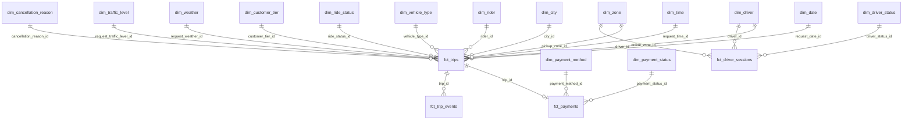

# RideFlow — Dimensional Model (Star Schema)

**The analytical model: facts, dimensions, grain, relationships, and the bus matrix.**

| Field | Value |
|---|---|
| Version | `1.0.0` |
| Status | Approved for implementation |
| Milestone | M1 |
| Last updated | 2026-08-05 |
| Modelling approach | Kimball dimensional modelling |

---

## 0. Naming convention

The requested table names were `Fact_Rides`, `Dim_Driver`, `Dim_Customer`, `Dim_Time`, `Dim_City`. This document uses **lowercase `snake_case` with `fct_` / `dim_` prefixes** instead. The mapping is explicit:

| Requested | Implemented as | Why the name differs |
|---|---|---|
| `Fact_Rides` | **`fct_trips`** | "Trip" is the term used consistently in the event contract. Mixing "ride" and "trip" for the same entity is how a codebase ends up with two words for one thing and neither reliably searchable. |
| `Dim_Driver` | **`dim_driver`** | Case only |
| `Dim_Customer` | **`dim_rider`** | The event contract uses `rider_id` throughout. A dimension named `customer` keyed on `rider_id` invites exactly the confusion above. |
| `Dim_Time` | **`dim_date` + `dim_time`** | Split deliberately — see §6.3 |
| `Dim_City` | **`dim_city`** | Case only |

**Why lowercase snake_case:** it is the dbt community standard, it avoids quoting requirements in engines that fold unquoted identifiers to lowercase, and it survives migration to Snowflake or BigQuery without a rename. Mixed-case identifiers eventually force `"Fact_Rides"` quoting into every query.

---

## 1. The model

Four facts, thirteen dimensions. `fct_trips` is the centre of the model; the other three facts serve specific analytical needs at different grains.

---

## 2. `fct_trips` — the primary fact

### 2.1 Grain

> **One row per `trip_id`.** Every requested trip appears exactly once, whether it completed, was cancelled, or expired.

**Declaring the grain first is the most important step in dimensional modelling.** Everything else — which dimensions apply, which measures are additive, which joins are safe — follows from it. Getting the grain wrong is not a detail that can be patched later; it invalidates the model.

**Why not "one row per completed trip"?** Because cancellations are the analytical core of the conversion funnel. A fact table containing only successes cannot measure failure, and `PROJECT_PLAN.md` §2.1 asks precisely about where riders drop off. Restricting the grain to completions would make the second business question unanswerable.

### 2.2 Structure

Full column-level detail is in `docs/data_dictionary.md` §5. Summarised by role:

| Role | Columns | Count |
|---|---|---|
| **Degenerate key** | `trip_id` | 1 |
| **Foreign keys** | `city_id`, `driver_id`, `rider_id`, `vehicle_type_id`, `requested_vehicle_type_id`, `customer_tier_id`, `ride_status_id`, `cancelled_at_status_id`, `cancellation_reason_id`, `pickup_zone_id`, `dropoff_zone_id`, `actual_dropoff_zone_id`, `driver_pickup_zone_id`, `request_date_id`, `request_time_id`, `request_weather_id`, `trip_weather_id`, `request_traffic_level_id`, `trip_traffic_level_id` | 19 |
| **Timestamps** | `requested_at`, `accepted_at`, `arrived_at`, `started_at`, `completed_at`, `cancelled_at`, `paid_at` | 7 |
| **Additive measures** | `total_fare`, `base_fare`, `distance_fare`, `time_fare`, `surge_amount`, `airport_fee`, `toll_amount`, `booking_fee`, `tax_amount`, `driver_payout`, `platform_commission`, `cancellation_fee`, `distance_km` | 13 |
| **Semi-additive measures** | `duration_sec`, `matching_duration_sec`, `rider_wait_duration_sec`, `actual_pickup_duration_sec`, `arrival_delay_sec`, `seconds_since_request`, `total_lifecycle_sec` | 7 |
| **Non-additive measures** | `surge_multiplier`, `driver_rating_at_accept`, `estimate_accuracy_pct`, `distance_accuracy_pct`, `eta_accuracy_pct`, `revenue_per_km` | 6 |
| **Degenerate attributes** | `promo_code`, `device_platform`, `app_version`, `cancelled_by`, `currency` | 5 |
| **Flags** | `is_completed`, `is_cancelled`, `is_paid`, `is_matched`, `is_expired`, `is_airport_pickup`, `is_airport_dropoff`, `is_surge_trip`, `is_late_arrival`, `is_fee_charged`, `is_driver_fault`, `is_sequence_valid`, `had_duplicate_events`, `had_out_of_order_events` | 14 |

### 2.3 Additivity — and why it is not pedantry

| Class | Meaning | Correct use |
|---|---|---|
| **Additive** | Summable across every dimension | `SUM(total_fare)` by city, by day, by driver — all valid |
| **Semi-additive** | Summable across some dimensions only | `SUM(duration_sec)` across trips is total drive time (valid); across *time periods* for one trip is meaningless |
| **Non-additive** | Never summable | `SUM(surge_multiplier)` is nonsense. Only averages — and weighted ones — are valid. |

**The non-additive measures are the trap.** `AVG(surge_multiplier)` across trips is an unweighted average of ratios: a ₹50 trip at 3.0× and a ₹3000 trip at 1.1× average to 2.05×, which describes no real state of the marketplace. The correct revenue-weighted answer is `SUM(surge_amount) / SUM(base+distance+time)`.

`surge_amount` exists as a stored, additive column precisely so this mistake is avoidable. **The model is designed so the correct calculation is also the easy one** — the strongest defence against analytical error is making the right query the obvious one.

### 2.4 Example row

From `docs/samples/sample_events.json`, trip `1a4f8c22…` (airport pickup, 2.30× surge, peak hour):

| Column | Value |
|---|---|
| `trip_id` | `1a4f8c22-9e5b-4c07-8d3a-2f6b1e904d77` |
| `city_id` | `1` (Bengaluru) |
| `driver_id` / `rider_id` | `7f3a2c18…` / `c3d8e0b5…` |
| `vehicle_type_id` | `2` (PREMIUM) |
| `customer_tier_id` | `3` (GOLD) |
| `ride_status_id` | `6` (PAID) |
| `pickup_zone_id` → `dropoff_zone_id` | `412` (Airport T1) → `118` (Indiranagar) |
| `request_date_id` / `request_time_id` | `20260317` / `812` — **local** IST, not UTC |
| `requested_at` | `2026-03-17T02:42:10.412Z` |
| `surge_multiplier` / `surge_amount` | `2.30` / `1027.52` |
| `distance_km` / `duration_sec` | `34.80` / `3132` |
| `total_fare` / `driver_payout` / `platform_commission` | `2092.57` / `1594.34` / `398.58` |
| `is_airport_pickup` / `is_surge_trip` / `is_completed` | `true` / `true` / `true` |

Note `request_time_id = 812` — 08:12 **local**, derived from `02:42 UTC` via `dim_city.timezone`. Bucketing on UTC would place the Bengaluru morning peak at 2 a.m.

---

## 3. `fct_payments`

### 3.1 Grain

> **One row per `payment_id`.** Zero or one per trip today; many-to-one once refunds exist.

### 3.2 Why it is separate from `fct_trips`

Four reasons, and the fourth is the decisive one:

1. **Different grain.** Not every trip has a payment (cancellations, expiries).
2. **Different timing.** A payment settles after the trip and may retry over minutes.
3. **Different identity.** `payment_id` is its own key; refunds and chargebacks attach to it.
4. **It will become one-to-many.** The moment the first refund exists, a trip has multiple payment records. Folding payments into `fct_trips` would require restructuring the primary fact table at that point — the expensive kind of migration. Separating now costs one join and avoids it entirely.

### 3.3 Structure

| Role | Columns |
|---|---|
| Key | `payment_id` |
| Foreign keys | `trip_id`, `rider_id`, `driver_id`, `city_id`, `payment_method_id`, `payment_status_id` |
| Timestamps | `paid_at`, `settlement_due_at` |
| Additive measures | `trip_fare`, `tip_amount`, `discount_amount`, `amount_charged`, `gateway_fee_amount`, `net_platform_revenue` |
| Attributes | `currency`, `promo_code`, `attempt_number`, `previous_attempt_failure_reason`, `gateway_reference`, `had_failed_attempts` |

### 3.4 Example row

Trip `4d7e2f91…` — the payment-retry case:

| Column | Value |
|---|---|
| `payment_id` | `5c81e2a7-0f63-4d29-b7e4-92a3f068c51b` |
| `payment_method_id` | `2` (CARD) |
| `payment_status_id` | `3` (SUCCEEDED) |
| `trip_fare` / `tip_amount` / `amount_charged` | `294.21` / `20.00` / `314.21` |
| `attempt_number` | `3` |
| `previous_attempt_failure_reason` | `INSUFFICIENT_FUNDS` |
| `had_failed_attempts` | `true` |
| `gateway_fee_amount` | `6.28` (CARD at 2.00%) |

> **`payment_status_id` is always `3` in v1.0.0.** `PaymentCompleted` asserts success (`event_contract.md` §5.7). This is not a 100% success rate — terminal failures are unobservable until `PaymentFailed` ships. `had_failed_attempts` is the only proxy, and it undercounts, because it can only see failures that were eventually followed by success.

---

## 4. `fct_driver_sessions`

### 4.1 Grain

> **One row per `session_id`** — one driver duty period.

### 4.2 Why it exists

This is the **supply side** of the marketplace. `fct_trips` measures demand that was served; without session data, there is no way to distinguish "no demand" from "demand with no available supply" — which are opposite problems with opposite remedies.

It also cannot share a grain or a Kafka topic with trip events: presence events partition by `driver_id`, trip events by `trip_id` (`event_contract.md` §3.3).

### 4.3 Structure

| Role | Columns |
|---|---|
| Key | `session_id` |
| Foreign keys | `driver_id`, `city_id`, `vehicle_type_id`, `driver_status_id`, `online_zone_id`, `offline_zone_id` |
| Timestamps | `online_at`, `offline_at` |
| Additive measures | `session_duration_sec`, `trips_completed_in_session` |
| Non-additive | `trips_per_online_hour` |
| Attributes | `offline_reason`, `device_platform`, `app_version`, `is_session_open`, `zone_drift` |

### 4.4 Example rows

| | Session `8e14b5c0…` (D1) | Session `6b04e7f2…` (D3) | Session `2f7a9d81…` (D2) |
|---|---|---|---|
| `online_at` → `offline_at` | 02:10 → 06:55 | 03:40 → 05:30 | 02:55 → **null** |
| `session_duration_sec` | `17112` | `6600` | **null** |
| `trips_completed_in_session` | `2` | `0` | **null** |
| `offline_reason` | `SHIFT_END` | `CONNECTION_LOST` | — |
| `trips_per_online_hour` | `0.42` | `0.00` | **null** |
| `is_session_open` | `false` | `false` | **`true`** |

> **The open session is correct data, not missing data.** D2 was still online when the observation window closed. Imputing an end time would fabricate supply hours and inflate every utilisation denominator. Open sessions are excluded from completed-session metrics and reported separately.

---

## 5. `fct_trip_events` — the atomic fact

### 5.1 Grain

> **One row per event, post-deduplication.** 2–6 rows per trip.

### 5.2 Why keep it

`fct_trips` is an aggregation. This table is the atomic record, and it earns its place three ways:

1. **Auditability.** Any `fct_trips` number can be traced to the events that produced it.
2. **Pipeline metrics.** Duplicate rate, out-of-order rate, and arrival lateness are properties of *events*, not trips. They are invisible at trip grain.
3. **Future re-modelling.** A new mart can be built from atomic events without re-reading the landing zone.

It carries `payload_json` — the unmodified original — making the fact table self-auditing.

### 5.3 Example: the out-of-order case

Trip `2e59f0c7…`, ordered by arrival:

| `event_type` | `event_timestamp` | `ingested_at` | `is_out_of_order` | `is_duplicate` |
|---|---|---|---|---|
| `RideCompleted` | 04:58:05.310 | 04:58:06.180 | `false` | `false` |
| `RideStarted` | **04:27:05.310** | **04:58:20.500** | **`true`** | `false` |
| `RideStarted` | 04:27:05.310 | 04:58:31.940 | `true` | **`true`** |

The trip *started* at 04:27 but that event arrived 31 minutes late, **after** the completion event. The duplicate arrived 11 seconds later still.

`fct_trips` shows this trip as a clean, correctly-sequenced completion, because the intermediate layer resolves the state machine from the assembled event set rather than from arrival order. `fct_trip_events` preserves the messy truth. **Both are needed: one for business questions, one for pipeline questions.**

---

## 6. Dimensions

Ten dimensions are fully specified in `docs/reference_data.md` and are not duplicated here. The four **generated** dimensions are specified below, since no other document owns them.

### 6.1 `dim_driver` — SCD Type 2

**Grain:** one row per driver per version.

| Column | Type | Key | Notes |
|---|---|---|---|
| `driver_key` | integer | **PK** | Surrogate; new row per version |
| `driver_id` | uuid | Natural key | From events |
| `city_id` | integer | FK → `dim_city` | Home city |
| `first_seen_at` | timestamptz | | First observation |
| `current_rating` | decimal(3,2) | | **Trap — see below** |
| `lifetime_trips` | integer | | Completed trips |
| `lifetime_earnings` | decimal(14,2) | | Total payout |
| `valid_from` / `valid_to` / `is_current` | | | SCD2 versioning |

**Accumulated from event history**, because RideFlow has no upstream OLTP master. This is unusual and worth understanding: the dimension is *derived from facts*, which means it can only ever know about drivers who have appeared in at least one event.

### 6.2 `dim_rider` — SCD Type 2

**Grain:** one row per rider per version.

| Column | Type | Key | Notes |
|---|---|---|---|
| `rider_key` | integer | **PK** | Surrogate |
| `rider_id` | uuid | Natural key | From events |
| `city_id` | integer | FK → `dim_city` | Home city |
| `current_tier_id` | integer | FK → `dim_customer_tier` | **Trap — see below** |
| `lifetime_trips` | integer | | Completed trips |
| `lifetime_spend` | decimal(14,2) | | Total charged |
| `cancellation_rate_pct` | decimal(5,2) | | Rider reliability |
| `valid_from` / `valid_to` / `is_current` | | | SCD2 versioning |

### 6.3 `dim_date` and `dim_time` — why they are split

`Dim_Time` was requested as one dimension. It is implemented as two, and the reason is structural rather than stylistic.

**A combined date-time dimension at minute grain needs 1,440 rows per day** — 525,600 per year, 5.2 million for a decade. Worse, it makes the two most common time questions awkward:

| Question | With split dimensions | With a combined dimension |
|---|---|---|
| "Revenue by month" | Join `dim_date`, group by month | Group over 43,200 rows per month |
| "Demand by hour of day, across all dates" | Join `dim_time`, group by hour — **24 groups** | Must strip the date component out of every row first |

Splitting keeps `dim_date` at ~365 rows/year and `dim_time` at exactly 1,440 rows **total**, reused across every date. The second question — the daily demand curve, which is central to a ride-hailing business — becomes a trivial 24-group aggregation instead of an awkward extraction.

**`dim_date`** — `date_id` (`YYYYMMDD`), `full_date`, `day_of_week`, `day_name`, `is_weekend`, `week_of_year`, `month_number`, `quarter`, `year`, `is_holiday`, `holiday_name`.

**`dim_time`** — `time_id` (`HHMM`), `hour_24`, `minute`, `day_part`, `is_peak_hour`.

> Both are keyed on **local** time, derived via `dim_city.timezone`. See §8.1.

### 6.4 `dim_zone` — SCD Type 2

**Grain:** one row per zone per version. `zone_id`, `zone_code`, `zone_name`, `city_id`, `zone_type`, `centroid_lat/lon`, `boundary_wkt`, `is_airport_zone`, `is_surge_eligible`, `avg_daily_demand`. Full detail in `docs/data_dictionary.md` §8.3.

---

## 7. Bus Matrix

The Kimball bus matrix — which dimensions are conformed across which facts. **Conformed dimensions are what make a star schema a coherent model rather than four unrelated tables.**

| Dimension | `fct_trips` | `fct_payments` | `fct_driver_sessions` | `fct_trip_events` |
|---|:---:|:---:|:---:|:---:|
| `dim_date` | ✅ | ✅ | ✅ | ✅ |
| `dim_time` | ✅ | ✅ | ✅ | ✅ |
| `dim_city` | ✅ | ✅ | ✅ | ✅ |
| `dim_driver` | ✅ | ✅ | ✅ | ✅ |
| `dim_rider` | ✅ | ✅ | — | ✅ |
| `dim_zone` | ✅ | — | ✅ | — |
| `dim_vehicle_type` | ✅ | — | ✅ | — |
| `dim_ride_status` | ✅ | — | — | — |
| `dim_cancellation_reason` | ✅ | — | — | — |
| `dim_customer_tier` | ✅ | — | — | — |
| `dim_weather` | ✅ | — | — | — |
| `dim_traffic_level` | ✅ | — | — | — |
| `dim_payment_method` | ✅ | ✅ | — | — |
| `dim_payment_status` | — | ✅ | — | — |
| `dim_driver_status` | — | — | ✅ | — |

### 7.1 What the matrix enables

**`dim_driver`, `dim_city`, `dim_date`, and `dim_time` are conformed across all four facts.** That is what permits drill-across queries — combining measures from different facts through shared dimensions:

> *"For each driver, on each day: hours online (`fct_driver_sessions`), trips completed (`fct_trips`), and revenue collected (`fct_payments`)."*

This query is only possible because all three facts share `dim_driver` and `dim_date` **with identical keys and identical meaning**. If `fct_driver_sessions` used a different driver key, or bucketed dates in UTC while `fct_trips` used local time, the join would silently produce wrong numbers rather than an error.

**Conformance is a discipline, not a diagram.** It has to be enforced by tests, which is why `testing_strategy.md` includes referential integrity checks across every FK in this matrix.

### 7.2 Drill-across must not be a single join

Joining three facts directly through shared dimensions produces a **fan trap**: a driver with 3 sessions and 12 trips yields 36 rows, and every measure is inflated.

**The correct pattern is aggregate-then-join:** aggregate each fact to the common grain (`driver × date`) separately, then join the aggregates. This is a routine source of overstated numbers in real BI reports and is called out here so it is designed against rather than debugged later.

---

## 8. Modelling decisions and their reasoning

### 8.1 Date and time keys are local, not UTC

Events store UTC (`event_contract.md` §3.1). `request_date_id` and `request_time_id` are **local**, converted via `dim_city.timezone`.

08:12 IST is 02:42 UTC. Bucketing on UTC would place the Bengaluru morning peak at 2 a.m. — and the resulting chart looks plausible enough to be rationalised rather than investigated. Both timestamps are retained: UTC for cross-city ordering, local keys for business analysis.

### 8.2 Point-in-time attributes over dimension joins

`customer_tier_id` and `driver_rating_at_accept` are stored **on the fact**, captured at event time, rather than joined from `dim_rider` / `dim_driver`.

A rider who was `SILVER` in March and `GOLD` in August must appear as `SILVER` on their March trips. Joining to the current tier drags today's value backwards over historical facts, systematically inflating the apparent performance of higher tiers — because riders who *later* upgraded carry their new tier over trips taken at a lower one.

This is why `dim_rider.current_tier_id` and `dim_driver.current_rating` are explicitly labelled traps in `docs/data_dictionary.md` §8.4. They answer "what is true now?", never "what was true then?"

### 8.3 SCD Type 2 where attributes change metrics

| Type | Applied to | Rule |
|---|---|---|
| **Type 1** (overwrite) | Display labels, descriptions | A typo fix should not create a version |
| **Type 2** (versioned) | `commission_pct`, `base_fare_multiplier`, `discount_pct`, driver and rider attributes | **If changing it would change a historical metric, it is Type 2** |

A commission rate rising from 20% to 22% must not retroactively alter last quarter's reported net revenue.

### 8.4 The `-1 / UNKNOWN` row on every dimension

Every dimension has a row with surrogate key `-1`. An unresolved lookup maps to it rather than to null.

A null FK breaks inner joins and silently drops rows from every aggregate — the loss appears in no count and no error log. The `-1` row keeps the fact row, keeps joins working, and makes unknown values **countable**. A rising `UNKNOWN` count is an alertable quality signal; a null is invisible.

### 8.5 Degenerate dimensions

`trip_id`, `promo_code`, `gateway_reference`, and `app_version` sit on the fact with no dimension table. They are high-cardinality and carry no attributes worth normalising — a `dim_promo_code` holding only the code itself would be a join for nothing.

### 8.6 What this model deliberately does not do

| Not done | Why |
|---|---|
| **Snowflaking** (normalising dimensions into sub-tables) | Star beats snowflake for query performance and comprehensibility. Storage saved is negligible; joins added are not. |
| **A factless fact table for driver availability** | Would model "driver available in zone at time" for supply density. Genuinely useful, deferred — it needs a `DriverStatusChanged` event that does not exist yet. |
| **An accumulating snapshot fact** | `fct_trips` is close to one (multiple lifecycle timestamps updated as the trip progresses), but is implemented as an incremental table since trips reach a terminal state quickly. |
| **Aggregate/summary tables** | Premature. DuckDB handles this volume directly. Add only when a measured query is too slow. |
| **Correct `POOL` modelling** | Pooled trips share a vehicle, breaking the one-trip-one-occupancy assumption. v1 treats each booking as independent, which **over-counts vehicle-hours for pooled trips**. A known, documented simplification (`reference_data.md` §2). |

---

## 9. Query patterns the model is built for

Each maps to a business question in `PROJECT_PLAN.md` §2.1.

| Question | Grain | Facts | Key dimensions |
|---|---|---|---|
| **Marketplace health** — unmet demand by zone and hour | zone × hour | `fct_trips` + `fct_driver_sessions` | `dim_zone`, `dim_time`, `dim_date` |
| **Conversion funnel** — where riders drop off | funnel stage | `fct_trips` | `dim_ride_status`, `dim_cancellation_reason` |
| **Pricing effectiveness** — does surge rebalance supply? | zone × hour | `fct_trips` | `dim_zone`, `dim_weather`, `dim_traffic_level` |
| **Financial truth** — reconciled revenue | day × city | `fct_trips` + `fct_payments` | `dim_date`, `dim_city`, `dim_payment_method` |
| **Driver productivity** — trips per online hour | driver × day | `fct_driver_sessions` + `fct_trips` | `dim_driver`, `dim_date` |
| **Pipeline health** — duplicates, lateness, ordering | event | `fct_trip_events` | `dim_date`, `dim_time` |

**Marketplace health and driver productivity are drill-across queries** — they combine `fct_trips` with `fct_driver_sessions` through conformed dimensions, and must use the aggregate-then-join pattern of §7.2.

---

## 10. Related documents

| Document | Covers |
|---|---|
| `docs/data_dictionary.md` | Every column, type, rule, and example |
| `docs/reference_data.md` | The ten lookup dimensions in full |
| `docs/event_contract.md` | Source events and invariants |
| `docs/etl_design.md` | How events become these tables |
| `docs/architecture.md` | Why DuckDB, dbt, and Power BI |
