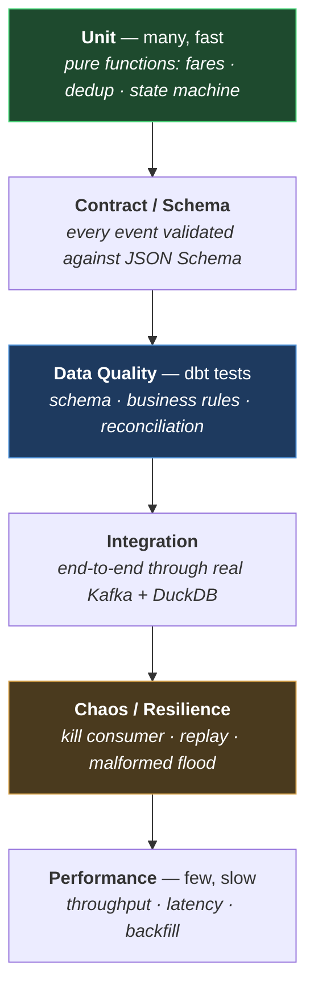
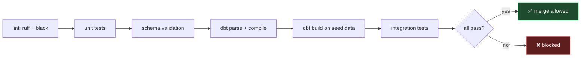

# RideFlow — Testing Strategy

**What is tested, at which layer, and what a failure blocks.**

| Field | Value |
|---|---|
| Version | `1.0.0` |
| Status | Approved for implementation |
| Milestone | M0 → M10 (continuous) |
| Last updated | 2026-08-06 |

---

## 0. The principle

**A pipeline that has never been shown bad data has not been tested.**

Most data pipelines are verified by running them on clean data and observing that numbers appear. That proves the happy path executes; it proves nothing about the failure modes that actually cause incidents — duplicates, late arrivals, malformed payloads, consumer restarts, and financial drift.

RideFlow's testing strategy is built around a different question: **what does this system do when things go wrong, and can I demonstrate it?**

Two rules follow, and they are binding:

1. **Every reliability guarantee in `PROJECT_PLAN.md` §6.1 must be provable by a repeatable test.** A guarantee that is asserted but not demonstrated is a claim, not a property.
2. **A schema or business-rule change that lands without a corresponding test does not count as landed** (`event_contract.md` §2.4).

---

## 1. The test pyramid

| Layer | Count | Runtime | Runs in CI | Blocks merge |
|---|---|---|---|---|
| Unit | ~120 | < 10 s | ✅ | ✅ |
| Contract / schema | ~40 | < 15 s | ✅ | ✅ |
| Data quality (dbt) | ~90 | < 60 s | ✅ | ✅ |
| Integration | ~15 | 3–5 min | ✅ | ✅ |
| Chaos | ~8 | 10–15 min | Nightly | ❌ |
| Performance | ~5 | 15–30 min | Nightly | ❌ |

**The shape is deliberate.** Data projects commonly invert this — a handful of slow end-to-end checks and nothing underneath, so a broken fare calculation is only discovered after a full pipeline run. Unit tests on pure functions catch that in milliseconds.

---

## 2. Unit Testing

**Scope:** pure functions with no I/O. Fast, deterministic, run on every save.

### 2.1 Event generator

| Target | Assertions |
|---|---|
| Lifecycle generation | Every trip follows a legal path (S1–S8); terminal states are terminal |
| Fare calculation | F1, F2, F5 hold for randomised inputs; components sum to total |
| Surge coupling | Multiplier responds to supply/demand imbalance, not randomness |
| Temporal patterns | Peak-hour demand exceeds off-peak; weekend differs from weekday |
| **Determinism** | **Identical seed ⟹ byte-identical output** |
| Anomaly injection | Each anomaly type appears at its configured rate ±tolerance |

**The determinism test is the foundation of everything above it.** Without a fixed seed producing identical output, every downstream test becomes flaky and no failure is reproducible.

### 2.2 Ingestion consumer

| Target | Assertions |
|---|---|
| Envelope validation | All 11 fields required; each omission rejected with the right reason |
| Payload validation | Each of the nine types validates against its schema |
| Unknown enum tolerance | Unknown `cancellation_reason_code` **accepted**, not DLQ'd |
| Unknown `event_type` | **DLQ'd** — the one exception |
| Deduplication (pass 1) | Same `event_id` twice in a batch ⟹ one output |
| Batching triggers | Flush on size **and** on time, independently |
| DLQ envelope | Rejection reason, offset, partition, raw base64 all present |
| Timestamp bounds | T3/T4 violations rejected; 5-min clock skew tolerated |

### 2.3 Transformation helpers

Fare reconciliation, state-machine resolution from an event set, lookback-window boundary arithmetic, local-time conversion via `dim_city.timezone`, and surrogate-key resolution mapping unknowns to `-1`.

### 2.4 Property-based testing

For fare arithmetic specifically, generate randomised valid inputs and assert the invariants hold for all of them, rather than for three hand-picked examples.

**This catches the rounding cases hand-written tests miss** — the trip where components sum to `2092.575` and half-up rounding at the total produces a one-paisa drift that only appears at specific distance/duration combinations. A human will not think to write that test; a property test finds it in seconds.

---

## 3. Schema / Contract Validation

**Scope:** every event, against the JSON Schemas in `event_contract.md` §5.

| Test | Purpose |
|---|---|
| Sample corpus validates | All 30 events in `docs/samples/sample_events.json` pass |
| Each required field, omitted | 40+ cases: every required field's absence is caught |
| Type violations | String where number expected, etc. |
| Range violations | `surge_multiplier < 1.0`, negative fares, coordinates out of bounds |
| Conditional rules | `driver_id` null ⟺ `cancelled_at_status = REQUESTED` |
| **Backward compatibility** | **A frozen v1.0 corpus must always parse with the current consumer** |

### 3.1 The backward-compatibility test

A frozen set of v1.0.0 events is committed to the repository. Every CI run parses them with the current consumer.

**This test must never be modified to make it pass.** If a change breaks it, the change is breaking — that is the test's entire purpose. Editing the fixture to accommodate a breaking change converts the guarantee in `event_contract.md` §9.1 from a commitment into decoration.

CI additionally enforces that a changed schema requires a version bump in the same commit, and that a MAJOR bump fails the build without a migration document.

---

## 4. Data Quality Testing (dbt)

**Scope:** the warehouse. **These are the pipeline gate** — a failure fails the run and blocks publication (`PROJECT_PLAN.md` FR-5).

### 4.1 Generic tests

| Test | Applied to |
|---|---|
| `unique` | `trip_id`, `payment_id`, `session_id`, `event_id` (post-dedup) |
| `not_null` | Every non-nullable column in `data_dictionary.md` |
| `accepted_values` | Every enum against `reference_data.md` |
| `relationships` | Every FK in the `star_schema.md` §7 bus matrix |

### 4.2 Business assertions

| ID | Assertion |
|---|---|
| **T2** | `requested_at < accepted_at < arrived_at <= started_at < completed_at <= paid_at` |
| **F1** | Fare components sum to `total_fare` (±0.01) |
| **F2** | `driver_payout + platform_commission = total_fare − tax_amount` (±0.01) |
| **F3** | `amount_charged = trip_fare + tip − discount` (±0.01) |
| **F5** | `surge_amount = (base+distance+time) × (surge−1)` (±0.01) |
| **F6** | `airport_fee > 0` only on airport trips |
| **F7** | `surge_multiplier` identical in request and completion |
| **S4** | No trip both completed and cancelled |
| **R2** | `driver_id` null only where the contract permits |
| **R3** | Every `DriverOffline.session_id` matches an earlier `DriverOnline` |

### 4.3 Reconciliation

N1–N5 from `etl_design.md` §10 — layer counts, trip counts, financial totals, orphan checks, session pairing.

**N3 excludes cash trips.** Cash never produces a gateway reference and settles outside the platform; including it would fail on entirely correct data. A check that cries wolf on valid data is worse than no check, because it trains people to dismiss the alert.

### 4.4 Freshness

`dbt source freshness` on the landing zone — `warn_after: 2h`, `error_after: 6h`.

### 4.5 Severity is graded

| Severity | Applied to | Effect |
|---|---|---|
| **`error`** | Financial invariants, uniqueness, referential integrity | **Blocks publication** |
| **`warn`** | Unknown-enum rate, freshness, distribution drift | Logged and alerted, run continues |

**Financial failures block; quality signals warn.** Publishing a wrong revenue number is worse than publishing nothing, while blocking an entire run because one unknown cancellation reason appeared would make the gate so disruptive it gets disabled — which is how quality gates die.

---

## 5. Integration Testing

**Scope:** real components, real Kafka, real DuckDB. No mocks.

| Test | Verifies |
|---|---|
| **End-to-end happy path** | Generate 1,000 events → Kafka → consumer → Parquet → dbt → marts. Trip counts and fare totals reconcile at every layer. |
| **Full lifecycle fidelity** | A trip's marts row exactly matches the events that produced it |
| **Cancellation path** | Cancelled trip lands with correct status, reason, and stage — and no fare revenue |
| **Payment retry** | `attempt_number > 1` surfaces correctly in `fct_payments` |
| **Duplicate handling** | Same event twice ⟹ one row in `fct_trips`, two in `fct_trip_events`, one flagged |
| **Out-of-order** | `RideCompleted` before `RideStarted` ⟹ correctly assembled trip |
| **Late arrival** | Event arriving after the window ⟹ historical mart correctly revised |
| **Unknown enum** | New reason code ⟹ landed, bucketed to `UNKNOWN`, metric incremented, **not DLQ'd** |
| **Malformed event** | → DLQ with reason; offset committed; **partition continues** |
| **Reference data drift** | Seed CSVs match `reference_data.md` allowed values |

### 5.1 The sample dataset is the integration fixture

`docs/samples/sample_events.json` — 30 events, 5 trips, 3 sessions — already exercises the duplicate, out-of-order, late-driver, payment-retry, cancellation, surge, and airport paths. It is promoted to `tests/fixtures/` in M2 and becomes the canonical integration input.

**Its invariants were verified at authoring time, not assumed**: F1–F7, T1–T2, I2/I3, C1, S4, and every stored duration was checked against its own timestamps before the file was accepted. That verification found four real errors in the data dictionary — including a logic error where the maximum event count per trip was stated as 7 when `RideCancelled` and `RideCompleted` are mutually exclusive, making the true maximum 6.

---

## 6. Chaos / Resilience Testing

**Scope:** deliberately break things and assert the guarantees hold. Nightly, not merge-blocking.

| Scenario | Method | Assertion |
|---|---|---|
| **Consumer kill mid-batch** | `SIGKILL` during processing | Restart resumes from last committed offset; **zero loss**, duplicates removed |
| **Consumer kill after write, before commit** | Kill in the commit window | Batch redelivered; **duplicates, never loss** |
| **Broker restart** | Stop/start broker | Producer buffers and retries; no message lost |
| **Duplicate replay** | Re-consume a full day | Marts **byte-identical** to before |
| **Malformed flood** | 10% malformed injection | All to DLQ with reasons; valid events unaffected; **no partition stalls** |
| **Disk full** | Fill the landing-zone volume | Write fails, offset **not** committed, consumer retries; no loss |
| **dbt mid-run failure** | Kill during `dbt_run` | **No partial write**; last-good marts intact |
| **Warehouse deletion** | `rm rideflow.duckdb` | Full rebuild from landing zone reproduces it **exactly** |

### 6.1 The two that matter most

**Duplicate replay → byte-identical marts** is the direct proof of objective **O2** (`PROJECT_PLAN.md`). It is the single strongest evidence that the idempotency design works, and it is falsifiable — either the outputs match or they do not.

**Warehouse deletion → full rebuild** proves the strongest guarantee in the system: the landing zone is the system of record and the warehouse is disposable (`architecture.md` §11.1).

### 6.2 What is deliberately not chaos-tested

Landing-zone deletion. It is the one genuinely unrecoverable failure (`architecture.md` §11.2), and "verifying" it would only confirm that data is lost. The mitigation is backup, not a test.

---

## 7. Performance Testing

**Scope:** the measurable targets in `PROJECT_PLAN.md` §6.2. Nightly.

| Target | Threshold | Method |
|---|---|---|
| Sustained ingestion | **≥ 1,000 events/sec**, single consumer | 10-min sustained load; measure lag |
| End-to-end freshness | **< 15 min** processing latency | Timestamped probe event, measured to mart |
| Mart query response | **< 2 s** on 90 days | Benchmark the six §9 query patterns |
| Full backfill | **30 days in < 30 min** | Timed backfill run |
| Consumer memory | Stable, no growth | 1-hour soak |

### 7.1 Targets are stated so they can be missed

A target that cannot fail is not a target. Each threshold is asserted numerically, and a regression fails the nightly run.

### 7.2 Freshness measurement is honest

"< 15 min" is **pipeline processing latency**, not wall-clock data age. Real observed freshness includes scheduling latency — worst case ~71 minutes on an hourly DAG (`airflow_design.md` §4.2).

Both numbers are measured and reported separately. Conflating them would let the dashboard claim 15-minute freshness while displaying hour-old data, which is a credibility problem rather than a performance one.

### 7.3 Expected first bottleneck

Small-file proliferation, then single-consumer throughput (`architecture.md` §12.1). Performance tests track file count and average file size in the landing zone alongside throughput, so degradation is attributed correctly rather than blamed on DuckDB.

---

## 8. CI Pipeline

| Stage | Gate |
|---|---|
| Lint / format | Ruff + Black, zero tolerance |
| Unit | 100% pass |
| Schema | 100% pass, **including backward compatibility** |
| dbt parse | Compiles; no circular refs |
| dbt build | Runs on a small seeded dataset; all `error` tests pass |
| Integration | 100% pass |
| Docs consistency | Contract ↔ dictionary ↔ reference data agree |

### 8.1 Docs-consistency check

CI validates that `event_contract.md`, `data_dictionary.md`, and `reference_data.md` do not drift — every enum in the contract exists in reference data, every dictionary column traces to a contract field or is marked derived, and every seed CSV matches its documented allowed values.

**Documentation drift is a real defect class in data projects**, because the docs are the interface the rest of the team codes against. Making drift fail the build is what keeps a data dictionary from becoming fiction six months in.

### 8.2 Coverage

Target **≥ 85%** on `event_generator/` and `ingestion/`. Not a goal in itself — coverage measures which lines executed, not whether behaviour is correct. The reliability guarantees in §6 are the real quality signal; coverage is a floor that catches obviously untested code paths.

---

## 9. Test Data Strategy

| Kind | Source | Use |
|---|---|---|
| **Seeded synthetic** | Generator, fixed seed | Unit and integration — reproducible |
| **Curated fixtures** | `docs/samples/sample_events.json` | Known edge cases |
| **Frozen v1.0 corpus** | Committed, immutable | Backward compatibility |
| **Anomaly-injected** | Generator, anomaly mode | Chaos and quality gates |
| **Volume** | Generator at scale | Performance |

**All test data is synthetic. No PII exists anywhere in the system by design** (`PROJECT_PLAN.md` §6.5) — which removes an entire category of test-data governance problems rather than mitigating it.

---

## 10. Testing by milestone

| Milestone | Testing added |
|---|---|
| M0 | CI skeleton, lint, pre-commit |
| M1 | Schema validation against the contract *(sample corpus already verified)* |
| M2 | Generator unit tests, determinism, anomaly rates |
| M3 | Kafka connectivity, topic configuration |
| M4 | Consumer unit tests, **restart chaos test** |
| M5 | dbt schema tests, staging reconciliation |
| M6 | Business assertions, **idempotency test** |
| M7 | Full quality gate, injected bad data |
| M8 | DAG tests, backfill correctness |
| M9 | Mart query benchmarks |
| M10 | **Full chaos + performance suite** |

---

## 11. Design decisions worth defending

| Decision | Reasoning |
|---|---|
| **Test failures block publication** | Quality is a gate, not a report |
| **Graded severity: financial errors block, drift warns** | An over-blocking gate gets disabled |
| **Zero retries on quality gates** | Deterministic failures gain nothing from retry |
| **Frozen compatibility corpus, never edited to pass** | Editing it converts a guarantee into decoration |
| **Property-based fare tests** | Rounding bugs occur at inputs humans do not think to write |
| **Chaos nightly, not merge-blocking** | 15-minute runtime would make merges intolerable |
| **Docs consistency in CI** | Documentation drift is a defect class, not an aesthetic issue |
| **Coverage is a floor, not a goal** | Coverage measures execution, not correctness |
| **Landing-zone deletion not tested** | It is unrecoverable; the fix is backup, not a test |

---

## 12. Related documents

| Document | Covers |
|---|---|
| `docs/event_contract.md` | Invariants I, T, C, F, R, N and the schemas |
| `docs/etl_design.md` | Edge-case handling under test |
| `docs/kafka_design.md` | Delivery semantics the chaos tests verify |
| `docs/airflow_design.md` | Retry policy and quality-gate placement |
| `PROJECT_PLAN.md` | §6.1 guarantees and §6.2 performance targets |
